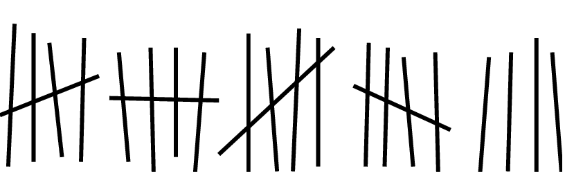
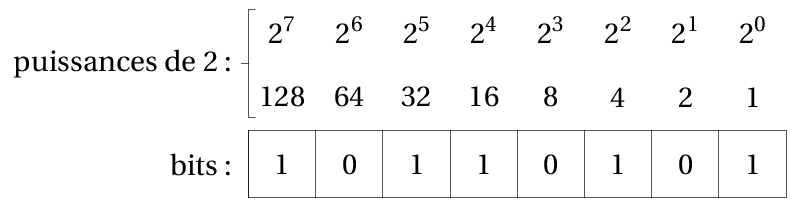

# T1.1 Écriture d'un entier dans une base

> Le monde se divise en 10 catégories : ceux qui comprennent le binaire et ceux qui ne le comprennent pas.

## 1.1.1 Le système décimal

Depuis la préhistoire, l'Homme a besoin de compter. Sa première idée:

{: .center width=50%} 

Pas très pratique... Heureusement, il en eut rapidemennt une autre, beaucoup plus efficace: regrouper les bâtons en paquets.

{: .center width=50%} 


{align=right width=25%} 

Des paquets de 5 et surtout de 10. Pourquoi 10? 

Pour écrire les nombres, regroupés en paquets de 10, il a donc fallu inventer 10 chiffres pour compter les unités (en-dessous du paquet): 0, 1, 2, 3, 4, 5, 6, 7, 8, 9.

Et le nombre 10 ne signifie ni plus ni moins que 1 paquet et 0 unité.

Ensuite, on fait un paquet de paquets, la centaine (100, c'est à dire $10 \times 10 = 10^2$), puis un paquet de centaines, le millier (1000, c'est-à-dire $10\times 10\times10=10^3$), et ainsi de suite.

Au final, si on écrit le nombre 2023, on sait que c'est:

- **2** mille, c'est-à-dire $2\times 10^3$ ;
- **0** centaine, c'est-à-dire $0\times 10^2$ ;
- **2** dizaines, c'est-à-dire $2\times 10^1$;
- **3** unités, c'est-à-dire $3\times 10^0$.

Et bien entendu, $2021 = 2\times 10^3 + 0\times 10^2+ 2\times 10^1 +3\times 10^0$

> La position de chaque chiffre dans l'écriture du nombre correspond à la puissance de 10 par laquelle on le multiplie.

!!! note inline end "Homer compte"
    |Octal|Décimal
    |:-:|:-:|
    |0|0|
    |1|1|
    |2|2| 
    |3|3|
    |4|4|
    |5|5|
    |6|6|
    |7|7|
    |10|8|
    |11|9|
    |12|10|
    |13|11|
    |14|12|
    |15|13|
    |16|14|
    |17|15|
    |20|16|
    |21|17|
    |...|...|


!!! info "Un autre exemple, la base octale"
    Pour Homer Simpson, qui n'a que 8 doigts, il aurait été certainement plus naturel de faire des paquets de 8... et donc de manipuler seulement 8 chiffres : 0, 1, 2, 3, 4, 5, 6 et 7.
    
    C'est le **système octal**.

    Ainsi, «son» 10 signifierait 1 paquet de 8 et 0 unité, soit «notre» 8...
    Et donc notre 10 (en décimal) s'écrirait 12 (en octal).

    Enfin, 2023 (en décimal) s'écrit 3747 en octal puisque : 
    
    $$\begin{array}{rl}
        3747_8 &= 3\times 8^3+7\times 8^2+4\times 8^1+7\times 8^0 \\
        &= 3\times 512+7\times 64+4\times 8+7\times 1  \\
        &= 1536+448+32+7\\
        &= 2023
        \end{array}
        $$


## 1.1.2 Notion de base

!!! abstract "Écriture d'un entier en base $b$"
    - Choisir une base, c'est choisir la «taille» du paquet, et donc le nombre de chiffres dont on aura besoin: en base $b$, il y a $b$ chiffres.

    - Dans notre système décimal, la base est $b=10$.

    - La position de chaque chiffre correspond à la puissance de $b$ par laquelle on le multiplie.

    - On précisera la base (si différente de 10) en indice en fin du nombre. Par exemple, le nombre $312_5$ est écrit en base 5.

!!! note "Exemples"
        $$\begin{array}{rl}
        312_5 &= 3\times 5^2 + 1\times 5^1 + 2\times 5^0 \\
        &= 3\times 25+1\times 5+2\times 1  \\
        &= 82
        \end{array}
        $$
                
        $$\begin{array}{rl}
        25072_8 &= 2\times 8^4 + 5\times 8^3+0\times 8^2+7\times 8^1+2\times 8^0 \\
        &= 2\times 4096 + 5\times 512 + 7\times 8 + 2\times 1  \\
        &= 10810
        \end{array}
        $$

## 1.1.3 Le système binaire (base 2)

!!! abstract "Le binaire"
    - Le système binaire est le système de numération de base $b=2$.
    - Il utilise donc seulement deux chiffres, 0 et 1, appelés **bits** (contraction de l'anglais binary digit).

    - Il est particulièrement adapté à l'informatique car il permet d'unifier la logique (Vrai/Faux), le calcul et l'électronique (voir vidéo suivante).

    - Un regroupement de 8 bits est appelé un **octet**.

    - Avec $n$ bits, on écrit $2^n$ nombres entiers, de $0$ jusqu'à $2^n-1$.
??? video "Vidéo"
    <p align="center">
    <iframe width="560" height="315" src="https://www.youtube.com/embed/VRdp_vaNRoY" title="YouTube video player" frameborder="0" allow="accelerometer; autoplay; clipboard-write; encrypted-media; gyroscope; picture-in-picture" allowfullscreen></iframe>
    </p>


!!! gear "Conversions"
    === "Binaire → Décimal"
        Il est utile de connaître alors les puissances de 2 pour convertir rapidement de l'écriture binaire vers l'écriture décimale.

        {: .center width=50%} 

        Par exemple $10110101_2=128+32+16+4+1=181$.
    
    === "Décimal → Binaire"
        - On peut utiliser l'algorithme de soustraction: on soustrait du nombre la plus grande puissance de 2 possible, et on recommence...

        - On utilise l'algorithme de divisions: on effectue les divisions successives du nombre par 2. L'écriture en binaire est donnée par les restes lus de bas en haut.

        {: .center} 

    === "Décimal →  Base quelconque"
        Les deux algorithmes de soustraction et de divisions fonctionnent également pour la conversion du décimal vers n'importe quelle autre base.


## 1.1.4 Le système hexadécimal (base 16)

!!! abstract "L'hexadécimal"
    - Le système hexadécimal est le système de numération de base $b=16$.
    
    - Il utilise donc 16 chiffres : 0, 1, 2, 3, 4, 5, 6, 7, 8, 9, A, B, C, D, E, F.

    - Bien qu'il nécessite plus de chiffres, ce système donne des écritures plus courtes et particulièrement pratique du fait que 16 est une puissance de 2 : la conversion entre les systèmes binaire et hexadécimal se fait sans calcul, uniquement par regroupement de 4 bits.


!!! info "Couleurs"
    Le système hexadécimal est en particulier un mode de code informatique des couleurs.

    En effet une couleur (codage RGB) est composée de 3 valeurs correspondant aux composantes rouge, verte et bleue, et chacune de ces valeurs est un entier compris entre 0 et 255, c'est-à-dire entre 0 et FF en hexadécimal: on peut les écrire avec seulement deux chiffres.

    {align=right} 

    Par exemple, la couleur rouge ci-contre a pour composantes (178, 26, 15), ce qui donne en hexadécimal : (B2, 1A, 0F), qu'on écrit en général de façon *concaténée* B21A0F et souvent précédée d'un #.

!!! tip "Convertisseur"
    Un [convertisseur](http://www.proftnj.com/RGB3.htm){:target="_blank"}  bien utile.


## 1.1.5 Exercices

### 1.1.5.1 À la main

!!! example "Exercices"
    === "{{ exercice() }}"
        Convertir de la base mentionnée vers la base 10 (système décimal).

        **Attention, il y a un piège...**

        1. $131_6$
        2. $420_5$
        3. $1515_8$
        4. $716_4$
        5. $321_4$
    
    === "{{ exercice() }}"
        Convertir les écritures décimales vers la base mentionnée.

        1. 47 en base 5
        2. 92 en base 4

    === "{{ exercice() }}"
        Convertir du binaire vers le décimal.

        1. 1010
        2. 101110
        3. 10001101
        4. 11111111

    === "{{ exercice() }}"
        Convertir du décimal vers le binaire.

        1. 17
        2. 34
        3. 68
        2. 100
        3. 200

        Que remarquez-vous quand on passe de l'écriture binaire d'un nombre à celle de son double?

    === "{{ exercice() }}"
        1. Vérifier la conversion de la couleur rouge donnée en exemple à la section précédente.

        2. Convertir les écritures hexadécimales en décimal: 99, D7, 1B8, ABC.

        3. Comment s'écrit la couleur blanche en code hexadécimal?


    === "{{ exercice() }}"
        Convertir les écritures décimales en hexadécimal.

        1. 45
        2. 72
        3. 421

    === "Correction" 
        {{ correction(False, 
        "
        "
        ) }}


!!! example "{{ exercice() }}"
	=== "Conversion Binaire → Hexadécimal"
		- On regroupe les bits par paquets de 4 (quitte à ajouter des 0 pour compléter).
		- On convertit chaque paquet en chiffre hexadécimal.
		- On concatène les chiffres
		
		Par exemple, $11111100101_2 = \underbrace{0111}_{7} \underbrace{1110}_{14=\text{E}_{16}} \underbrace{0101}_{5} = 7\text{E}5_{16}$	
		
	=== "Conversion Hexadécimal  → Binaire"
		On fait la même chose dans l'autre sens.
		
	=== "Application"
		
		1. Convertir $1101110_2$ puis $10011011111_2$ en base 16.
		2. Convertir $8\text{D}_{16}$ puis $1\text{CA}7_{16}$ en binaire.

    === "Correction" 
        {{ correction(True, 
        "
        1. $1101110_2 = 0110\, 1110_2$. $0110_2=6_{16}$  et $1110_2=E_{16}$ donc $1101110_2=6E_{16}$

        $10011011111_2 = 0100\, 1101\, 1111_2$. $0100_2=4_{16}$, $0100_2=4_{16}$  et $1110_2=E_{16}$ donc $1101110_2=6E_{16}$
        "
        ) }}
	
### 1.1.5.2 Avec Python

!!! info "Fonctions de conversion"
	Pour convertir un entier écrit en décimal vers le binaire ou l'hexadécimal, on peut utiliser les fonctions `bin` et `hex`, qui renvoient des chaînes de caractères.

	```python
	>>> bin(2021)
	'0b11111100101'
	>>> hex(2021)
	'0x7e5'
	>>>
	```

	Les préfixes `0b` et `0x` indiquent que les écritures sont respectivement en base 2  et en base 16.


	Réciproquement, pour convertir l'écriture d'un nombre écrit en base $b$ vers le décimal, on utilise la fonction `int` en passant en arguments l'écriture en chaîne de caractères et la base.

	```python
	>>> int('11111100101', 2) # pour convertir 11111100101 écrit en binaire vers le décimal
	2021
	>>> int('7e5', 16)        # convertir 7E5 écrit en hexadécimal vers le décimal
	2021
	>>> int('131', 6)         # pour convertir 131 écrit en base 6 vers le décimal
    55
	```

!!! example "{{ exercice() }}"
	Utilisez ces fonctions pour vérifier vos résultats des exercices précédents.

    {{ terminal() }}
    