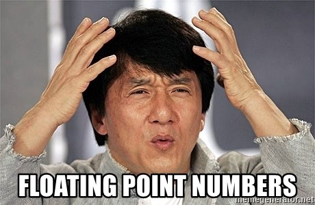
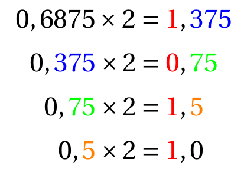
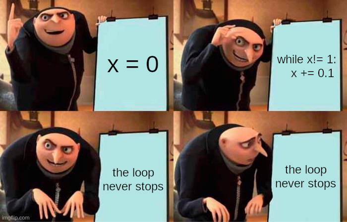
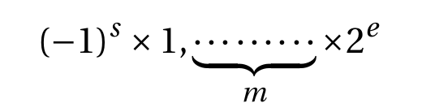
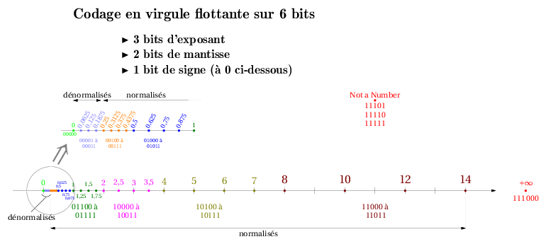

# T1.4 Flottants

Avant de commencer, demandez à Python d'effectuer les calculs suivants (que vous aurez bien entendu faits de tête auparavant) dans un terminal:
```python
>>> 0.1 + 0.2

>>> 0.5 - 0.2 - 0.2 - 0.1

```

{: .center} 

{{ initexo(0) }}


Un **nombre flottant** permet de représenter les nombres *à virgule*... Mais pas tous...

En Python, un nombre flottant est du type `float`.

```python
>>> type(0.5)
<class 'float'>
```

## 1.4.1 Écriture binaire

Comme pour les entiers, on utilise le système binaire, qu'on prolonge à la partie à droite de la virgule par les puissances négatives de 2.

!!! abstract "Base 2 → Base 10"

    On utilise un tableau de conversion avec les puissances de 2:

    {: .center} 

    **Exemple:** Que vaut $101,011_2$ en décimal?

    ??? check "Correction"
        $101,011_2 = 1 \times 2^2 + 0 \times 2^1 + 1 \times 2^0 + 0\times 2^{-1} + 1 \times 2^{-2} +1 \times 2^{-2} = 4 + 1 + 0,25 + 0, 125 = 5,375$

    **Remarque:** si l'écriture en base 2 est finie, alors l'écriture en base 10 est également finie.


!!! abstract "Base 10 → Base 2"
    Prenons par exemple le nombre $3,6875$. Il comporte une partie entière (3)  et une partie décimale (0,6875)

    - On écrit la partie entière «comme d'habitude» : $3 = 11_2$.
    - On convertit la partie décimale par des **multiplications successives par 2**:
        {: .center width=320} 

        Et on prend les parties entières des résultats dans l'ordre: $0,6875=0,1011_2$
    
    - Donc $3,6875=11,1011_2$.


!!! example "{{ exercice() }}"
    === "Énoncé" 
        1. Donner l'écriture binaire de $20,875$.
        2. Donner l'écriture binaire de $0,1$.
        3. En déduire celle de $0,2$.

    === "Correction" 
        {{ correction(False, 
        "
        1. $20,875 = 10100,111_2$
        2. $0,1 = 0,00011\overline{0011}_2$
        3. $0,2 = 0,0011\overline{0011}_2$ (il suffit d'enlever le premier 0 de la partie décimale).
        "
        ) }}

!!! warning "Écritures binaires infinies"
    Un nombre ayant une écriture *décimale* finie peut ne pas admettre une écriture *binaire* finie: par exemple, seul $0,5$ admet une écriture binaire finie parmi les nombres décimaux à un chiffre après la vrigule !
    
    Or la mémoire d'un ordinateur, quelqu'il soit, est toujours finie. Certains nombres ne peuvent donc pas être représentés correctement en machine : c'est une impossibilité théorique. Cela amène aux comportements étranges vus en introduction...

## 1.4.2 Précautions d'usage

Un nombre admettant une écriture binaire **infinie** ne peut pas être correctement représenté: le nombre manipulé sur la machine est donc **une valeur approchée**.  Il faut garder en tête que les calculs sont potentiellement faux, du moins imprécis, lorsque des flottants interviennent.

{: .center} 

!!! warning "Comparaison de flottants"
    - On ne teste **JAMAIS** l'égalité de flottants:
        ```python linenums='1' title='Pas bien'
        >>> a = 0.1
        >>> b = 0.3 - 0.2
        >>> if a == b:
                print("a et b sont égaux")
            else:
                print("a et b sont différents")

        a et b sont différents
        >>> 
        ```
    - On teste plutôt s'ils sont suffisamment proches, c'est-à-dire que leur différence (en valeur absolue) est inférieure à une précision donnée, suffisament petite:
        ```python linenums='1' title='Bien'
        >>> a = 0.1
        >>> b = 0.3 - 0.2
        >>> epsilon = 10 ** (-12)
        >>> if abs(a-b) < epsilon:
                print("a et b sont égaux")
            else:
                print("a et b sont différents")

        a et b sont égaux
        >>>
        ```

!!! history "Histoire de l'informatique: Antimissile Patriot"
    Lors de la guerre du Golfe, en 1991, les américains disposaient de systèmes d'antimissiles *Patriot* pour intercepter les missiles *Scud* irakiens.
    Les *Patriot* disposaient d'une horloge interne émettant un signal tous les 0.1 secondes, dès leur mise sous tension. Une durée écoulée est donc : 0.1 × le nombre de «tics».
    
    Sur ces systèmes, les nombres sont codés en **virgule fixe sur 24 bits**: c'est tout simplement une troncature de l'écriture binaire.

    Or $0,1 = 0,00011001100110011001100|\overline{1100}$ 
    
    L'erreur commise est donc d'environ $0,000000000000000000000001100 \simeq 9,54 \times 10^{-8}$.

    Sur 100 heures de surveillance cela entraîne donc un décalage d'horloge interne de $0,34$ seconde... ce qui correspond à une distance de plus de 500 mètres à la vitesse d'un missile *Scud* ( 1676 m/s ).
    
    Ainsi un *Patriot* est passé à plus de 500 mètres d'un *Scud* le 25 février 1991 qui s'est abattu sur la caserne de Dahran et a causé ainsi la mort de 28 personnes.


## 1.4.3 Norme IEEE-754 (Hors programme)

!!! abstract "Virgule fixe"
    Sur certains microcontrôleurs, on utilise un codage en **virgule fixe**: on retient un nombre fixe de chiffre après la virgule (voir précédemment).

    La distance entre deux nombres successifs est donc toujours la même, égale à $2^{-n}$ où $n$ est le nombre de chiffres conservés après la virgule.

    **Problème:** l’erreur *relative* commise sur le codage des nombres peut devenir très grande lorsque les nombres sont petits...

!!! abstract "Virgule flottante"
    L'idée est de retenir un nombre fixe de **chiffres significatifs**.
    Ainsi, les petits nombres seront plus serrés que les grands (pour avoir une erreur relative tolérable).

    On se rapproche donc de l'écriture scientifique des nombres réels, en binaire:

    {: .center width=480} 

    - $(-1)^s$ désigne le signe: $s=0$ pour un nombre positif, $s=1$ pour un négatif;
    - $m$ est la **mantisse** ;
    - $e$ est l'**exposant**. On note $E = e +127$ l'exposant décalé (pour être positif).

    **Exemple:**  $25,90625$ (base 10) $\Rightarrow 11001,111101$ (base 2) $\Rightarrow (-1)^0 \times 1,1001111101 \times 2^4$ (notation scientifique en base 2)

    On choisit ensuite une variante (simple précision, double précision, ou plus) qui détermine le nombre de bits pour coder la mantisse et l'exposant (un seul suffit toujours pour le signe).

    | | signe | exposant $E$ | mantisse | taille totale |
    |:-:|:-:|:-:|:-:|:-:|
    |simple précision| 1 | 8 | 23 |32 |
    |double précision| 1 | 11 | 52 |64 |

    On code ainsi un nombre dans l'ordre : $s$ puis $E$ (exposant décalé) puis $m$.
    
    Ainsi  $20,90625$ se code en simple précision `0 10000011 10011110100000000000000` .
    

    Selon les valeurs de l’exposant décalé (notez que le décalage vaut $2^b-1$ où $b$ est le nombre de bits utilisés
    pour coder l’exposant), le nombre final peut appartenir à l'une ou l'autre des catégories suivantes.

    En simple précision :
    
    - Normalisés : $0 < E < 255$
    - Dénormalisés : $E = 0$ et $m \neq 0$ de la forme $(-1)^s \times 0, m \times 2^{-126}$
    - Infinis : $E = 255$ et $m = 0$ 
    - Indéfinis (Not a Number, `NaN`) : $E=255$ et $m \neq0$


!!! example "{{ exercice() }}"
    === "Énoncé" 
        On imagine un codage en virgule flottante sur simplement 6 bits, avec 1 bit pour le signe, 3 bits pour l'exposant et 2 pour la mantisse.

        On a ainsi $E = e + 3$.

        1. Déterminer les nombres indéfinis.
        2. Déterminer l'écriture de $-\infty$ et $+\infty$.
        3. Placer sur une droite graduée les nombres normalisés positifs.
        4. Placer sur une autre droite graduée les nombres dénormalisés positifs.

    === "Correction" 
        {{ correction(False, 
        "
        {: .center} 
        "
        ) }}


!!! example "{{ exercice() }}"
    === "Énoncé" 
        Quel nombre s'écrit en virgule flottante simple précision : `11000101000000101100001101000000` ?

    === "Correction" 
        {{ correction(False, 
        "
        Il s'agit de $-2092,203125$.
        "
        ) }}
!!! example "{{ exercice() }}"
    === "Énoncé" 
        Dans cet exercice, on considère le codage en virgule flottante à simple précision.

        1. Écrire le nombre $49,78125$ en binaire, puis en notation scientifique binaire. En déduire son codage en virgule flottante simple précision ($s$, $E$, $m$).

        2. Parmi les nombres normalisés positifs, quels sont le plus petit nombre et le plus grand nombre?
        3. Quelle est la différence entre le plus grand nombre normalisé et celui qui lui est immédiatement inférieur?

        4. Parmi les nombres dénormalisés positifs, quels sont le plus petit nombre et le plus grand nombre?
    === "Correction" 
        {{ correction(False, 
        "
        "
        ) }}

!!! example "{{ exercice() }}"
    === "Énoncé" 
        Python utilise le codage en virgule flottante **double** précision.
        
        Reprendre l'exercice précédent en double précision.
    === "Correction" 
        {{ correction(False, 
        "
        "
        ) }}