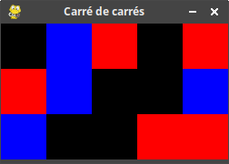

# T2.1 Tableaux à plusieurs dimensions

## 2.1.7 Listes de listes
Nous avons vu qu'une liste pouvait contenir des éléments de tous types : des entiers, des chaines des caractères... et pourquoi pas une liste qui contient des listes ?

On obtient alors un tableau à deux dimensions... qu'on appelle également **matrice**.

!!! note "Exemple"
    La liste ```tab``` ci-dessous est composée de 3 listes qui elles-mêmes contiennent trois nombres :
    ```python
    tab =  [[3, 5, 2],
            [7, 1, 4], 
            [8, 6, 9]]
    ```

    On accède aux *lignes* du tableau avec un simple crochet:

    ```python 
    >>> tab[1]
    [7, 1, 4]
    ```
    
    Et aux éléments par un double crochet:

    ```python 
    >>> tab[2][1]
    6
    ```
    
    {: .center width=30%}

{{ initexo(0) }}

!!! example "{{ exercice() }}"
    === "Énoncé"
        On considère le jeu du Morpion (ou *Tic-Tac-Toe*) dont la surface de jeu vierge est representée par le tableau :  
        ```python
         tab = [[' ', ' ', ' '], [' ', ' ', ' '], [' ', ' ', ' ']]
        ``` 

        Les premiers coups joués sont ceux-ci :

        - ```tab[1][1] = 'X'``` 
        - ```tab[2][1] = 'O'``` 
        - ```tab[2][2] = 'X'``` 
        - ```tab[0][0] = 'O'``` 

        Quel coup doit maintenant jouer le joueur  `'X'` pour s'assurer la victoire ?

    === "Correction"
        {{ correction(True,
        "
        ```python
        tab[0][2] = 'X'
        # ou
        tab[1][2] = 'X'
        ```
        "
        ) }}


## 2.1.8 Parcours d'une liste de listes

!!! note "Exemple"

    - Parcours par éléments :
    ```python linenums='1'
    for ligne in tab:
        for elt in ligne:
            print(elt)
    ```

    - Parcours par indice :
    ```python linenums='1'
    for i in range(3):
        for j in range(3):
            print(tab[i][j])
    ```

!!! example "{{ exercice() }}"
    === "Énoncé"
        On considère la liste ```m``` ('m' comme *matrice*) suivante :  

        ```python
        m = [[1, 9, 4], [4, 1, 8], [7, 10, 1]]
        ```  

        Quelle est la somme de tous les nombres de la matrice ```m``` ?

    === "Correction"
        {{ correction(True,
        "
        ```python linenums='1'
        m = [[1, 9, 4], [4, 1, 8], [7, 10, 1]]

        somme = 0
        for ligne in m:
            for elt in ligne:
                somme += elt

        print(somme)
        ```
        "
        ) }}

## 2.1.9 Exercices

!!! example "{{ exercice() }}"
    === "Énoncé" 
        On modélise un labyrinthe rectangulaire par un tableau à deux dimensions d'entiers dans lequel:
        
        - 0 représente une case vide, hors case de départ et arrivée;
        - 1 représente un mur;
        - 2 représente le départ du labyrinthe;
        - 3 représente l'arrivée du labyrinthe.

        Ce labyrinthe est donné par :

        ```python
        laby = [[2, 1, 0, 1, 0, 0, 0, 1], [0, 1, 0, 0, 0, 1, 0, 0], [0, 1, 1, 0, 1, 1, 1, 0], [0, 0, 1, 0, 1, 0, 0, 0], [1, 0, 0, 0, 1, 3, 1, 0]]
        ```
        
        1. Quelle instruction permet de récupérer la hauteur du labyrinthe (c'est-à-dire le nombre de lignes du tableau)?
        2. Quelle instruction permet de récupérer la largeur du labyrinthe (c'est-à-dire le nombre de colonnes du tableau)?
        3. Écrire un programme qui affiche successivement les lignes de ce tableau (pour visualiser plus facilement le labyrinthe).
        4. Proposer un chemin - c'est-à-dire les éléments `laby[i][j]` - du départ vers l'arrivée du labyrinthe.


    === "Correction" 
        {{ correction(True, 
        "
        1. Le nombre de lignes correspond au nombre d'élément de la liste `laby`, c'est-à-dire `len(laby)`.
        2. Le nombre de colonnes correspond au nombre d'éléments de chaque ligne, c'est-à-dire de chaque élément de la liste `laby`. En général on choisit la première, donc l'instruction est `len(laby[0])`.
        3. Par exemple:

            ```python linenums='1'
            for ligne in laby:
                print(ligne)    
            ```
        
        4. `#!py chemin = [laby[0][0], laby[1][0], laby[2][0], laby[3][0], laby[3][1], laby[4][1], laby[4][2], laby[4][3], laby[3][3], laby[2][3], laby[1][3], laby[1][4], laby[0][4], laby[0][5], laby[0][6], laby[1][6], laby[1][7], laby[2][7], laby[3][7], laby[3][6], laby[3][5], laby[4][5]]`
        "
        ) }}


!!! example "{{ exercice() }}"
    === "Énoncé" 
        Dans le fichier [`input.txt`](../data/input.txt) (à télécharger) est contenu un tableau de châines de caractères.
        
        Le code suivant permet de lire ce fichier et de convertir ces chaînes de caractères en une liste de listes (un tableau à 2 dimensions).
        
        ```python
        tab = [list(row) for row in open('input.txt').read().splitlines()]
        ```
        
        1. Quelles sont les dimensions de ce tableau?        
        2. Dans ce tableau, seules deux lettres sont en majuscules. Récupérer leurs indices...

    === "Correction" 
        {{ correction(True, 
        "
        ```python linenums='1'
        tab = [list(row) for row in open('input.txt').read().splitlines()]
        for i in range(len(tab)):
            for j in range(len(tab[i]): # ou len(tab[0]) puisque le tableau est «rectangulaire»
                if ord(tab[i][j]) < 97:
                    print(f\"Majuscule {tab[i][j]} trouvée en ligne {i} et colonne {j}\")
        ```
        
        "
        ) }}


!!! example "{{ exercice() }}"
    === "Énoncé" 
        Dans le thème T6.1.2, à l'exercice 6 de la série 4 avec Pygame, le code suivant permettait de tracer un «carré de carrés» dont la couleur était choisie aléatoirement.

        ```python linenums='1'
        from random import randint
        import pygame
        from pygame.locals import *

        pygame.init()

        fenetre = pygame.display.set_mode((500, 500))
        pygame.display.set_caption("Carré de carrés")

        for i in range(20):
            for j in range(20):
                couleur = (randint(0, 255), randint(0, 255), randint(0, 255))
                pygame.draw.rect(fenetre, couleur, (25*i, 25*j, 50, 50))

        pygame.display.flip()

        # Boucle des événements
        continuer = True
        while continuer:
            for evenement in pygame.event.get():    #Attente des événements
                if evenement.type == QUIT:
                    continuer = False

        # Sortie
        pygame.quit()
        
        ```
        
        Adapter ce code pour représenter un tableau donné dont les éléments sont des «codes» couleur. 
        
        Par exemple, le tableau:

        ```python linenums='1'
        exemple = [[0, 2, 1, 0, 1],
                   [1, 2, 0, 0, 2],
                   [2, 0, 0, 1, 1]]
        ```
        
        où le 0 représente le noir, le 1 le rouge et le 2 le bleu sera affiché ainsi:

        {: .center} 
        
        On pourra écrire une fonction qui prend le tableau en paramètre ainsi que le côté en pixels des petits carrés.
    === "Correction" 
        {{ correction(False, 
        "
        "
        ) }}