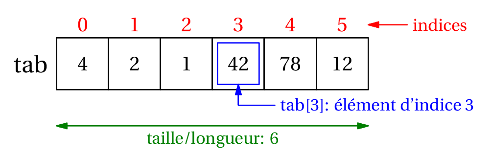

# T2.2 Tableaux et listes

## 2.2.1 Notion de tableau, indices

En informatique (comme ailleurs...), un tableau permet de stocker de façon structurée plusieurs valeurs, en général de même type[^1].

[^1]: même si Python l'autorise, il n'y a pas beaucoup de situations où on va créer un tableau avec des valeurs de types différents.

Voici comment on se représente traditionnellement un tableau de 6 entiers, avec des cases (ou cellules):

{: .center width=50%} 

Bien entendu, il faut stocker ce tableau dans un variable et lui donner un nom. Appelons-le `t`. Ce tableau est **ordonné**, le premier élément est 4, le deuxième est 2, et le dernier est 12.

On repère chaque élément du tableau par sa position, le numéro de la case, qu'on appelle **indice**.

{: .center width=50%} 

Généralement, on utilise la notation `t[i]` pour désigner l'élement d'indice `i` du tableau `t`. Par exemple, dans notre exemple, `t[3]` contient la valeur 42.

Enfin la **taille** d'un tableau est le nombre d'éléments qu'il contient. Ici le tableau `t` a une taille égale à 6.

## 2.2.2 Tableau et liste de Python

!!! abstract "Le type `list`"
    En Python, on implémente le type abstrait de tableau par le type `list`. On définit un tableau avec des **crochets** et on sépare ses éléments par des **virgules**. Par abus de langage on parle de liste plutôt que de tableau[^2].

    Une liste vide se déclarera par `[]`.

    [^2]: en fait la liste est un autre type abstrait de données en informatique. Python identifie un peu les deux. C'est un peu plus compliqué en réalité, mais c'est une autre histoire...

    ```python
    >>> t = [4, 2, 1, 42, 78, 12]
    >>> type(t)
    <class 'list'>
    >>> t[3]
    42
    >>> len(t)
    6
    >>> t[6]
    Traceback (most recent call last):
    File "<pyshell>", line 1, in <module>
    IndexError: list index out of range
    >>> t[-1]
    12
    >>> liste_vide = []
    >>> len(liste_vide)
    0
    ```

**Remarques**:

- on obtient la taille d'une liste avec la fonction `len`;
- un indice supérieur à `len(t) - 1` provoque une erreur `IndexError: list index out of range` (en dehors de la liste);
- on peut utiliser les indices négatifs: en particulier l'indice -1 permet d'accèder facilement au **dernier** élement.

## 2.2.3 Modification de liste

En Python, les objets de type `list` sont modifiables (on emploie le mot *mutable*). Et c'est souvent une bonne chose, car des listes peuvent évoluer après leur création. 

!!! abstract "Modification d'un élément existant"
    On modifie un élément du tableau par simple affectation, en écrasant sa valeur avec la nouvelle.

    ```python 
    >>> famille = ["Bart", "Lisa", "Maggie"]
    >>> famille[0] = "Bartholomew" # oui, c'est son vrai nom
    >>> famille
    ['Bartholomew', 'Lisa', 'Maggie']   
    ```

!!! abstract "Ajout d'un élément en fin de liste"
    La méthode `append` permet d'ajouter un élément en fin de liste (et donc d'augmenter la taille de la liste).

    ```python 
    >>> famille = ["Bart", "Lisa", "Maggie"]
    >>> famille.append("Homer")
    >>> famille
    ['Bart', 'Lisa', 'Maggie', 'Homer']  
    ```

!!! abstract "Suppression d'un élément"
    La métode `remove` permet de supprimer la **première** occurrence de l'élément (et seulement la première). À condition bien entendu que l'élément soit dans la liste...

    ```python 
    >>> matieres = ["nsi", "maths", "anglais", "français", "maths"]
    >>> matieres.remove("maths")
    >>> matieres
    ["nsi", "anglais", "français", "maths"]
    >>> matieres.remove("espagnol")
    Traceback (most recent call last):
    File "<pyshell>", line 1, in <module>
    ValueError: list.remove(x): x not in list
    ```
    
    
## 2.2.4 Création de listes

Jusqu'à présent on a créé des listes en *extension*, c'est-à-dire qu'on a écrit tous les éléments un par un entre crochets. Voici deux autres façons de faire, souvent pratiques et parfois plus rapides lorsque la taille de la liste est grande.

!!! info "Avec une boucle `for`"
    On crée une liste vide, puis on lui ajoute élément par élément.

    Création d'une liste contenant les entiers multiples de 3 ou de 5 inférieurs à 100:
    
    ```python linenums='1'
    multiples = []
    for k in range(101):
        if k%3 == 0 or k%5 == 0:
            multiples.append(k)
    ```
    
!!! info "Élements identiques"
    Il est souvent pratique d'initialiser une liste de taille donnée, souvent en la remplissant de la même valeur, souvent 0.
    Par exemple, pour produire une liste contenant 26 zéros:

    ```python
    >>> lst = 26 * [0]
    >>> lst
    [0, 0, 0, 0, 0, 0, 0, 0, 0, 0, 0, 0, 0, 0, 0, 0, 0, 0, 0, 0, 0, 0, 0, 0, 0, 0]
    ```

## 2.2.5 Parcours de listes

Il existe principalement deux méthodes pour parcourir une liste: par ses éléments ou par les indices. Mais dans les deux cas on utilise une boucle `for`.

!!! abstract   "Parcours par élément"
    On l'a déjà rencontré sur la boucle `for`:

    ```python linenums='1'
    famille = ["Bart", "Lisa", "Maggie"]
    for membre in famille:
        print(membre)
    ```
    affichera:
    ```python
    Bart
    Lisa
    Maggie
    ```

!!! abstract "Parcours par indice"
    Chaque élément étant accessible par son indice (de `0` à `len(liste) - 1` ), il suffit de faire parcourir à une variable `i` l'ensemble des entiers de `0` à `len(liste) - 1`, par l'instruction `range(len(liste))` :

    Le code suivant affichera donc la même chose que le précédent:
    ```python linenums='1'
    famille = ["Bart", "Lisa", "Maggie"]
    for i in range(len(famille)):
        print(famille[i])
    ```


## 2.2.6 Exercices

{{ initexo(0) }}

!!! example "{{ exercice() }}"
    === "Énoncé" 
        Dans la liste suivante:
        
        - remplacer `"Loki"` par `"Thor"`
        - ajouter `"Dr. Strange"`
        - supprimer l'intrus.

        ```python
        avengers = ["Black Widow", "Captain America", "Loki", "Iron Man", "Hulk", "Batman", "Hawkeye"]
        ```
        
    === "Solution" 
        {{ correction(True, 
        "
        ```python
        avengers[2] = 'Thor'
        avengers.append('Dr. Strange')
        avengers.remove('Batman')
        ```
        
        "
        ) }}
!!! example "{{ exercice() }}"
    === "Énoncé" 
        Construire une liste de 100 éléments tous égaux à 0. Puis remplacer tous les éléments d'indice impair par des 1.

    === "Solution" 
        {{ correction(True, 
        "
        ```python linenums='1'
        lst = 100 * [0]
        for k in range(100):
            if k%2 != 0:
                lst[k] = 1
        ```        
        "
        ) }}

!!! example "{{ exercice() }}"
    === "Énoncé"
        Trouvez le nombre qui est **exactement à la même place** dans la liste `list1` et dans la liste `list2`, sachant que :

        - les deux listes ont la même taille
        - vous n'avez droit qu'à une seule boucle ```for```. 

        ```python
        list1 = [8468, 4560, 3941, 3328, 7, 9910, 9208, 8400, 6502, 1076, 5921, 6720, 948, 9561, 7391, 7745, 9007, 9707, 4370, 9636, 5265, 2638, 8919, 7814, 5142, 1060, 6971, 4065, 4629, 4490, 2480, 9180, 5623, 6600, 1764, 9846, 7605, 8271, 4681, 2818, 832, 5280, 3170, 8965, 4332, 3198, 9454, 2025, 2373, 4067]
        list2 = [9093, 2559, 9664, 8075, 4525, 5847, 67, 8932, 5049, 5241, 5886, 1393, 9413, 8872, 2560, 4636, 9004, 7586, 1461, 350, 2627, 2187, 7778, 8933, 351, 7097, 356, 4110, 1393, 4864, 1088, 3904, 5623, 8040, 7273, 1114, 4394, 4108, 7123, 8001, 5715, 7215, 7460, 5829, 9513, 1256, 4052, 1585, 1608, 3941]
        ```
        
    === "Solution"
        {{ correction(True,
        "
        ```python linenums='1'
        list1 = [8468, 4560, 3941, 3328, 7, 9910, 9208, 8400, 6502, 1076, 5921, 6720, 948, 9561, 7391, 7745, 9007, 9707, 4370, 9636, 5265, 2638, 8919, 7814, 5142, 1060, 6971, 4065, 4629, 4490, 2480, 9180, 5623, 6600, 1764, 9846, 7605, 8271, 4681, 2818, 832, 5280, 3170, 8965, 4332, 3198, 9454, 2025, 2373, 4067]
        list2 = [9093, 2559, 9664, 8075, 4525, 5847, 67, 8932, 5049, 5241, 5886, 1393, 9413, 8872, 2560, 4636, 9004, 7586, 1461, 350, 2627, 2187, 7778, 8933, 351, 7097, 356, 4110, 1393, 4864, 1088, 3904, 5623, 8040, 7273, 1114, 4394, 4108, 7123, 8001, 5715, 7215, 7460, 5829, 9513, 1256, 4052, 1585, 1608, 3941]

        for i in range(len(list1)):
            if list1[i] == list2[i]:
                print(list1[i])
        ```
        "
        ) }}

!!! example "{{ exercice() }}"
    === "Énoncé" 
        On considère la liste 
        
        ```python
        temp = [11, 28, -16, -18, -10, 16, 10, 16, 2, 7, 23, 22, -4, -2, 19, 16, 22, -8, 18, -14, 29, -1, 16, 22, -5, 6, 2, -4, 9, -17, -13, 22, 14, 24, 22, -9, -18, -9, 25, -11, 17, 17, 25, -10, 2, -18, 29, 14, -16, 7]
        ```

        Construire la liste `temp_pos` qui ne contient que les éléments positifs de `temp`. 
    === "Solution" 
        {{ correction(True, 
        "
        ```python linenums='1'
        temp_pos = []
        for t in temp:
            if t >= 0:
                temp_pos.append(t)
        ```
        "
        ) }}

!!! example "{{ exercice() }} (BNS)"
    === "Énoncé" 
        Programmer la fonction `recherche`, prenant en paramètre un tableau non vide `tab` (type `list`) d'entiers et un entier `n`, et qui renvoie l'indice de la dernière occurrence de l'élément cherché. Si l'élément n'est pas présent, la fonction renvoie la longueur du tableau.

        Exemples :

        ```python 
        >>> recherche([5, 3],1)
        2
        >>> recherche([2,4],2)
        0
        >>> recherche([2,3,5,2,4],2)
        3

        ```
    
    === "Solution" 
        {{ correction(True, 
        "
        ```python linenums='1'
        def recherche(tab: list, n: int) -> int:
            '''
            Renvoie l'indice de la dernière occurence de l'entier n dans la liste tab.
            Si tab est vide, renvoie la longueur de la liste tab.
            '''
            indice_max = len(tab) # valeur par défaut si tab est vide
            for i in range(len(tab)):
                if tab[i] == n:
                    indice_max = i
            return i
        ```
        
        "
        ) }}

!!! example "{{ exercice() }}"
    === "Énoncé" 
        Construire une liste de taille 26 contenant le nombre d'occurences de chaque lettre de l'alphabet dans le texte suivant:

        ```python 
        texte_long = '''
        mpaowhuqhvyywtvypjkfrrasexnwzrgpargvpjlfbjsxxjipjgkyscgdiqswpvpbzigfkljhicuftshk
        qekwqojwchsgyuvakynjpxlacrnbojawdisjzbcqjflhgqofhccdxnqpbnxcxcypawaqgzbikretwlkf
        qodnoseirzvssdczsyczqjbugcgjuorxciblnojkvygxqirysffsmjyokjdsxlymjokgodupumjoxcmi
        teeenikwlkzidirjnmexsmqjefsgpbpoynusfpudmxwcwrzzqzuobjtlyshbvvgjkhoujsdlnsyfshuu
        mfmqmssbyrzybswyswbdmqmcwsdudrfdnmlmnchossxcwarfmpkrcqcyvyjkplzexrnebukxhqbnzkgh
        nalfpkxghypaimemqzmcreozagufiljxdmgrwftyajtonfisefxujtdmpgxttugxhvpgdqhvgzohovbe
        qaafwqfiokzhtbxgoxpzzvbswlxdtykgufqevlmjjrddufrogzsfzzuaqpqfzinvmfpcylgftkkhqylp
        rgzywwefwghhrivsjtvbbcixhztwujdqqesdertmtwdricrzmwsibhstsgnnxbvqnyklcbrcxtycvcww
        ojphbqyrjffndkgwqfqvarfupklwwixekudmbspqtydkegltqvwjzfooscehpnfwvvnkrxsfakwezvol
        mpvnprcrwomddjneyrhpxmnrveibxqxcjluezypvsbfudilpjdqflsdhwucjgtusxjjcnewamoewwjhu
        '''
        ```
        
    === "Solution" 
        {{ correction(True, 
        "
        ```python linenums='1'
        occurences = 26 * [0]
        for lettre in texte_long:
            indice = ord(lettre) - ord('a')
            occurences[indice] += 1
        ```
        "
        ) }}


{: .center width=50%} 