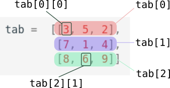

# T2.2 Tableaux à plusieurs dimensions

Nous avons vu qu'une liste pouvait contenir des éléments de tous types : des entiers, des chaines des caractères... et pourquoi pas une liste qui contient des listes ?

On obtient alors un tableau à deux dimensions... qu'on appelle également **matrice**.

!!! note "Exemple"
    La liste ```tab``` ci-dessous est composée de 3 listes qui elles-mêmes contiennent trois nombres :
    ```python
    tab =  [[3, 5, 2],
            [7, 1, 4], 
            [8, 6, 9]]
    ```

    On accède aux *lignes* du tableau avec un simple crochet:

    ```python 
    >>> tab[1]
    [7, 1, 4]
    ```
    
    Et aux éléments par un double crochet:

    ```python 
    >>> tab[2][1]
    6
    ```
    
    {: .center width=30%}

{{ initexo(0) }}

!!! example "{{ exercice() }}"
    === "Énoncé"
        On considère le jeu du Morpion (ou *Tic-Tac-Toe*) dont la surface de jeu vierge est representée par le tableau :  
        ```python
         tab = [[' ', ' ', ' '], [' ', ' ', ' '], [' ', ' ', ' ']]
        ``` 

        Les premiers coups joués sont ceux-ci :

        - ```tab[1][1] = 'X'``` 
        - ```tab[2][1] = 'O'``` 
        - ```tab[2][2] = 'X'``` 
        - ```tab[0][0] = 'O'``` 

        Quel coup doit maintenant jouer le joueur  `'X'` pour s'assurer la victoire ?

    === "Correction"
        {{ correction(True,
        "
        ```python
        tab[0][2] = 'X'
        # ou
        tab[1][2] = 'X'
        ```
        "
        ) }}


### Parcours d'une liste de listes

!!! note "Exemple"

    - Parcours par éléments :
    ```python linenums='1'
    for ligne in tab:
        for elt in ligne:
            print(elt)
    ```

    - Parcours par indice :
    ```python linenums='1'
    for i in range(3):
        for j in range(3):
            print(tab[i][j])
    ```

!!! example "{{ exercice() }}"
    === "Énoncé"
        On considère la liste ```m``` ('m' comme *matrice*) suivante :  

        ```python
        m = [[1, 9, 4], [4, 1, 8], [7, 10, 1]]
        ```  

        Quelle est la somme de tous les nombres de la matrice ```m``` ?

    === "Correction"
        {{ correction(True,
        "
        ```python linenums='1'
        m = [[1, 9, 4], [4, 1, 8], [7, 10, 1]]

        somme = 0
        for ligne in m:
            for elt in ligne:
                somme += elt

        print(somme)
        ```
        "
        ) }}
