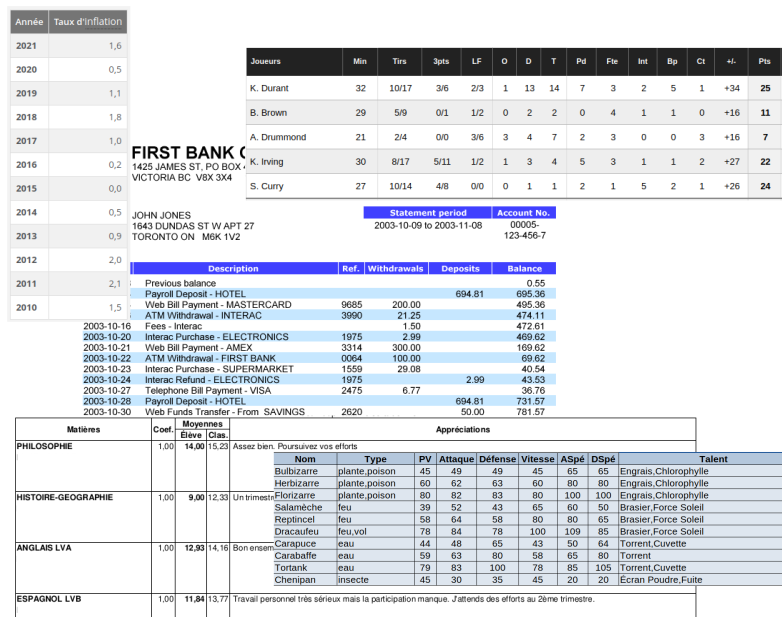

# T3.1 Tables de données

## 3.1.1 Données tabulées

Lorsqu'on souhaite manipuler des données, il est très fréquent de les présenter sous forme de tableaux: extrait de compte bancaire, bulletin scolaire, statistiques sportives, etc.  On parle alors de *données tabulées*.

{: .center} 


Ces tables sont le principal moyen de stocker des données structurées, et il est très important de savoir traiter efficacement ces données pour en tirer de l'information. 

!!! abstract "Vocabulaire"
    - une table est une collection d'**enregistrements**;
    - chaque enregistrement contient des valeurs correspondant aux **champs** ou **attributs** de la table (des enregistrements).

    | pseudo | catégorie | score | classement |
    |:-:|:-:|:-:|:-:|
    |Loyche|Emojibots|165|8|
    |perl43|Emojibots|113|10|
    |cgouygou|Cybermen|438|4|
    |clement_77|Cybermen|242|11|
    |h25 (ClementHammel, MathisHammel)|Daleks|591|1|
   
    Dans la table ci-dessus, les champs/attributs sont `'pseudo'`, `'catégorie'`, `'score'` et `'classement'` et chaque ligne est un enregistrement.


!!! code "Représentation des tables en Python"
    Puisque chaque enregistrement contient une valeur pour chaque champ de la table, il paraît naturel de représenter chaque enregistrement par un **dictionnaire**.
    
    Par exemple, le premier enregistrement de la table précédente est 
    ```python 
    {'pseudo': 'Loyche', 'catégorie': 'Emojibots', 'score': 165, 'classement': 8}
    ```
    
    
    Une table sera donc représentée par une **liste de dictionnaires**.

## 3.1.2 Fichiers CSV

Les tables de données que nous manipulerons sont représentées par des fichiers au format `csv` (*comma separated values*) qui est un format fréquemment utilisé pour importer ou exporter des données tabulées.

C'est un simple fichier texte dans lequel la première ligne contient les champs, et chaque ligne suivante les enregistrements. Les champs et valeurs sont séparées par un **délimiteur**, généralement la **virgule** (*comma* in english).

!!! warning "Virgule ou point-virgule?"
    Il peut être nécessaire (comme dans l'exemple de la table précédente) de conserver la virgule pour séparer une valeur composite. On utilise alors parfois le point-virgule pour séparer les champs et valeurs... 
    Lors de l'import d'un fichier `csv` avec un tableur, il faut préciser à l'ouverture quel délimiteur il faut utiliser. 

!!! example "Exercice"
    - Télécharger [ce fichier](../data/pokedex.csv){:target="_blank"}  et l'ouvrir avec LibreOffice Calc. Observer l'importance de préciser les délimiteurs.
    - L'ouvrir ensuite avec l'éditeur de texte (`gedit`) pour observer sa construction.


!!! code "Charger un fichier CSV avec Python"
    Avec une ouverture classique de fichier texte, les données importées sont sous forme d'une liste, dont la première valeur contient les champs, et les autres les enregistrements:

    ```python
    >>> data = open('pokedex.csv').read().splitlines()
    >>> data[:5]
    ['No;Nom;Type;PV;Attaque;Défense;Vitesse;ASpé;DSpé;Talent;Nom US;code', '1;Bulbizarre;plante,poison;45;49;49;45;65;65;Engrais,Chlorophylle;Bulbasaur;77140', '2;Herbizarre;plante,poison;60;62;63;60;80;80;Engrais,Chlorophylle;Ivysaur;67530', '3;Florizarre;plante,poison;80;82;83;80;100;100;Engrais,Chlorophylle;Venusaur;65357', '4;Salamèche;feu;39;52;43;65;60;50;Brasier,Force Soleil;Charmander;10140']
    ```
    Pour obtenir une liste de dictionnaires, il faudrait donc retravailler ces données (c'est un bon exercice, je vous le conseille...).

    On va donc plutôt utiliser un module dédié à la manipulation de fichiers au format `csv`, le module ... `csv`:

    ```python linenums='1' title="Code-type d'importation d'un fichier CSV"
    import csv

    with open('pokedex.csv') as f:       # (1)
        table = list(csv.DictReader(f, delimiter=';')) # (2)
    ```

    1. On charge le fichier dans une variable `f`
    2. On applique la fonction `DictReader` du module `csv` au fichier, **en précisant le délimiteur** et enfin en convertissant en type `list`.

    !!! warning "Problème de version de Python"
        Je me suis aperçu qu'avec le code précédent, `#!py table` est une liste d'objets de type `#!py OrderDict` et non de type `#!py dict`. Cela est dû à une version trop anicenne sur les VM...
        En attendant, on peut convertir les objets ainsi, en créant la liste en compréhension:

        ```python linenums='1'
        import csv

        with open('pokedex.csv') as f:
            table = [dict(ligne) for ligne in csv.DictReader(f, delimiter=';')]
        ```
        
    
!!! example "Exercice"
    Exécuter le code précédent et contrôler que la variable `table` est bien une liste de dictionnaires avec l'inspecteur d'objet de Thonny.


## 3.1.3 Export en csv

!!! code "Écrire un fichier CSV"
    Le module `csv` permet également d'exporter une table (une liste de dictionnaires, donc) vers un fichier CSV, avec la fonction `DictWriter`.

    ```python linenums='1' title="Code-type d'exportation d'une table vers un fichier CSV"
    def export_csv(nomfichier: str, table: list, champs: list) -> None:
        '''
        Écrit dans un fichier le contenu d'une table connaissant ses champs.

        - nomfichier: le nom du fichier à créer, d'extension csv. S'il existe, il sera écrasé, 
        sinon il sera créé.
        - table: la table à exporter dans le fichier.
        - champs: une liste de str contenant les intitulés des champs de la table.
        '''
        with open(nomfichier, "w") as sortie:
            w = csv.DictWriter(sortie, champs)
            w.writeheader()
            w.writerows(table)
    ```
    