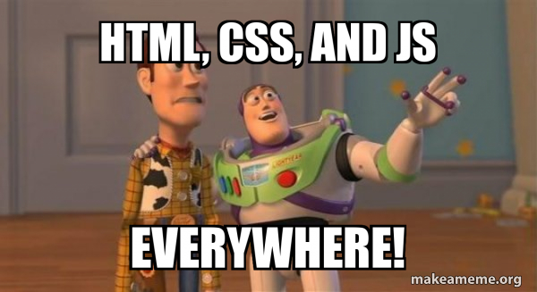

# T4.1 HTML & CSS

{: .center} 

On commence par s'intéresser au cas le plus simple, celui où le serveur renvoie une page unique, identique pour tous les utilisateurs. De plus, l'utilisateur ne pourra pas agir sur sa page : il n'y a aucune interactivité.

{: .center} 

!!! tip "Sources de l'Escape Game"
    Vous pouvez prendre modèle sur la source du site de l'escape game en la téléchargeant [ici](http://lyceevalois.com/nsi/WebEscapeGame.zip){:target="_blank"}.


## 4.1.1 Les bases de HTML

Nous allons nous intéresser à un acteur fondamental du développement web, le couple HTML+CSS (Hyper Text Markup Langage et Cascading Style Sheets).

{: .center width=50%} 

Dans un premier temps, nous allons exclusivement nous intéresser au HTML. Qu'est-ce que le HTML, voici la définition que nous en donne Wikipedia :

> L’Hypertext Markup Language, généralement abrégé HTML, est le format de données **conçu pour représenter les pages web**. C’est un **langage de balisage** permettant d’écrire de l’hypertexte, d’où son nom. HTML permet également de structurer sémantiquement et de mettre en forme le contenu des pages, d’inclure des ressources multimédias, dont des images, des formulaires de saisie, et des programmes informatiques. Il permet de créer des documents interopérables avec des équipements très variés de manière conforme aux exigences de l’accessibilité du web. Il est souvent utilisé conjointement avec des langages de programmation (JavaScript) et des formats de présentation (feuilles de style en cascade).

On retiendra que HTML est un langage dit « à balises ». Ce n'est pas à proprement parler un langage de programmation, mais un langage de **description** de contenu. Il a été inventé en 1992 par [Tim Berners-Lee](https://fr.wikipedia.org/wiki/Tim_Berners-Lee){:target="_blank"}. La version actuellement utilisée est le `html5`.

!!! info "Balises"
    Voici un site pour apprendre le fonctionnement des balises :
    
    [https://developer.mozilla.org/fr/docs/Apprendre/HTML/Introduction_%C3%A0_HTML/Getting_started](https://developer.mozilla.org/fr/docs/Apprendre/HTML/Introduction_%C3%A0_HTML/Getting_started){:target="_blank"} 

!!! note "Exemple complet minimal"
    Ouvrir l'éditeur de texte `gedit` et y coller le code suivant. Enregistrer le document sous le nom `exemple_minimal.html` par exemple, dans un dossier `HTML`. Puis l'ouvrir avec un navigateur (Firefox).

    === "`<head>`"
        ```html hl_lines="3-6" 
        <!DOCTYPE html> 
        <html>
            <head>                                      <!-- (1) -->
                <meta charset="utf-8">
                <title>Titre très original</title>
            </head>
            <body>
                <h1>Une belle page web</h1>
                <p>
                    Un texte très <strong>intéressant</strong>.
                </p>
                <br>
                <a href="http://lyceevalois.com/lmdv">Un lien</a>
                <!-- Un commentaire... -->
            </body>
        </html>
        ```

        1. La balise `<head>` regroupe l'entête du document: à part le titre, aucun des éléments de l'entête n'est affiché sur la page.
    
    === "`<body>`"
        ```html hl_lines="7-15" 
        <!DOCTYPE html> 
        <html>
            <head>                                      <!-- (1) -->
                <meta charset="utf-8">
                <title>Titre très original</title>
            </head>
            <body>
                <h1>Une belle page web</h1>
                <p>
                    Un texte très <strong>intéressant</strong>.
                </p>
                <br>
                <a href="http://lyceevalois.com/lmdv">Un lien</a>
                <!-- Un commentaire... -->
            </body>
        </html>
        ```

        1. La balise `<body>` regroupe tous les éléments qui structurenet et composent la page.

{{ initexo(0) }}

!!! example "{{ exercice() }}"
    === "Énoncé" 
        Répondre à  l'aide de recherches sur le web.

        1. Quelle est la signification des balises de ce code minimal?
        2. Quelles sont les balises contenant un *attribut*?
        3. L'indentation est-elle obligatoire?
        4. Quelle est l'erreur dans l'extrait de code suivant?
        ```python linenums='1'
        <balise1>
            <balise2>
            </balise1>
        </balise2>
        ```
        5. Quelle est la balise permettant d'insérer une image dans une page web? Combien d'attributs obligatoires comporte-t-elle?

        
    === "Correction" 
        {{ correction(False, 
        "
        "
        ) }}

On peut donner des attributs pour mettre en forme les différents éléments.

Modifier par exemple dans l'exemple précédent:

```html
<h1 style="color: #FF0000;">Une belle page web</h1>
<p style="text-align: center;">
    Un texte très <strong>intéressant</strong>.
</p>
```

Pour l'instant, cela fera l'affaire, mais c'est une très mauvaise pratique, qu'on abandonnera dès la section suivante...


!!! example "{{ exercice() }}"
    === "Énoncé" 
        Créer une page web, présentant la biographie de la personnalité qui vous a été attribuée:

        |    Élève    | Personnalité                     |
        |:-----------:|:--------------------------------:|
        |    Télio    | John Von Neumann                 |
        |   Maxime    | Ada Lovelace                     |
        |     Léa     | Dorothy Johnson Vaughan          |
        | Aléa-Eddine | George Boole                     |
        |   Théo      | Tim Berners-Lee                  |
        |     Anis    | Linus Torvalds                   |
        |    Lucas    | Aaron Swartz                     |
        |   Younes    | Margaret Hamilton                |
        | Maximilien  | Whitfield Diffie & Martin Hellman|
        |  Guillaume  | Hedy Lamarr                      |
        |   Basit     | Guido Van Rossum                 |
        |   Gaylord   | Steve Jobs                       |
        |   Zachary   | Donald Knuth                     |
        |   Nicolas   | Grace Hopper                     |
        |    Sacha    | Larry Page & Sergueï Brin        |

        La page web devra comporter (*a minima*):

        - le nom de la personne en titre (centré);
        - une image (centrée);
        - la biographie sous forme d'une liste non numérotée (unordered list);
        - un lien vers vos sources, qui doit s'ouvrir dans un nouvel onglet.

        **Exemple de rendu:**

        {: .center width=640} 
    === "Correction" 
        {{ correction(False, 
        "
        "
        ) }}


## 4.1.2 Avec CSS

L'acronyme CSS signifie Cascading Style Sheets. L'idée est de regrouper dans un seul fichier toutes les informations relatives à la mise en forme des éléments de la page html.

De manière très simplifiée, on peut dire que le fichier `html` s'occupe du fond tandis que le fichier `css` s'occupe de la forme.

Le fichier CSS (souvent nommé `style.css`) doit être référencé au début du fichier `html` , au sein de la balise `<head>` en y ajoutant cette ligne:

```html
<link href="style.css" rel="stylesheet" type="text/css" />
```


!!! note "Un exemple"
    Voici un extrait du fichier css utilisé pour l'escape game d'introduction:

    ```css
    body                                /* note (1) */
    {
        color : #FFFFFF;
        background-color : #000000;
        font-family : monospace;
    }

    h1                                  /* note (2) */
    {
        text-align: center;
        font-style : bold;
        width : 60%;
        font-size : 5em;
        margin-left: auto;
        margin-right: auto;
    }
    
    a                                   /* note (3) */
    {
        font-style : bold;
        color : #C80903;
    }

    .cesar                              /* note (4) */
    {
        margin-left: auto;
        margin-right: auto;
        width : 50%;
        font-size: 4em;
    }
    

    ```

    1. On définit le style par défaut des pages (balise `<body>`): couleurs du texte et du fond, police de caractère).
    2. On définit le sstyle des titres de niveau 1 (balise `<h1>`).
    3. On définit le style des liens (balise `<a>`).
    4. On définit le style de la classe `cesar`.


!!! abstract "Classes"
    Dans l'exemple de code `css`    précédent, j'ai définit un style pour la `class` que j'ai appelée `cesar`.
    
    En fait, `class` est un attribut que l'on peut attribuer à une balise (`div`, `p`, `span`) pour lui appliquer le style correspondant.
    
    Ce que je fait dans la page `/true/level5.html`: 

    ```html
    <p class="cesar">
        Mh vxlv frqqxh srxu dyrlu uhdolvh oh suhplhu yhulwdeoh surjudpph lqirupdwltxh hw xq odqjdjh gh surjudppdwlrq sruwh prq suhqrp.
    </p>
    ```


!!! example "{{ exercice() }}"
    === "Énoncé" 
        Écrire un fichier `css` contenant la mise en forme de votre page web. Celle-ci ne doit plus contenir de mise en forme en attributs de balises.

        Pour s'aider : [https://openclassrooms.com/fr/courses/1603881-apprenez-a-creer-votre-site-web-avec-html5-et-css3/1605060-mettez-en-place-le-css](https://openclassrooms.com/fr/courses/1603881-apprenez-a-creer-votre-site-web-avec-html5-et-css3/1605060-mettez-en-place-le-css){:target="_blank"} 
    === "Correction" 
        {{ correction(False, 
        "
        "
        ) }}


