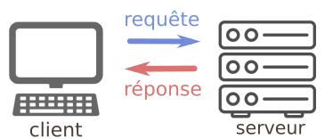
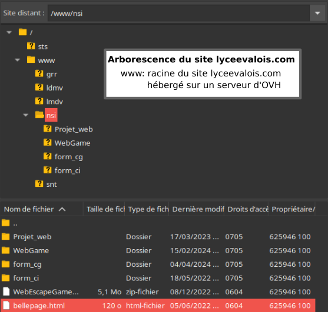
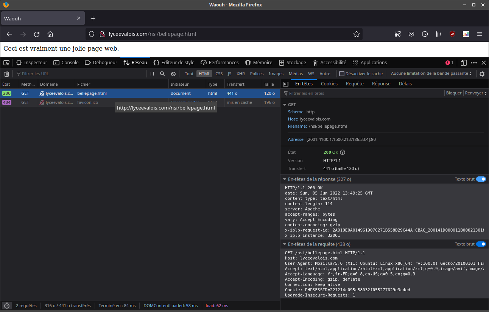

# T4.3 Protocole HTTP
{{ initexo(0) }}

{: .center  width=480} 

## 4.3.1 Le protocole HTTP : des requêtes et des réponses

HTTP (HyperText Transfer Protocol) est le protocole qui régit la communication entre :  

- le client (la machine de l'utilisateur qui souhaite obtenir une page web). On dit que le client effectue une **requête**.  
- le serveur (la machine sur laquelle sont stockés les fichiers nécessaires à l'affichage de cette page web). Le serveur va renvoyer une **réponse**.
 

{: .center}


## 4.3.2 Déroulé d'une requête

Prenons pour exemple la requête d'un navigateur vers la page : [http://lyceevalois.com/nsi/bellepage.html](http://lyceevalois.com/nsi/bellepage.html){:target="_blank"} 

- le navigateur analyse l'url : la demande concerne la page ```nsi/bellepage.html``` (c'est-à-dire le fichier `bellepage.html` du répertoire `nsi/`), stockée sur le serveur ```lyceevalois.com```.  

    {: .center} 
    
- une demande est préalablement effectuée auprès du serveur DNS pour obtenir l'adresse IP du serveur `lyceevalois.com`. Ici, l'adresse IP sera ```2001:41d0:1:1b00:213:186:33:4``` (au format Ipv6, on la retrouvera dans la capture de la fenêtre d'Outils de devéloppement).
- la requête est effectuée sur le port 80 de l'adresse ```2001:41d0:1:1b00:213:186:33:4```.
- la réponse est envoyée au navigateur, qui en extrait la charge utile et procède à l'affichage de la page.

!!! warning "Adresse IP"
    L'adresse IP donnée ci-dessus ne sera peut-être pas la même lorsque vous essaierez chez vous. Cela dépend de l'hébergeur.


## 4.3.3 Analyse d'une requête

!!! abstract "Avec un navigateur"
    - Ouvrir le lien précédent ([http://lyceevalois.com/nsi/bellepage.html](http://lyceevalois.com/nsi/bellepage.html){:target="_blank"} ) **avec Firefox**, puis ouvrir les «Outils de développement» (clic droit sur la page web puis «Inspecter», ou `Ctrl+Maj+I`).
    - Sélectionner l'onglet «Réseau», puis cliquer sur la première ligne, vous devez obtenir ceci (ou à peu près):

    {: .center} 


    Observons à partir de l'Inspecteur d'élément d'un navigateur (ici Firefox) les informations qui transitent lors de la requête et de la réponse.

    === "URL et méthode GET"
        La requête de type GET vers l'url ```http://lyceevalois.com/nsi/bellepage.html``` a généré un code de réponse **200 OK**, ce qui signifie que la requête a été traitée et que la réponse contenant la page a été envoyée.

        On peut trouver à l'adresse [https://developer.mozilla.org/fr/docs/Web/HTTP/Status](https://developer.mozilla.org/fr/docs/Web/HTTP/Status){. target="_blank"} la totalité des codes de réponse possibles. 

        !!! example "{{ exercice() }}"
            === "Énoncé"
                1. En «déroulant» le GET dans la partie **En-têtes** à droite, récupérer l'adresse IP consultée.
                2. Donner la signification des codes réponses 304, 403, 404, 500.

            === "Correction" 
                {{ correction(False, 
                "
                Citons par exemple : 

                - **304 Not Modified** : la page n'a pas eu besoin d'être renvoyée, elle indique au navigateur d'aller la rechercher dans son cache. 
                - **403 Forbidden** : le client n'a pas le droit d'accès à la page.
                - **404 Not Found** : la page demandée est introuvable
                - **500 Internal Server Error** : le serveur a rencontré une erreur qu'il ne sait pas traiter.
                "
                ) }}

    === "Structure de la réponse"
        En observant la taille totale des données transférées (326 octets), on peut comprendre que la réponse faite par le serveur est constituée :

        - d'un **en-tête** (326 octets) qui contient :
        ```
        HTTP/1.1 200 OK
        date: Sun, 05 Jun 2022 15:29:46 GMT
        content-type: text/html
        content-length: 114
        server: Apache
        accept-ranges: none
        vary: Accept-Encoding
        content-encoding: gzip
        x-iplb-request-id: 2A010E0A014961907C271B558D29C44A:CDC4_200141D000011B000213018600330004:0050_629CCBE4_09CC:1CBC3
        x-iplb-instance: 31974
        ``` 
        - du corps de la **réponse** (dont on sait d'après l'en-tête qu'il pèse 114 octets). Ce corps de la réponse est la charge utile de la réponse. Elle contient ici le code html de la page (voir onglet «Réponse», et cocher le bouton «Brut»):
        ```html
        <!DOCTYPE html>
        <html>
        <head>
        <title>Waouh</title>
        </head>
        <body>
        Ceci est vraiment une jolie page web.
        </body>
        </html>
        ```
    === "Remarque"
        On peut observer que le navigateur a aussi effectué (de sa propre initiative) une requête vers un fichier ```favicon.ico``` qui est l'icone de la page web dans les onglets du navigateur ou la barre de favoris. Ce fichier n'a pas été trouvé sur le serveur d'où la réponse **404**.

        De manière générale, une requête vers un site web moins élémentaire va occasionner une multitude de réponses (essayer avec le site web de votre choix).


!!! abstract "Avec Python"

    On peut effectuer des requêtes HTTP avec le module `requests` (l'installer si besoin en ouvrant la console du système avec Thonny, puis taper `#!py pip install requests`). Par exemple, exécuter le code suivant:

    ```python linenums='1'
    import requests
    r = requests.get('http://lyceevalois.com/nsi/bellepage.html')
    ```

    On peut récupérer alors les informations précédentes en consultant dans le terminal:

    ```python linenums='1'
    >>> r
    ...
    >>> r.headers
    {'date': 'Sun, 05 Jun 2022 16:26:27 GMT', 'content-type': 'text/html', 'content-length': '114', 'server': 'Apache', 'accept-ranges': 'bytes', 'vary': 'Accept-Encoding', 'content-encoding': 'gzip', 'x-iplb-request-id': '2A010E0A014961907C271B558D29C44A:D110_200141D000011B000213018600330004:0050_629CD934_10A81:D667', 'x-iplb-instance': '31965'}
    >>> r.content
    b'<!DOCTYPE html>\n<html>\n<head>\n<title>Waouh</title>\n</head>\n<body>\nCeci est vraiment une jolie page web.\n</body>\n</html>\n'
    >>> r.text
    ...
    ```
<!-- 
    !!! info "Utile pour le challenge de la page **T4.4**"
        Remarquez que le `#!py r.text` est un `#!py str` contenant le code `html` de la page demandée. -->
        