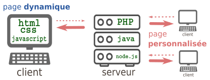

# T4.4 Formulaires, méthodes GET et POST

{: .center width=480} 

## 4.4.1 Pages web dynamiques

Jusqu'à présent, toutes les pages que nous avons étudiées ou créées (avec ou sans Javascript)  sont uniformément envoyées par le serveur au client. Aucune «préparation» de la page en amont n'a lieu sur le serveur, aucun dialogue n'a lieu avec le serveur une fois que la page a été livrée. Évidemment, si le web était comme ceci, il ne serait qu'une gigantesque bibliothèque en consultation seule (ce fut le cas pendant longtemps, et ce qui n'était déjà pas si mal).

Les langages serveurs, parmi lesquels PHP (présent sur environ 80% des serveurs), Python (via le framework Django), Java, Ruby, C#, permettent de rajouter de l'interactivité côté serveur.

!!! abstract "Pages côté serveur"
    === "Page statique"
        Lors d'une requête d'un client vers un serveur, si le client demande la page `bellepage.html`, une copie **exacte** du fichier `bellepage.html` est transmise au client sur sa machine. 
    
    === "Page dynamique"
        Une page web peut être «fabriquée» à la demande pour le client, à l'aide d'un langage comme PHP par exemple.

        {: .center} 

        Par exemple, voici le contenu de la page [http://lyceevalois.com/nsi/form_cg/date.php](http://lyceevalois.com/nsi/form_cg/date.php){:target="_blank"}:

        ```php
        <!DOCTYPE html>
        <html>
            <head>
                <meta charset="utf-8" />
                <title>Quel jour sommes-nous</title>
            </head>
            <body>
            <p>
            <?php
            $date = date("d-m-Y");
            $heure = date("h \h i \m s \s");
            Print("Nous sommes le $date et il est $heure.");
            ?>
            </p>
            <br>
            <p>
            <?php
              function getIp(){
                if(!empty($_SERVER['HTTP_CLIENT_IP'])){
                  $ip = $_SERVER['HTTP_CLIENT_IP'];
                }elseif(!empty($_SERVER['HTTP_X_FORWARDED_FOR'])){
                  $ip = $_SERVER['HTTP_X_FORWARDED_FOR'];
                }else{
                  $ip = $_SERVER['REMOTE_ADDR'];
                }
                return $ip;
              }

              echo 'Votre adresse IP est : '.getIp();
            ?>
            </p>
        </body>
        </html>
        ```

        !!! example "{{ exercice() }}"
            === "Énoncé" 
                1. Consulter cette page en cliquant sur le lien.
                2. Afficher le code source de la page et le comparer au code `php` précédent. Qu'a produit la balise `#!php <?php?>` ?
            === "Correction" 
                {{ correction(False, 
                "
                "
                ) }}
        

## 4.4.2 Formulaires

Un formulaire HTML est créé à l'aide de la balise `#!html <form>` et contient des champs de saisie appelés `#!html <input>` de différents types (cf. le quiz créé en **T4.2**).

Les paramètres du formulaire peuvent alors être transmis via le protocole HTTP par deux méthodes: la méthode **GET** ou la méthode **POST**.

!!! abstract "Méthode GET"
    Voici un exemple de formulaire, inclus dans une page html ouverte dans le navigateur du client (voir un aperçu dans le lien donné à l'exercice suivant):

    ```html 
    Le mot de passe est :
    <form action="cible.php" method="get">
    <p>
        <input type="password" name="pass" /> 
        <input type="submit" value="Valider" />
    </p>
    </form>
    ```

    **Description:**

    - le fichier ```cible.php``` est le fichier sur le serveur qui recevra les paramètres contenus dans le formulaire.
    - le paramètre sera nommé ```pass``` et sera de type ```password```, ce qui signifie qu'on n'affichera pas les caractères tapés par l'utilisateur.
    On aurait pu aussi avoir un type :
        - ```text``` : le texte s'affiche en clair (pour les login par ex) 
        - ```radio``` : pour une sélection (d'un seul élément)
        - ```checkbox``` : pour une sélection (éventuellement multiple)
    - un bouton comportant le label «Valider» déclenchera l'envoi (grâce au type particulier ```submit```) des paramètres (ici un seul, la variable ```pass```) au serveur.

    
    !!! example "{{ exercice() }}: méthode GET et confidentialité"
        === "Énoncé" 
            1. Aller à l'adresse [http://lyceevalois.com/nsi/form_cg/test_get.html](http://lyceevalois.com/nsi/form_cg/test_get.html){:target="_blank"} et tester un mot de passe.
            2. Observer attentivement l'url de la page obtenue. Que remarque-t-on ?
        === "Correction"
            {{ correction(False, 
            "
            Les paramètres passés au serveur par la méthode GET sont transmis **dans l'url de la requête**. Ils sont donc lisibles **en clair** par n'importe qui.

            {: .center}

            Évidemment, c'est une méthode catastrophique pour la transmission des mots de passe. Par contre, c'est une méthode efficace pour accéder directement à une page particulière : ainsi l'url [https://www.google.fr/search?q=angouleme](https://www.google.fr/search?q=angouleme){:target=\"_blank\"} nous amènera directement au résultat de la recherche Google sur le mot-clé «angouleme».
            "
            ) }}

!!! abstract "Méthode POST"
    Dans le code du formulaire précédent, on modifie l'attribut ```method```, auparavant égal à ```"get"``` et le changeant par```"post"```  :

    ```html 
    Le mot de passe est :
    <form action="cible.php" method="post">
    <p>
        <input type="password" name="pass" /> 
        <input type="submit" value="Valider" />
    </p>
    </form>
    ```

    !!! example "{{ exercice() }}: méthode POST et confidentialité"
        === "Énoncé" 
            1. Aller à l'adresse [http://lyceevalois.com/nsi/form_cg/test_post.html](http://lyceevalois.com/nsi/form_cg/test_post.html){:target="_blank"} et tester un mot de passe.
            2. Observer attentivement l'url de la page obtenue. Que remarque-t-on ?
            3. Inspecter la page et retrouver le mot de passe que vous avez saisi.
        === "Correction"
            {{ correction(False, 
            " 
            Les paramètres passés au serveur par la méthode POST ne sont pas visibles dans l'url de la requête. Ils sont contenus dans le corps de la requête, mais non affichés sur le navigateur.

            Ce n'est pas pour autant que la transmision est bien sécurisée par la méthode POST ! Si le protocole de transmission est du `http` et non pas du `https`, n'importe qui interceptant le trafic peut lire le contenu de la requête et y trouver le mot de passe en clair.

            Le passage en ```https``` chiffre le contenu de la requête et empêche donc la simple lecture du mot de passe.
            "
            ) }}

!!! info "En résumé : quand utiliser GET ou POST ?"
    - **GET** : la méthode GET doit être utilisée quand les paramètres à envoyer :

        - n'ont pas de caractère confidentiel. 
        - n'ont pas vocation à créer des modifications sur le serveur (ceci est plus une bonne pratique qu'une interdiction technique)
        - ne sont pas trop longs. En effet, vu qu'ils seront contenus dans l'url, il peut exister des limites de longueur spécifiques au navigateur. Une taille inférieure à 2000 caractères est conseillée.
        
    - **POST** : la méthode POST doit être utilisée quand les paramètres à envoyer :
        - ont un caractère confidentiel (attention, à coupler impérativement avec un protocole de chiffrement).
        - peuvent avoir une longueur très importante (le paramètre étant dans le corps de la requête et non plus dans l'url, sa longueur peut être arbitraire).
        - ont vocation à provoquer des changements sur le serveur. Ainsi, un ordre d'achat sur un site de commerce sera nécessairement passé par une méthode POST. Les navigateurs préviennent alors le risque de «double commande» lors d'une actualisation malencontreuse de la page par l'utilisateur par la fenêtre :

            {: .center}

            Cette fenêtre est caractéristique de l'utilisation d'une méthode POST.

## 4.4.3 Challenge :sunglasses: (facultatif)

Au chapitre précédent (**T4.3 Avec Python**), on a vu comment effectuer une requête par méthode GET. L'objectif de cette partie est de trouver le mot de passe demandé sur la page précédente par [brute force](https://fr.wikipedia.org/wiki/Attaque_par_force_brute){:target="_blank"}.

{: .center width=480} 

Le principe est simple:

- on effectue une première requête dont on sait que le mot de passe est erroné pour récupérer le `text` (voir **T4.3 Avec Python**) de la page correspondante à un mauvais mot de passe;
- on recommence en testant tous les mots de passe d'une liste de mots de passe jusqu'à ce que le `text` ne soit pas celui mémorisé à l'étape précédente.

Pour cela on a donc besoin d'une liste de mots de passe. On pourra utiliser [celle-ci](../data/extraitrockyou.txt){:target="_blank"} qui est un extrait du [*leak* du site Rockyou en 2009](https://www.zdnet.fr/actualites/le-piratage-du-site-rockyou-revele-la-simplicite-des-mots-de-passe-des-utilisateurs-39712411.htm){:target="_blank"} et dont le mot de passe à trouver fait partie.

Pour lire et charger dans une liste le contenu d'un fichier texte, voir [ici](https://cgouygou.github.io/1NSI/T08_Extras/4Divers/6c0d1ngUP/CodingUP/){:target="_blank"}.
