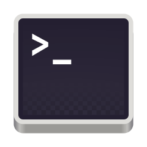
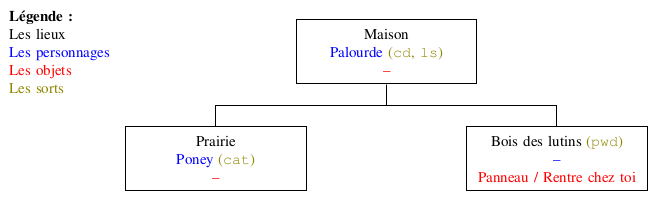

# T5.2 OS et commandes UNIX

{: .center width=480} 

## 5.2.1 Système d'exploitation

Le système d’exploitation (OS) est le logiciel système qui gère l'ordinateur, en jouant un rôle d’intermédiaire entre les programmes, les éléments matériels de l’ordinateur (notamment la mémoire) ainsi que les périphériques d'entrée/sortie. C’est le premier programme exécuté au démarrage de la machine, et c’est le seul qui reste en permanence en exécution.

{: .center} 

La partie de l'OS qui gère la communication avec les éléments matériels s'appelle  **le noyau** (kernel).

Outre le noyau, l'OS comporte des applications, une interface graphique, la gestion des fichiers, le terminal...

Historiquement, les premiers systèmes d’exploitation ne disposaient pas d’interface graphique. D’ailleurs, à cette époque, la souris
n’existait même pas. On interagissait donc avec le système essentiellement par échange de texte. L’écran servait à recevoir les infor-
mations fournies par le système sous forme de phrase, d’affichage de valeur ou de tableau textuel. Aujourd’hui, même si les interfaces
graphiques modernes permettent d’effectuer la plupart des opérations, il est important de connaitre quelques-unes de ces lignes de commandes qui se saisissent dans un (émulateur de) terminal, qui lance un shell par défaut.

!!! info "Vocabulaire"
    === "Terminal"
        {: .center} 

        L'**émulateur de terminal** (souvent appelé **terminal** tout court) est un programme qui s'exécute dans le gestionnaire de fenêtre. Il sert à exécuter des programmes en mode texte, c'est-à-dire où toute l'interaction avec l'utilisateur se fait avec l'écran (pour afficher du texte) et le clavier (pour lire du texte). 

        Par défaut le terminal exécute un **shell**.

        Il existe de nombreux émulateurs de terminaux sous Unix: xterm, rxvt-unicode, LXTerminal, gnome-terminal, konsole, xfce4-terminal...
    === "Shell"

        Le shell (aussi appelé invite de commande ou interpréteur de commandes) est un programme avec une interface en mode texte. Le shell affiche un prompt (représenté par le symbole $) et lit les commandes tapées par l'utilisateur. Ces commandes permettent d'effectuer des tâches courantes sur les fichiers et répertoires, de lancer d'autres programmes, etc. Le shell offre aussi un langage permettant d'effectuer des tâche conditionnelles et / ou répétitive à l'aide de structures de controle (conditionnelles, boucles for et while, etc.) Les suites de commandes que l'on souhaite réutiliser peuvent être sauvegardées dans un fichier appelé script.

        Il existe de nombreux shell sous Unix. Les plus utilisés dans le monde Linux sont bash et zsh.
    
    === "Commande"

        Une commande est en général un petit programme externe lancé par le shell. Par exemple, la commande `ls` permet d'afficher la liste des fichiers contenus dans le répertoire courant. Il est également possible d'exécuter des programmes très complexes (comme un traitement de texte ou un navigateur internet), mais cela est rarement fait depuis le shell.


Principalement, les commandes servent à lancer des petits programmes ou à travailler sur les fichiers et les répertoires. Dans les systèmes de type "UNIX" (par exemple GNU/Linux ou macOS), nous avons un système de fichier en arborescence : 

{: .center} 


!!! abstract "Repertoire courant et chemins"
    On parle de **chemin** dans une arborescence de fichiers lorsqu'on veut changer de répertoire ou faire une référence vers un fichier qui ne se situe pas dans le même répertoire que celui où «on travaille».

    === "Répertoire courant"
        Le *répertoire courant* est celui où on se situe, c'est-à-dire celui où l'on se trouve lors d'une navigation dans l'arborescence de fichiers ou bien celui dans lequel on est en train de travailler sur un fichier (python, html, document texte, etc.) à travers un logiciel.

        Par exemple, si Elsa décide de suivre le TP sur l'image dans un fichier `images.py` qu'elle enregistrera dans le répertoire `boulot` avec Thonny, le répertoire courant pour Thonny sera `boulot`. Il est alors impératif d'enregistrer le fichier `ada.png` dans **ce répertoire** pour pouvoir l'importer avec `#!py imageio.imread('ada.png')` par exemple.

    === "Chemin absolu"
        Le chemin **absolu** d'un fichier est son chemin complet **depuis la racine** `/`. 

        Par exemple le chemin absolu du fichier `fiche.ods` dans l'illustration précédente est `/home/elsa/documents/fiche.ods`.
    
    === "Chemin relatif"
        Le chemin **relatif** d'un fichier est son chemin **depuis le répertoire courant**.
        
        On indique qu'on «remonte» d'un répertoire avec `..`.

        Par exemple, si le répertoire courant est `ski`, le chemin relatif du fichier `photo_1.jpg` est `../photos_vac/photo_1.jpg`.

        Si par mégarde Elsa a enregistré le fichier `ada.png` dans le répertoire `elsa`, il faudra l'importer avec `#!py imageio.imread('../../ada.png')` .

## 5.2.2 Commandes 

Pour découvrir un certain nombre de commandes UNIX, parmi les plus courantes, nous allons jouer à un jeu:

[{: .center} ](http://luffah.xyz/bidules/Terminus/){:target="_blank"}


!!! example "Travail à faire"
    En jouant à Terminus: 

    - noter au fur et à mesure les commandes découvertes, à quoi elles servent et comment on les utilise (tableau conseillé):

    | Nom de la commande | Description | Utilisation |
    |--------------------|-------------|-------------|
    | `ls`               | Lister les éléments du dossier | Saisir `ls` puis *Entrée*|

    - faire un plan du jeu sous forme d'une arborescence, par exemple:

    {: .center} 

## 5.2.3 Compléments sur les commandes

Prenons l'exemple de l'arborescence du dossier `/home/jeanmichel/` de l'ordinateur personnel de Jean-Michel B.:

```
.
+-- Travail
|   +-- reforme
        +-- projet_flou.odt
|   +-- HTML
|   |   +-- images
|   |   |   +-- toto.png
|   |   |   +-- tata.png
|   |   |   +-- tutu.png
|   |   +-- styles
|   |   |   +-- style.css
|   |   +-- scripts
|   |   |   +-- script.js
|   |   +-- index.html
|   |   +-- page1.html
|   |   +-- page2.html
+-- Photos
|   +-- Ibiza
|   |   +-- reveillon.png    
```

!!! abstract "Chemins"
    On a vu la commande `cd` qui permet de changer de répertoire (dossier). Par exemple, pour aller dans le répertoire `images` depuis la racine, on peut taper successivement:
    ```bash
    ~$ cd Travail/
    ~/Travail$ cd HTML/
    ~/Travail/HTML$ cd images/
    ~/Travail/HTML/images$
    ```

    On peut plus rapidement préciser le chemin relatif:
    ```bash    
    ~$ cd Travail/HTML/images/
    ~/Travail/HTML/images$
    ```

    Pour revenir à la racine `/home/jeanmichel/`, on peut taper successivement 3 fois la commande `cd ..`, ou bien plus rapidement:
    ```bash    
    ~/Travail/HTML/images$ cd ../../../
    ~$
    ```

    Et pour aller du répertoire `images` au répertoire `scripts`, on utilisera le chemin relatif:
    ```bash    
    ~/Travail/HTML/images$ cd ../scripts/
    ~/Travail/HTML/scripts$
    ```

    Ou bien le chemin absolu (mais c'est plus long...):
    ```bash    
    ~/Travail/HTML/images$ cd /home/jeanmichel/Travail/HTML/scripts/
    ~/Travail/HTML/scripts$
    ```

!!! abstract "Options et arguments"
    === "Options"
        On peut ajouter aux commandes UNIX une ou plusieurs options, qui s'écrivent soit:

        - avec une lettre précédée d'un tiret;
        - avec un mot-clé précédé de 2 tirets.

        === "Exemple avec `ls`"
            Tester par exemple dans un de vos répertoires les commandes suivantes:
            ```bash
            $ ls
            $ ls -l
            $ ls -l -h 
            ```
        === "Exemple avec `rm`"
            **Attention, l'usage de `rm` est dangereux, soyez attentif !**

            La commande `rm` permet de supprimer **définitivement** un fichier, il n'y a pas de corbeille dans le shell! Mais pas un répertoire non vide. 

            Pour effacer tous les fichiers d'un répertoire:
            ```bash
            $ rm *
            ```

            Et pour supprimer tout le contenu d'un répertoire, y compris les sous-répertoires, on utilise l'option `-r`:
            ```bash
            $ rm -r *
            ```
    === "Arguments"
        On peut parfois préciser plusieurs arguments à une commande pour ne pas répéter plusieurs fois son utilisation. Par exemple pour créer deux répertoires `images/` et `data/`   en même temps dans le répertoire courant:
        ```bash
        $ mkdir images/ data/
        ```
        Et trois fichiers `toto.txt`,  `tata.txt` et  `tutu.txt`:
        ```bash
        $ touch toto.txt tata.txt tutu.txt
        ```
        

!!! abstract "À propos de `grep`"
    Comme vu dans l'activité «Terminus», la commance `grep` permet de rechercher une chaîne de caractéres dans un fichier. La syntaxe générale est:
    ```bash
    $ grep options "recherche" chemin
    ```
    Voici quelques options utiles:

    - `--ignore-case` ou `-i` : pour ignorer la casse (minuscules/majuscules indifférentes);
    - `-c` : pour afficher seulement le nombre d'occurences de la recherche;
    - `-l` : pour afficher le nom des fichiers contenant la recherche (`chemin` est alors un répertoire);
    - `-r` : pour rechercher dans tous les fichiers et sous-répertoires de `chemin`, qui est un répertoire.

    Pour rechercher dans plusieurs fichiers (comme dans l'activité Terminus) on peut utiliser `*` qui remplace n'importe quel mot. Par exemple, pour rechercher `'password'` dans tous les fichiers `txt` de l'activité, on aurait pu taper:
    ```bash
    $ grep 'password' *.txt
    ```

## 5.2.4 Utilisateurs et droits

Un système UNIX est un système multi-utilisateur. Toute personne physique ou tout programme interagissant avec le système est un **utilisateur** (user). Cet utilisateur est authentifié sur le système par un nom unique et un identifiant unique (UID). Chaque utilisateur possède certains droits lui permettant d'effectuer certaines opérations et pas d'autres (avoir accès aux répertoires et fichiers, aux périphériques, installer des logiciels...).

Pour connaître les utilisateurs de votre système, on consulte le fichier `/etc/passwd` (faites-le) où on trouve tous les utilisateurs au format:

```bash
nom:motdepasse:UID:GID:informations:repertoire:shell
```
    

Chaque utilisateur appartient à un ou plusieurs groupes, qui servent à ressembler plusieurs utilisateurs pour leur attribuer des droits (permissions d'accès) communs aux fichiers ou applications.

Pour connaître les utilisateurs de votre système, on consulte le fichier `/etc/group` (faites-le).

{: .center width=50%} 

Parmi les utilisateurs, il y a un **super-utilisateur** appelé `root` qui a tous les pouvoirs sur le système. Son UID est 0. Pour exécuter une commande réservée au super-utilisateur, un utilisateur doit utiliser la commande `sudo` (super user do) qui nécessite de connaître le **mot de passe root** qui en général n'est connu que de l'administrateur du système.

En particulier le super-utilisateur peut modifier les droits (en attribuer ou en retirer) des utilisateurs et des groupes.

!!! abstract "Les types de droits `r-w-x`"

    - les droits en **lecture** (symbolisés par la lettre `r`) : il est possible de lire le contenu de ce fichier
    - les droits en **écriture** (symbolisés par la lettre `w`) : il est  possible de modifier le contenu de ce fichier
    - les droits en **exécution** (symbolisés par la lettre `x`) : il est possible d'exécuter le contenu de ce fichier (quand le fichier est du code exécutable)

!!! abstract "Les types d'utilisateurs `u-g-o`"
    Tout fichier UNIX:

    - possède un propriétaire (par défaut l'utilisateur qui l'a créé) : **u** comme *user*;
    - est associé à un groupe dont on définit les actions sur ce fichier: **g** comme *group*;
    - peut être éventuellement manipulé par tous les autres utilisateurs : **o** comme *others*.

!!! example "Lecture des droits"
    Voici ce que me donne la commande `ls` avec l'option `-l` pour obtenir des informations sur le contenu du répertoire `/Travail/1NSI/Archi/`:

    {: .center} 

    - Le premier caractère `-` ou `d` indique s'il s'agit d'un fichier ou d'un répertoire;
    - les 9 caractères suivants représentent dans l'ordre les droits pour les 3 types d'utilisateurs (par paquets de 3 caractères), dans l'ordre **ugo**. Par exemple pour le premier fichier, le propriétaire **u** a les droits `rw-`, c'est-à-dire lecture, écriture, pas d'éxécution (il ne s'agit pas d'un fichier exécutable), les utilisateurs du groupe ont les mêmes droits `rw-` et les autres utilisateurs **o** ont les droits `r--`, c'est-à-dire seulement lecture. Pour les dossiers, tous les utilisateurs ont le droit d'éxécution `x`, qui consiste à explorer le répertoire.
    - ensuite on lit le nombre de liens (notion non étudiée cette année);
    - on trouve ensuite le nom du propriétaire du fichier, le nom du groupe, la taille du fichier en octets, la date et l'heure de la dernière modification et enfin le nom du fichier ou répertoire.

    {: .center width=50%} 

!!! example "Modification des droits"
    Il est important de ne pas perdre de vu que l'utilisateur "root" a la possibilité de modifier les droits de tous les utilisateurs.

    Le propriétaire d'un fichier peut également modifier les permissions d'un fichier ou d'un répertoire à l'aide de la commande `chmod`. 

    Elle s'utilise ainsi, en précisant l'utilisateur (**a** pour tous), l'ajout **+** ou la suppression **-** ou la réinitialisation **=** de la permission et enfin le type de permission:

    ```bash
    chmod [u g o a] [+ - =] [r w x] nom_du_fichier
    ```
    Par exemple, 
    ```bash
    chmod g+w toto.txt
    ```
    attribuera la permission "écriture" au groupe associé au fichier `toto.txt`.


## 5.2.5 Exercices
    
{{ initexo(0) }}

!!! example "{{ exercice() }}"
    === "Énoncé" 
        {: .center} 

        1. Donner les chemins absolus:

            - du fichier `grub.cfg`
            - du répertoire `photos_vac`
        
        3. Le répertoire courant est `grub`. Donner le chemin relatif du fichier `abi`.

        2. Le répertoire courant est `documents`. Donner les chemins relatifs:
            
            - du fichier `rapport.odt`
            - du dossier `images`
        
        
    === "Correction" 
        {{ correction(False, 
        "
        "
        ) }}

!!! example "{{ exercice() }}"
    === "Énoncé partie 1" 
        Décrire (papier/crayon) l'effet de chacune des commandes suivantes en supposant qu'elle sont exécutées les unes à la suite des autres.

        1. `cd ~`
        2. `mkdir T5`
        3. `mkdir T5/TP_shell`
        4. `cd T5/TP_shell`
        5. `touch toto.txt`
        6. `ls -l`
        7. `chmod g-rwx,o-rwx toto.txt`
        8. `ls -l`
        9. `cd ..`
        10. `rm -r TP_shell`
    
    === "Énoncé partie 2" 
        Ouvrir un terminal et effectuer ces commandes. Vérifier que tout se déroule comme décrit dans la partie 1.

    === "Correction" 
        {{ correction(False, 
        "
        1. On revient au répertoire personnel (`/home/nsi/` ou `~`).
        2. On crée un répertoire `T5` dans le répertoire courant (`~`).
        3. On crée un répertoire `TP_shell` dans le répertoire `T5`.
        4. On dse déplace dans le répertoire `TP_shell` du répertire `T5`.
        5. On crée un fichier (vide) nommé `toto.txt` dans le répertoire courant (`T5/TP_shell`).
        6. On liste les éléments du répertoire courant.
        7. On enlève (-) tous les droits (r, w, x) aux utilisateurs du groupe (sauf user) et aux \"others\".
        8. On liste les éléments du répertoire courant.
        9. On remonte d'un répertoire dans l'arborescence.
        10. On efface le répertoire `TP_Shell` et tout son contenu.
        "
        ) }}

!!! example "{{ exercice() }}"
    === "Énoncé" 
        On suppose que l'on se trouve dans un répertoire vide `TEST/` et qu'on exécute les commandes suivantes. Dessiner l'arborescence finale des fichiers et répertoires en utilisant `TEST/` comme racine de l'arborescence.

        1. `mkdir series films mangas musique`
        2. `touch films/sw.txt mangas/HxH.txt`
        3. `cd series/`
        4. `mkdir ../musique/rap/ got/ oitnb/`
        5. `cd ..`
        6. `cp */*.txt series/got/`
        7. `rm -r mangas`

    === "Correction" 
        {{ correction(False, 
        "
        "
        ) }}

!!! example "{{ exercice() }}"
    === "Énoncé" 
        Consulter la page de manuel d'utilisation de la commande `head`. Trouver comment l'utiliser pour n'afficher que les 5 premières lignes d'un fichier `toto.txt`.

    === "Correction" 
        {{ correction(False, 
        "
        ```bash
        $ head -n 5 toto.txt
        ```
        "
        ) }}


!!! example "{{ exercice() }}"
    === "Énoncé" 
        Commencer par télécharger [ce fichier](../data/pg6318.txt) dans votre répertoire `/home/nsi/Téléchargements/`.

        1. Dans votre répertoire personnel, créez un répertoire `Shell/` puis un répertoire `Exo5/` dans ce répertoire `Shell/`.
        2. Déplacez le fichier `pg6318.txt` dans le répertoire `Exo5/` que vous venez de créer.
        3. Consultez les 25 premières lignes de ce fichier, puis renommez-le *judicieusement*.
        4. Créez un fichier nommé `reponses.txt`.
        5. Consulter le manuel de la commande `echo`.
        6. Écrivez votre nom dans ce fichier à l'aide de la commande `echo`.
        7. Cherchez les mots `rouge`, `bleu` et `jaune` dans le fichier texte et ajoutez au fichier `reponses.txt` celui qui n'y apparaît pas.
        8. Vérifier en affichant le contenu du fichier `reponses.txt`.
        9. Cherchez en quelle ligne apparaît pour la première fois le mot `traître`.
        10. Ajouter cette réponse au fichier `reponses.txt`.
    === "Correction" 
        {{ correction(False, 
        "
        Les commandes (a minima):

        1. 
        ```console
        mkdir Shell/
        mkdir Shell/Exo5/
        ```
        2. 
        ```console
        cd Téléchargements/
        mv pg6318.txt ../Shell/Exo5/
        ```
        3.
        ```console
        cd ../Shell/Exo5/
        head -n 25 pg6318.txt
        mv pg6318.txt avare.txt
        ```
        4. `touch reponses.txt`

        5. `man echo`

        6. `echo votre_nom > reponses.txt`

        7. 
        ```console
        grep rouge avare.txt
        grep bleu avare.txt
        grep jaune avare.txt
        echo jaune >> reponses.txt
        ```

        8. `cat reponses.txt`

        9. `grep -n traître avare.txt`

        10. `echo 467 >> reponses.txt`
        "
        ) }}

!!! example "{{ exercice() }}"
    === "Énoncé" 
        Ouvrir un terminal, puis **sans quitter le répertoire courant**:

        1. créer un répertoire `Exo6/` puis les répertoires `Exo6/NSI/` et `Exo6/Divers/`.
        2. créer un fichier `hello.py` dans le répertoire `Exo6/NSI/`.
        3. écrire `#!py print("hello world")` dans ce fichier.
        4. se déplacer dans le répertoire `Exo6/NSI/`.
        4. afficher le contenu de ce fichier `hello.py`.
        5. accorder tous les droits à «tout le monde» sur le fichier `hello.py`.
        6. exécuter ce fichier à l'aide du programme `python3`.
    === "Correction" 
        {{ correction(False, 
        "
        1. `mkdir Exo6/ Exo6/NSI/ Exo6/Divers/`
        2. `touch Exo6/NSI/hello.py`
        3. `echo print(\"hello world\") >> Exo6/NSI/hello.py`
        4. `cd Exo6/NSI/`
        5. `cat hello.py`
        6. `chmod a+rwx hello.py`
        7. `python3 hello.py`

        "
        ) }}

!!! example "{{ exercice() }}"
    === "Énoncé" 
        On imagine qu'un répertoire nommé `Bibliothèque` dans le répertoire `Travail` du répertoire personnel contient plusieurs fichiers textes (format `txt`) dont le fichier `brouillon.txt`.
        Le répertoire courant est `/home/nsi/Documents/Images`.

        1. En une seule commande, se déplacer dans le répertoire `Bibliothèque`.
        2. Afficher le contenu de ce répertoire.
        3. Chercher toutes les occurences du mot "informatique" dans les fichiers texte de ce répertoire.
        5. Supprimer le fichier `brouillon.txt`.
    === "Correction" 
        {{ correction(False, 
        "
        1. `cd ../../Travail/Bibliothèque/`
        2. `ls`
        3. `grep informatique *.txt`
        4. `rm brouillon.txt`
        "
        ) }}
