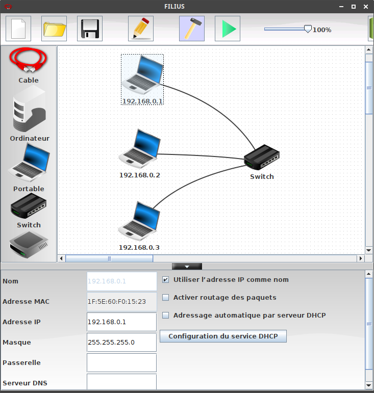

# T5.3 Architecture d'un réseau

!!! abstract "Notion de réseau"
    - En général, un **réseau** est un ensemble de *nœuds* reliés entre eux par des *liens*.
    - Un **réseau informatique** est un réseau dont les nœuds sont des équipements informatiques reliés par des liens de différente nature: câbles, fibre optique, liaisons satellites, ondes radio, ...).
    - Une **interface** est le point de raccordement entre un lien et un nœud: elle peut être matérielle (carte réseau) ou logicielle.
    - Un **protocole** est un ensemble de règles permettant d'établir, de mener et de terminer une communication entre deux équipements du réseau.

Dans ce cours, nous allons simuler un réseau local avec le logiciel [Filius](https://www.lernsoftware-filius.de/Herunterladen){:target="_blank"} installé sur les VM du lycée.

## 5.3.1 Un premier réseau

!!! example "Partie 1: Construction d'un réseau"
    1. Construire le sous-réseau ci-dessous, en cochant «Utiliser l'adresse IP comme nom».

        {: .center  width=640} 

        - **Adresse MAC** : Chaque ordinateur sur le réseau dispose d'une adresse MAC, qui est une valeur unique attribuée à sa carte réseau (Ethernet, Wifi, 4G, 5G, ...) lors de sa fabrication en usine.

            Cette adresse est codée sur 48 bits, présentés sous la forme de 6 octets en hexadécimal, ici `1F:5E:60:F0:15:23`.

            Les trois premiers octets correspondent au code du fabricant. Un site comme [https://www.macvendorlookup.com/](https://www.macvendorlookup.com/){:target="_blank"}  vous permet de retrouver le fabricant d'une adresse MAC quelconque.

        - **Adresse IP**: Une machine possède en général une adresse IP par interface et contrairement à l'adresse MAC, elle peut être modifiée lors du paramétrage du réseau.. Nous utiliserons la version IPv4 (sur 4 octets) bien que cette version est peu à peu remplacée par la version IPv6.

    2. Passer en mode simulation (triangle vert), puis cliquer sur l'ordinateur `192.168.0.1` et installer le logiciel "Ligne de commande".
    3. Réaliser un `ping` de la machine `192.168.0.1` vers la machine `192.168.0.3` en tapant `ping 192.168.0.3` en ligne de commande.

!!! info "Rôle du switch"
    Le rôle d'un switch est de distribuer un message au bon destinataire, en analysant la trame reçue. Lors d'un branchement d'un nouvel ordinateur sur le switch, celui-ci récupère son adresse MAC, ce qui lui permet de **trier** les messages.

    {: .center} 

!!! example "Partie 2: un deuxième réseau"
    1. Renommer le switch en "SwitchA" et créer un deuxième réseau de trois machines d'adresses IP `192.168.1.1`, `192.168.1.2` et `192.168.1.3` avec un "SwitchB".

    2. Tester un `ping` de `192.168.0.1` vers `192.168.1.2`.

    3. Renommer la machine `192.168.1.2` en `192.168.0.16` et retenter le `ping`. Que se passe-t-il?

## 5.3.2 Masque de sous-réseau

Lorsqu'une machine A veut envoyer un message à une machine B, elle doit déterminer si cette machine :

- appartient au même sous-réseau : auquel cas le message est envoyé directement via un ou plusieurs switchs.
- n'appartient pas au même sous-réseau : auquel cas le message doit d'abord transiter par un routeur (voir plus loin).

La notion de sous-réseau n'est pas topologique («il suffit de relier les ordinateurs entre eux») mais obéit à des règles numériques.

C'est le masque de sous-réseau (tout simplement "Masque" dans Filius, netmask en anglais) qui permet de déterminer quelles adresses font partie d'un même réseau.

!!! abstract "Adresse IP et masque de sous-réseau"
    Une adresse IP comporte deux parties: 

    - l'adresse du réseau : les *k* premiers bits;
    - l'adresse de l'hôte : les *32-k* derniers bits.

    La valeur de *k* est variable pour chaque réseau, elle acompagne donc généralement les adresses et se nomme **masque de sous-réseau**.

    Un masque de sous-réseau est souvent représenté comme une adresse IPv4 par 4 octets, et est constitué d'une suite de *k* `1` suivie d'une suite de `0`.

    === "Exemple 1"
        - Le masque par défaut de Filius est `255.255.255.0`, qui s'écrit en binaire : `11111111.11111111.11111111.00000000`.

        - La valeur de *k* est donc 24. On note donc aussi (notation CIDR) l'adresse IP : `192.168.0.1 / 24`.

        - Dans cette configuration, 256 machines peuvent donc appartenir au même sous-réseau (ce n'est pas tout à fait le cas car des adresses finissant par 0 ou par 255 sont réservées).

        - Deux machines appartiennent au même sous-réseau si elles **partagent les 3 premiers nombres (octets) de leur adresse IP**, c'est à dire les 24 premiers bits.

    === "Exemple 2"
        - Une autre valeur de masque peut être `255.255.248.0`, qui s'écrit en binaire : `11111111.11111111.11111000.00000000`.

        - La valeur de *k* est donc 21. On note donc aussi (notation CIDR) l'adresse IP : `192.168.0.1 / 21`.

        - Deux machines appartiennent au même sous-réseau si elles **partagent les 21 premiers bits de leur adresse IP**.

        - Combien de machines peuvent appartenir à ce même sous-réseau ?

!!! note "Appartenance à un même sous-réseau"
    Pour que deux machines appartiennent à un même sous-réseau, il faut donc qu'elles partagent un même nombre de bits, donnés par le masque de sous-réseau.

    L'opération qui permet de le déterminer est le `&` (et) logique, bit à bit.

    === "Exemple"
        Considérons trois machines A, B, C d'IP respectives ```192.168.129.10```, ```192.168.135.200``` et ```192.168.145.1```, configurées avec un masque de sous-réseau égal à ```255.255.248.0```.  

        |        | machine A      | machine B       | machine C     |
        |--------|----------------|-----------------|---------------|
        | IP     | 192.168.129.10 | 192.168.135.200 | 192.168.145.1 |
        | M      | 255.255.248.0  |  255.255.248.0  | 255.255.248.0 |
        | IP & M |   |  | |

    === "Correction"

        |        | machine A      | machine B       | machine C     |
        |--------|----------------|-----------------|---------------|
        | IP     | 192.168.129.10 | 192.168.135.200 | 192.168.145.1 |
        | M      | 255.255.248.0  |  255.255.248.0  | 255.255.248.0 |
        | IP & M | 192.168.128.0  |  192.168.128.0  | 192.168.144.0 |

        Les machines A et B font partie du même sous-réseau d'adresse `192.168.126.0`, mais pas la machine C.

## 5.3.3 Utilisation et rôle du routeur

La solution initiale (relier les deux switchs par un cable pour unifier les deux sous-réseaux) n'est pas viable à l'échelle d'un réseau planétaire.

Pour que les machines de deux réseaux différents puissent être connectées, on va utiliser un dispositif équipé de **deux cartes réseaux**, situé à cheval entre les deux sous-réseaux. Cet équipement de réseau est appelé **routeur** ou **passerelle**.

!!! abstract "Routage"
    Les 3 étapes du **routage** :

    - Lorsque qu'une machine A veut envoyer un message à une machine B, elle va tout d'abord vérifier si cette machine appartient à son réseau local. si c'est le cas, le message est envoyé par l'intermédiaire du switch qui relie les deux machines.
    - Si la machine B n'est pas trouvée sur le réseau local de la machine A, le message va être acheminé vers le routeur, par l'intermédiaire de son adresse de passerelle (qui est bien une adresse appartenant au sous-réseau de A).
    - De là, le routeur va regarder si la machine B appartient au deuxième sous-réseau auquel il est connecté. Si c'est le cas, le message est distribué, sinon, le routeur va donner le message à un autre routeur auquel il est connecté et va le charger de distribuer ce message : c'est le procédé (complexe) de [routage](https://openclassrooms.com/fr/courses/857447-apprenez-le-fonctionnement-des-reseaux-tcp-ip/854659-le-routage), qui sera vu en classe de Terminale.

    Dans l'exemple suivant, où le masque est `255.255.255.0`, l'adresse ```172.16.52.3``` n'est pas dans le sous-réseau de ```192.168.0.1```. Le message va donc transiter par le routeur.  
    {: .center}

!!! example "Partie 3: Ajout d'un routeur"
    Si vous n'avez pas sauvegardé votre réseau, téléchargez [ce fichier](../data/simulation_1.fls){:target="_blank"} .

    1. Ajouter un routeur entre le SwitchA et le SwitchB.
    2. Configurer le routeur :
        - L'interface reliée au Switch A doit avoir une adresse du sous-réseau A (idem pour le réseau B). On donne souvent une adresse finissant par ```254```, qui est en quelque sorte la dernière adresse du réseau (en effet l'adresse en ```255``` est appelée adresse de **broadcast**, utilisée pour «pinger» en une seule fois l'intégralité d'un sous-réseau).  
        - Dans l'onglet général, sélectionner « Routage automatique ».  
        - Ainsi configuré notre routeur peut jouer le rôle de **passerelle** entre les deux sous-réseaux.
    3. Tester un ping entre ```192.168.0.1``` et ```192.168.1.2```
    
        ??? tip "¿Que pasa?"
            Cela ne marche pas. La carte réseau refuse d'envoyer les paquets car elle ne sait pas où les envoyer.
            Il faut donc dire à chaque machine qu'une passerelle est maintenant disponible pour pouvoir sortir de son propre sous-réseau. Il faut donc aller sur la machine ```192.168.0.1``` et lui donner l'adresse de sa passerelle...

    4. Une fois les passerelles renseignées, effectuer un traceroute entre ```192.168.0.1``` et ```192.168.1.2``` : on y voit le nombre de sauts nécessaires entre les deux machines.

??? info "Cas d'un réseau domestique"
    Chez vous, la box de votre opérateur joue simultanément le rôle de switch et de routeur :

    - switch car elle répartit la connexion entre les différents dispositifs (ordinateurs branchés en ethernet, smartphone en wifi, tv connectée...)
    - routeur car elle fait le lien entre ce sous-réseau domestique (les appareils de votre maison) et le réseau internet.

    {: .center}

    Essayez chez vous de récupérer l'adresse IP locale, le masque de sous-réseau ainsi que la passerelle par défaut, à l'aide d'une commande `ipconfig` sous Windows.

## 5.3.4 Serveur DNS

Lors d'une utilisation classique d'un navigateur web, c'est une url mémorisable qui s'affiche, et non une adresse IP : on retient en effet plus facilement `https://www.google.com/` que `http://216.58.213.131`, qui renvoient pourtant à la même adresse. 
La machine qui assure ce rôle d'annuaire entre les serveurs web et leur adresse IP s'appelle un **serveur DNS**. Pour pouvoir indexer la totalité des sites internet, son rôle est structuré de manière hiérarchique. Vous trouverez des détails [ici](https://openclassrooms.com/fr/courses/857447-apprenez-le-fonctionnement-des-reseaux-tcp-ip/857163-le-service-dns).

!!! example "Partie 4: Ajout d'un serveur DNS"
    {: .center width=640} 

    1. Connecter un ordinateur au SwitchB, sur l'adresse ```192.168.1.30```, installer dessus un Serveur web et le démarrer.
    2. Sur la machine ```192.168.0.1```, installer un Navigateur Web. En tapant dans la barre d'adresse l'adresse IP du Serveur web, la page d'accueil de Filius s'affiche.  
    3. Rajouter un serveur DNS, qui n'aura dans son annuaire d'un seul site. Il faut pour cela raccorder une nouvelle machine (mais une machine déjà sur le réseau aurait très bien pu jouer ce rôle), et installer dessus un serveur DNS.  
    4. Sur ce serveur DNS, associer le nom de domaine ```www.vivelansi.fr```  à l'adresse IP ```192.168.1.30```.
    5. De retour sur la machine ```192.168.0.1```, spécifier maintenant l'adresse du serveur DNS.
    6. Depuis le navigateur web de la machine ```192.168.0.1```, le site ```http://www.vivelansi.fr``` doit maintenant être accessible.  


## 5.3.5 Exercices

{{ initexo(0) }}
!!! example "{{ exercice() }}"
    === "Énoncé" 
        On souhaite pouvoir raccorder 1000 machines sur le même réseau IP. Donner le plus petit masque permettant de définir un tel sous-réseau. Même question avec 3000 machines.

        Noter à chaque fois le masque en notation décimale pointée, puis CIDR.
    === "Correction" 
        {{ correction(False, 
        "
        "
        ) }}

!!! example "{{ exercice() }}"
    === "Énoncé" 
        On considère le masque `255.255.252.0`. Parmi les adresses suivantes, indiquer lesquelles appartiennent au même sous-réseau:

        1. `129.175.127.1`
        2. `129.175.130.10`
        3. `129.175.128.17`
        4. `129.175.131.110`
        5. `129.175.132.8`

    === "Indication"
        Penser à utiliser la fonction `bin` de Python pour effectuer les conversions (même s'il faut savoir les faire «à la main», et vérifier vos «et» logiques avec l'opérateur `&` de Python:
        ```python
        >>> 127 & 252
        124
        ```
        
    === "Correction" 
        {{ correction(False, 
        "
        "
        ) }}

