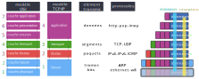
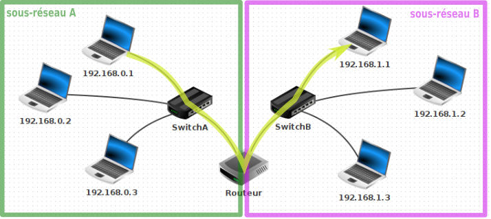

# T5.4 Protocoles de communication dans un réseau

<p align="center">
<iframe width="560" height="315" src="https://www.youtube.com/embed/aX3z3JoVEdE" title="YouTube video player" frameborder="0" allow="accelerometer; autoplay; clipboard-write; encrypted-media; gyroscope; picture-in-picture" allowfullscreen></iframe>
</p>

## 5.4.1 Modèle OSI, modèle Internet

Les bits transmis d'un ordinateur à un autre contiennent, en plus des données _utiles_ (le mot «bonjour» dans un email), une multitude de données (tout aussi utiles) qui vont aider à l'acheminement de ces bits au bon endroit, puis au bon ordinateur, puis au bon logiciel. 
Les différents protocoles qui régissent cette transmission sont regroupés dans ce qui est appelé un **modèle**.

!!! abstract "Deux modèles et plusieurs protocoles..."
     Deux modèles synthétisent ces protocoles :

    - le **modèle OSI** (Open Systems Interconnection, 1984), organisé en **7** couches : physique, liaison, réseau, transport, session, présentation,application. C'est un modèle théorique qui sert de référence pour inspirer d'autres architectures pour l'interconnexion de réseaux.
    - le **modèle Internet** (ou modèle **TCP/IP**, 1974), organisé en **4** couches : liaison, réseau, transport, application.

    Ils respectent tous deux les mêmes principes:

    - Chaque couche ne peut communiquer qu’avec une couche adjacente
    - Chaque couche est indépendante:
        - les informations d’une couche ne peuvent être utilisées dans une autre;
        - cela permet l’évolution des communications dans le temps : IPv4 va devenir IPv6 sans qu’on doive tout réécrire.

    


    Ces deux modèles coïncident suivant le schéma ci-dessous. Ce sont des modèles d'une certaine rigidité. Leur utilisation dans la pratique est parfois plus floue, avec des protocoles à cheval sur plusieurs couches.  
    Dans la suite de ce cours, nous évoquerons principalement le modèle Internet (TCP/IP).


    {: .center}

    Lors de son émission, un message va subir successivement toutes les transformations effectuées par chaque couche, depuis sa création (couche 7) jusqu'à sa transmission physique (couche 1).  

    Lorsque ce même message sera réceptionné, les transformations seront effectuées dans l'ordre inverse, jusqu'à la présentation du message au destinataire.

    === "Couche 4  — couche application"
        Cette couche regroupe les protocoles nécessaires à la bonne mise en forme d'un message (au sens large: compression, cryptage, ...) avant sa transmission. 
        
        Ces protocoles peuvent être de nature très différente : protocole HTTP pour la transmisson de pages web, protocole FTP pour le transfert de fichiers, protocoles POP ou IMAP pour le courrier électronique...

        {: .center} 


    === "Couche 3 — couche transport"
        Le protocole majeur de cette couche est le protocole TCP :

        - il s'assure par SYN-ACK que l'émetteur et le récepteur sont prêts à échanger des messages. 
        - il découpe en segments numérotés le message à transmettre (côté émetteur) ou bien recompose le message total en remettant les segments dans l'ordre (côté récepteur).    

        Les éléments échangés avec la couche inférieure sont des **segments**.

        {: .center} 

        !!! note "Ports"

            Une machine peut établir plusieurs connexions TCP en même temps. Afin de les distinguer on ajoute une information supplémentaire, le port réseau.

            TCP n’est pas le seul protocole à utiliser ces ports.

            Les ports sont des nombres sur 16 bits, généralement notés en décimal, entre 0 et $2^{16} = 65536$

            Ils sont généralement ajoutés à la fin de l’adresse IP après le symbole : (deux points)      `192.168.1.2:80`

            Chaque fois que vous ouvrez deux onglets dans le navigateur, celui-ci établi une connexion avec une machine différente et se voit attribuer un port de réception différent.

    === "Couche 2 — couche réseau"
        C'est la couche où chaque segment numéroté est encapsulé dans un paquet qui, suivant le protocole IP, va contenir son adresse source et son adresse de destination. C'est à ce niveau que se décide si le message doit rester dans le réseau local ou être envoyé sur un autre réseau via la passerelle du routeur.  
        Les éléments échangés avec la couche inférieure sont des **paquets**.

        {: .center} 

    === "Couche 1 — couche liaison/physique"
        C'est l'encapsulation finale du message, pour transmettre des **trames** à travers le réseau physique, en **bits**. Elle dépend donc du matériel.
        
        On y trouve donc:

        - la résolution d'adresses : suivant le protocole Ethernet, les informations sont transmises d'une carte réseau à une autre, grâce à leur adresse MAC (Media Access Controler).  Il s'agit donc d'associer une *adresse physique (MAC)* à une *adresse IP* : c'est le rôle du protocole ARP.
        - des routines d'accès au réseau : selon le medium de communication, par signal lumineux (fibre optique), par ondes (wifi), par courant électrique (Ethernet)...

        {: .center} 
    

 


Lors de son parcours, une trame peut être partiellement décapsulée et remonter à la couche 3, avant de redescendre et de continuer son chemin. C'est le cas notamment lors du passage dans un routeur. Mais jamais, lors de son acheminement, le contenu réel du message n'est ouvert : les paquets transmis sont acheminés de manière identique, qu'ils contiennent les éléments constitutifs d'une vidéo YouTube ou d'un email à votre cousin.  

Ce principe fondateur, actuellement menacé par certains acteurs politiques et industriels, est connu sous l'expression [**«la neutralité du net»**.](https://fr.wikipedia.org/wiki/Neutralit%C3%A9_du_r%C3%A9seau){:target="_blank"} 

{: .center width=480} 

## 5.4.2 TP: Observation avec Filius

!!! example "Partie 1: avant la communication"
    
    1. Télécharger et ouvrir le fichier [ping_switch.fls](../data/ping_switch.fls) avec Filius: deux machines sont reliés par un switch.
    2. Lancer la simulation et cliquer sur le switch pour consulter sa table SAT. Que constate-t-on?
    3. Sur la machine `192.168.0.10`, taper dans le terminal la commande `arp -a` pour obtenir sa table de correspondance IP ⮀ MAC. À quoi correspond la seule ligne de cette table?


!!! example "Partie 2: communication"
    1. Sur la machine `192.168.0.10`, lancer un `ping` vers la machine `192.168.0.11`, puis contrôler la table SAT du switch ainsi que la table de correspondance IP ⮀ MAC de `192.168.0.10`.
    2. Observer les échanges de données (clic droit sur la machine `192.168.0.10`). Cliquer sur chaque ligne pour en voir le détail.

??? info "Analyse des messages"
    === "Message 1: « Qui possède l'IP `192.168.0.11` ? »"
        Cette première ligne est une requête **ARP**. ARP est un protocole qui s'interface entre la couche *réseau* (appelée *Internet* sur Filius) et la couche *liaison* (appelée *Réseau* sur Filius). Comme indiqué dans le commentaire, elle consiste à un appel à tout le réseau : "Est-ce que quelqu'un ici possède l'IP ```192.168.0.11``` ?

        {: .center} 

        Il faut comprendre à cette étape que l'adresse IP est totalement inutile pour répérer un ordinateur dans un sous-réseau. Ce sont les adresses MAC qui permettent de se repérer dans un sous-réseau. Les adresses IP, elles, permettront éventuellement d'acheminer le message jusqu'au bon sous-réseau (elles n'intéressent donc que les routeurs).

        La commande ```arp -a``` effectuée dans un terminal de la machine ```192.168.0.10``` nous permet de voir qu'elle ne connaît encore personne dans son sous-réseau. La table de correspondance IP ⮀ MAC ne contient que l'adresse de broadcast ```255.255.255.255```, qui permet d'envoyer un message **à tout le réseau**.  

        {: .center} 

        Constatant qu'elle ne sait pas quelle est l'adresse MAC de ```192.168.0.11```, la machine ```192.168.0.10``` commence donc par envoyer un message à tout le sous-réseau, par l'adresse MAC de broadcast ```FF:FF:FF:FF:FF:FF```. Le switch va lui aussi lui aussi relayer ce message à tous les équipements qui lui sont connectés (dans notre cas, un seul ordinateur).
    
    === "Message 2 : « Moi ! »"

        La machine ```192.168.0.11``` s'est reconnu dans le message de broadcast de la machine ```192.168.0.10```. Elle lui répond pour lui donner son adresse MAC.  

        {: .center} 

        À partir de ce moment, la machine ```192.168.0.10``` sait comment communiquer avec ```192.168.0.11```. Elle l'écrit dans sa table ```arp```, afin de ne plus avoir à émettre le message n°1 :  

        {: .center} 


        Le switch, qui a vu passer sur ses ports 0 et 1 des messages venant des cartes MAC ```BC:81:81:42:9C:31```  et ```2A:AB:AC:27:D6:A7```, peut mettre à jour sa table SAT :  

        {: .center} 

        Par la suite, il saura sur quel port rediriger les messages destinés à ces deux adresses MAC. Un switch est un équipement de réseau de la couche 2 du modèle OSI, il ne sait pas lire les adresses IP : il ne travaille qu'avec les adresses MAC.

    === "Message 3 : le ping est envoyé"

        {: .center} 


    === "Message 4 : le pong est retourné"

        {: .center} 


!!! example "Partie 3: communication à travers un routeur"
    L'objectif est maintenant d'observer les différentes étapes lors d'un ping entre des machines de sous-réseaux différents:

    {: .center} 


    1. Télécharger et ouvrir le fichier [ping_routeur.fls](../data/ping_routeur.fls) avec Filius.
    2. Noter la configuration des machines `192.168.0.1 / 24` et `192.168.1.1 / 24` (adresses MAC) et du routeur (adresses IP et MAC sur chaque sous-réseau).
    3. Effectuer un `ping` entre les machines indiquées sur le schéma ci-dessus et analyser les messages émis/reçus (sur les deux machines et le routeur).

??? info "Analyse des messages"
    **Configuration:**

    - la machine ```192.168.0.1 / 24``` : adresse MAC ```F9:E1:D6:0B:29:03``` 
    - la machine ```192.168.1.1 / 24``` : adresse MAC ```D3:79:96:B8:5C:A4``` 

    Le routeur est configuré ainsi :

    - interface sur le réseau A :
        - IP : ```192.168.0.254``` 
        - MAC : ```77:C2:22:C9:5C:E7``` 
    - interface sur le réseau B :
        - IP : ```192.168.1.254``` 
        - MAC : ```66:E5:4E:7D:0B:B0``` 

    === "Étape 0 : le routeur signale sa présence"

        Lors de l'observation des messages reçus ou émis par la machine ```192.168.0.1```, on peut être intrigué par ce tout premier message reçu, émis par le routeur : 

        {: .center} 

        On peut y distinguer les 4 couches du modèle Internet. Le routeur, par ce message distribué à tous les éléments du sous-réseau A (il envoie un message équivalent sur son sous-réseau B), déclare sa présence, et le fait qu'il possède deux interfaces, une pour chaque réseau. 
        Il se positionne ainsi comme une passerelle : «c'est par moi qu'il faudra passer si vous voulez sortir de votre sous-réseau». 
        Dans cette trame envoyée figure son adresse MAC, de sorte que tous les membres de son sous-réseau pourront donc communiquer avec lui.


    === "Étape 1 : de ```192.168.0.1``` vers le routeur"

        La machine ```192.168.0.1 / 24``` calcule que la machine ```192.168.1.1 / 24``` avec laquelle elle veut communiquer n'est **pas** dans son sous-réseau.
        Elle va donc envoyer son message à sa passerelle, qui est l'adresse du routeur dans son sous-réseau. 

        Cette première trame est :

        {: .center} 


    === "Étape 2 : le routeur décapsule la trame"

        Le routeur est un équipement de réseau de couche 3 (couche réseau). Il doit observer le contenu du paquet IP (sans remonter jusqu'au contenu du message) pour savoir, suivant le procédé de **routage** (voir cours de Terminale), où acheminer ce paquet.

        Dans notre cas, l'adresse IP ```192.168.1.1```de destination lui est accessible : elle fait partie de son sous-réseau B.

        Le routeur va modifier la valeur du TTL (Time To Live), en la décrémentant de 1. Si, après de multiples routages, cette valeur devenait égale à 0, ce paquet serait détruit. Ceci a pour but d'éviter l'encombrement des réseaux avec des paquets ne trouvant pas leur destination.

        ??? note "NAT : translation d'adresse"
            Dans notre cas, le routeur va laisser intacte l'adresse IP Source. Ce n'est pas toujours le cas. Dans le cas classique de la box qui relie votre domicile à internet, le routeur contenu dans celle-ci va remplacer l'adresse locale de votre ordinateur ou smartphone (ex ```192.168.0.26```) par son IP publique (celle apparaissant sur [whatsmyip.com](http://whatsmyip.com), par exemple). Elle effectue ce qu'on appelle une translation d'adresse (NAT). 
            Pourquoi ? Parce que sinon la réponse du serveur distant que vous interrogez serait envoyée sur une adresse locale (votre adresse ```192.168.0.26```), qui est introuvable depuis un réseau extérieur. Il faut donc remplacer toutes les adresses locales par l'IP publique de votre box.
            Pour éviter que la réponse du serveur web que vous avez interrogé ne soit affichée sur l'ordinateur de vos parents, le routeur affecte des ports différents à chaque machine de son sous-réseau. Ce port est inclus dans le message transmis au serveur, et il l'est aussi dans sa réponse : le routeur peut donc rediriger le trafic vers la bonne machine du sous-réseau.

        Le routeur va ré-encapsuler le paquet IP modifié, et créer une nouvelle trame Ethernet en modifiant :

        - l'adresse MAC source : il va mettre l'adresse MAC de son interface dans le sous-réseau B.
        - l'adresse MAC de destination : il va mettre l'adresse MAC de ```192.168.1.1 ``` (qu'il aura peut-être récupérée au préalable par le protocole ARP)

        Cette deuxième trame est donc :

        {: .center} 

        On peut observer dans Filius cette trame, en se positionnant sur l'interface ```192.168.1.254 ``` du routeur, ou sur ```192.168.1.1 ``` :

        {: .center} 

        En suivant le même principe, la machine ```192.168.1.1 ``` pourra envoyer son *pong*.


## 5.4.3 Protocole du bit alterné

Ce protocole est un exemple de fiabilisation du transfert de données.  Simple et léger, il a longtemps été utilisé mais il peut toutefois être facilement mis en défaut, ce qui explique qu'il ait été remplacé par des protocoles plus performants.

**Contexte**

- Alice veut envoyer à Bob un message M, qu'elle a prédécoupé en sous-messages M0, M1, M2,...
- Alice envoie ses sous-messages à une cadence Δt fixée (en pratique, les sous-messages partent quand leur acquittement a été reçu ou qu'on a attendu celui-ci trop longtemps : on parle alors de *timeout*).

=== "1. Situation idéale"

    {: .center} 

    Dans cette situation, les sous-messages arrivent tous à destination dans le bon ordre. La transmission est correcte.

=== "2. Situation réelle"
    Mais parfois, les choses ne se passent pas toujours aussi bien. Car si on maîtrise parfaitement le timing de l'envoi des sous-messages d'Alice, on ne sait pas combien de temps vont mettre ces sous-messages pour arriver, ni même (attention je vais passer dans un tunnel) s'ils ne vont pas être détruits en route.

    {: .center} 

    Le sous-message M0 est arrivé après le M1, le message M2 n'est jamais arrivé...

    Que faire ?

    Écartons l'idée de numéroter les sous-messages, afin que Bob puisse remettre dans l'ordre les messages arrivés, ou même redemander spécifiquement des sous-messages perdus. C'est ce que réalise le protocole TCP (couche 3 — transport), c'est très efficace, mais cher en ressources. Essayons de trouver une solution plus basique.

=== "3. Solution naïve..."

    Pourquoi ne pas demander à Bob d'envoyer un signal pour dire à Alice qu'il vient bien de recevoir son sous-message ?
    Nous appelerons ce signal ACK (comme _acknowledgement_, traduisible par «accusé de réception»).
    Ce signal ACK permettra à Alice de renvoyer un message qu'elle considérera comme perdu :

    {: .center} 

    N'ayant pas reçu le ACK consécutif à son message M1, Alice suppose (avec raison) que ce message n'est pas parvenu jusqu'à Bob, et donc renvoie le message M1.

=== "4. Mais peu efficace..."

    {: .center} 

    Le deuxième ACK de Bob a mis trop de temps pour arriver (ou s'est perdu en route) et donc Alice a supposé que son sous-message M1 n'était pas arrivé. Elle l'a donc renvoyé, et Bob se retrouve avec deux fois le sous-message M1. La transmission est incorrecte. 
    En faisant transiter un message entre Bob et Alice, nous multiplions par 2 la probabilité que des problèmes techniques de transmission interviennent. Et pour l'instant rien ne nous permet de les détecter.

=== "5. Bob prend le contrôle"

    Bob va maintenant intégrer une méthode de validation du sous-message reçu. Il pourra décider de le garder ou de l'écarter. Le but est d'éviter les doublons.

    Pour réaliser ceci, Alice va rajouter à chacun de ses sous-messages un bit de contrôle, que nous appelerons FLAG (drapeau). Au départ, ce FLAG vaut 0. 
    Quand Bob reçoit un FLAG, il renvoie un ACK **égal au FLAG reçu**.

    Alice va attendre ce ACK contenant le même bit que son dernier FLAG envoyé :

    - tant qu'elle ne l'aura pas reçu, elle continuera à envoyer **le même sous-message, avec le même FLAG**.
    - dès qu'elle l'a reçu, elle peut envoyer un nouveau sous-message en **inversant** («alternant») **le bit de son dernier FLAG** (d'où le nom de ce protocole).


    Bob, de son côté, va contrôler la validité de ce qu'il reçoit : il ne gardera que **les sous-messages dont le FLAG est égal à l'inverse de son dernier ACK**. C'est cette méthode qui lui permettra d'écarter les doublons.

    Observons ce protocole dans plusieurs cas :

    === "5.1 Cas où le sous-message est perdu"

        {: .center} 


    === "5.2 Cas où le ACK  est perdu"
        {: .center} 

        Le protocole a bien détecté le doublon du sous-message M1.

    === "5.3 Cas où un sous-message est en retard"

        {: .center} 

        Le protocole a bien détecté le doublon du sous-message M1... mais que se passerait-il si notre premier sous-message M1 était _encore plus_ en retard ?


