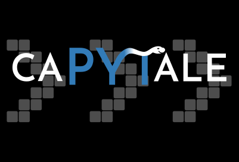

# 6.1.0 Prise en main de Python

## Préambule

### Python

{align=right}

Python est un [*langage de programmation*](https://fr.wikipedia.org/wiki/Langage_de_programmation){:target="_blank"} inventé en 1991 par Guido Van Rossum.

Ce langage est un des langages les plus utilisés actuellement (avec le C, le Java, le Javascript ...), notamment dans le monde scientifique.

Il est aussi un des langages de développement de nombreuses applications (Spotify, Instagram, Netflix), des sites Web, de traitement de données,  du noyau Linux... Python fait à peu près tout ce qu'on veut. Sauf le café.

 Il est aussi parfaitement adapté à la découverte de la programmation, de par sa clarté et sa concision (il a aussi bien sûr beaucoup de défauts !).

C'est pourquoi c'est le langage de programmation utilisé au lycée en Mathématiques, en Physique-Chimie, en SNT et bien sûr maintenant en NSI.

### Ordinateur  
Mis à part des calculs (beaucoup et très rapidement), un ordinateur ne sait pas faire énormément de choses...
Il sait faire les instructions suivantes:

- gérer des données stockées dans des variables;
- faire des tests (entre les valeurs des variables);
- répéter des instructions;
- enchaîner des instructions.

Et c'est (à peu près) tout.

!!! quote "Citation"
    Un ordinateur, c'est complètement con.

!!! quote "Citation"
    Programmer, c'est compliqué.

Ces deux citations sont de Gérard Berry, professeur d'Informatique au collège de France. La première signifie qu'un ordinateur ne prend pas de décision, et attend des instructions somme toute assez basiques. La seconde signifie que c'est à l'être humain de traduire sa façon de penser et de résoudre un problème en une séquence de ces quelques instructions basiques. Et ce n'est pas toujours simple.

Bien sûr, il faut également connaître la *syntaxe* de ces instructions, c'est-à-dire comment les écrire correctement pour que l'ordinateur puisse les interpréter sans erreur (car un ordinateur ne sait pas corriger vos erreurs, cf. citation 1).

Et n'oubliez pas:

!!! quote "Citation"
    99% des problèmes en informatique se situent entre le clavier et la chaise.

## Utiliser Python

Pour pouvoir utiliser un langage de programmation, en particulier Python, on a besoin d'un [IDE](https://fr.wikipedia.org/wiki/Environnement_de_d%C3%A9veloppement) (environnement de développement). Il en existe beaucoup...

## En ligne

Rendez-vous sur la page [https://console.basthon.fr/](https://console.basthon.fr/){:target="_blank"} 

<em>Éditeur à gauche, console à droite</em>

En s'identifiant sur l'ENT du lycée, vous avez accès à l'application **Capytale**, dans laquelle vous pouvez créer et gérer vos activités Basthon. 

{: .center width=240} 

## Au lycée / à la maison

Nous utiliserons l'IDE [Thonny](https://thonny.org/){:target="_blank"}  au lycée, qui est assez simple et complet.
Si vous souhaitez installer Python sur votre PC à la maison, je vous conseille de l'installer également.

{: .center .w640}

<em>Éditeur en haut, console en bas</em>

