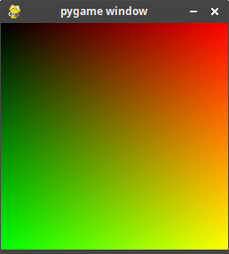

# 6.1.2 La boucle `for`

{{ initexo(0) }}

> Un ordinateur est fait pour effectuer des calculs longs et **répétitifs**.

## 1. Le principe
<!-- «Une cuillère pour ... maman», «Une cuillère pour ... Papa», «Une cuillère pour ... Tatie Jacqueline», etc. -->

Imaginons - nous sommes en 2074 - une maman (ou un papa) qui souhaite faire manger à son enfant les 10 dernières cuillères de soupe... en programmant son robot domestique pour qu'il annonce ces phrases à sa place.

On pourrait imaginer un code qui ressemble à ça:

```python
print("Une cuillère pour maman")
print("Une cuillère pour papa")
print("Une cuillère pour mamie Françoise")
print("Une cuillère pour papy Jacques")
print("Une cuillère pour mémé Paulette")
print("Une cuillère pour tata Jacqueline")
print("Une cuillère pour tonton Michel")
print("Une cuillère pour le cousin Maurice")
print("Une cuillère pour la cousine Gertrude")
print("Une cuillère pour Médor")
```

C'est très répétitif. Et heureusement qu'il n'y a que 10 cuillères...

D'autant que chaque instruction est quasiment identique, seul le nom du membre de la famille change.

En français, on serait tenté de résumer en 
> «annonce une cuillère pour chacun des 10 membres de la famille»

Heureusement, dans tous les langages de programmation, il existe une instruction qui permet de répéter une instruction (ou plusieurs instructions) **pour chaque élément d'un ensemble de valeurs donné**: la boucle `for`.

!!! abstract "Vocabulaire"
    En programmation, on parle de **boucle** pour toute instruction qui permet de répéter des instructions. On utilise plutôt le verbe *itérer* et on parle d'*itérations*.

## 2. Les ensembles de valeurs énumérables / itérables

En mathématiques, on dit qu'un ensemble est *dénombrable* lorsqu'on peut associer à chaque élément de l'ensemble un nombre (traditionnellement 1, 2, 3...)

- les fraises Tagada d'un paquet sont dénombrables.
- les voitures qui roulent sur l'autoroute sont dénombrables.
- l'eau qui coule d'un robinet n'est pas dénombrable.

En informatique, il existe un concept similaire qui va désigner les objets que l'on peut **énumérer**, c'est-à-dire les décomposer en une succession ordonnée d'éléments. On les appelle les **énumérables** ou les **itérables** (Python utilise le mot anglais ```iterable```).

- la variable ```NSI``` (qui est de type ```string```) est énumérable : on peut la décomposer en  ```N```,  ```S```, ```I```.
- la variable ```[4, 3, 17]```  (qui est de type ```list```[^1]) est énumérable : on peut la décomposer en  ```4```,  ```3```, ```17```.
- la variable ```5```  (qui est de type ```int```) n'est PAS énumérable : on ne peut pas la décomposer. 

[^1]: un objet de type `list` est un type construit que nous étudierons au thème 2, qui s'écrit entre crochets, ses éléments étant séparés par une virgule (comme dans cet exemple). On peut donc parcourir ses éléments.

## 3. La syntaxe
!!! abstract "La boucle `for`"
    Pour mettre en place cette boucle, on a besoin d'identifier:

    - les instructions à répéter;
    - pour quelles valeurs *différentes* on doit les répéter: on a donc besoin d'une variable et d'un iterable que cette variable va parcourir;
    - identifier dans les instructions ce qui dépend de cette variable de boucle.

     
    **Syntaxe générale:**

    ```python
    for var in iterable:
        *instructions à répéter*
    ```
    où `var` est un nom de variable (non précédemment déclarée dans le programme), `iterable` un objet ... itérable.

    On dit que `var` *parcourt* l'ensemble `iterable`.


!!! note "Exemples essentiels à tester"
    === "avec une chaîne de caractères"
        ```python
        for l in "INRIA":
            print(l)
        ```
        ??? note "Étude du code"
            Étudions, grâce à PythonTutor, le détail de cette exécution.

            Cliquez sur Next et observez bien l'évolution de la variable ```k```.

            <iframe width="800" height="300" frameborder="0" src="https://pythontutor.com/iframe-embed.html#code=for%20l%20in%20%22INRIA%22%3A%0A%20%20%20%20print%28l%29&codeDivHeight=400&codeDivWidth=350&cumulative=false&curInstr=0&heapPrimitives=nevernest&origin=opt-frontend.js&py=3&rawInputLstJSON=%5B%5D&textReferences=false"> </iframe>


    === "avec une liste"
        ```python
        for a in [1, 2, 3, 4]:
            b = 2 * a
            print("le double de", a, "est", b)
        ```
        ??? note "Étude du code"
            Étudions, grâce à PythonTutor, le détail de cette exécution.

            Cliquez sur Next et observez bien l'évolution de la variable ```a```. 

            <iframe width="800" height="300" frameborder="0" src="https://pythontutor.com/iframe-embed.html#code=for%20a%20in%20%5B1,%202,%203,%204%5D%3A%0A%20%20%20%20b%20%3D%202%20*%20a%0A%20%20%20%20print%28%22le%20double%20de%22,%20a,%20%22est%22,%20b%29&codeDivHeight=400&codeDivWidth=350&cumulative=false&curInstr=0&heapPrimitives=nevernest&origin=opt-frontend.js&py=3&rawInputLstJSON=%5B%5D&textReferences=false"> </iframe>
    
    === "sans appel à la variable de boucle"
        ```python
        for a in [1, 2, 3, 4, 5, 6]:
            print("miaou")
        ```
        ??? note "Étude du code"
            Étudions, grâce à PythonTutor, le détail de cette exécution.

            Cliquez sur Next et observez bien l'évolution de la variable ```a```. 
            <iframe width="800" height="300" frameborder="0" src="https://pythontutor.com/iframe-embed.html#code=for%20a%20in%20%5B1,%202,%203,%204,%205,%206%5D%3A%0A%20%20%20%20print%28%22miaou%22%29&codeDivHeight=400&codeDivWidth=350&cumulative=false&curInstr=0&heapPrimitives=nevernest&origin=opt-frontend.js&py=3&rawInputLstJSON=%5B%5D&textReferences=false"> </iframe>

    === "avec un `range`"
        ```python
        for k in range(10):
            print("We're up all night to get lucky")
        ```
        ??? note "Étude du code"
            Étudions, grâce à PythonTutor, le détail de cette exécution.

            Cliquez sur Next et observez bien l'évolution de la variable ```k```. 

            <iframe width="800" height="300" frameborder="0" src="https://pythontutor.com/iframe-embed.html#code=for%20k%20in%20range%2810%29%3A%0A%20%20%20%20print%28%22We're%20up%20all%20night%20to%20get%20lucky%22%29&codeDivHeight=400&codeDivWidth=350&cumulative=false&curInstr=0&heapPrimitives=nevernest&origin=opt-frontend.js&py=3&rawInputLstJSON=%5B%5D&textReferences=false"> </iframe>
!!! warning "Syntaxe"
    Il faut absolument un caractère `:` à la fin de la ligne du `for` !

!!! warning "Indentation"
    C'est le **décalage par rapport à la marge** - qu'on appelle **indentation** - qui détermine quelles sont les instructions à répéter !

!!! note "Exemples : attention à l'indentation"
    Tester les différents codes suivants dans votre IDE ou dans la console ci-dessous:

    === "Code 1"
        ```python
        for k in ["toto", "tata", "tutu"]:
        print("Bonjour", end=" ")
        print(k)
        ```
    === "Code 2"
        ```python
        for k in ["toto", "tata", "tutu"]:
            print("Bonjour", end=" ")
            print(k)
        ```
    === "Code 3"
        ```python
        for k in ["toto", "tata", "tutu"]:
            print("Bonjour", end=" ")
        print(k)
        ```
    
!!! example "Exercice 0"
    === "Énoncé"
        Compléter le code suivant pour satisfaire le parent de 2074 qui veur faire manger de la soupe à son enfant.

        ```python
        liste_noms = ["maman", "papa", "mamie Françoise", "papy Jacques", "mémé Paulette", "tata Jacqueline", "tonton Michel", "le cousin Maurice", "la cousine Gertrude", "Médor"]

        for
        ```
    === "Correction"
        {{ correction(True, 
        " 
        ```python linenums=\"1\"
        liste_noms = [\"maman\", \"papa\", \"mamie Françoise\", \"papy Jacques\", \"mémé Paulette\", \"tata Jacqueline\", \"tonton Michel\", \"le cousin Maurice\", \"la cousine Gertrude\", \"Médor\"]

        for nom in liste_noms:
            print(\"Une cuillère pour\", nom)
        ```
        "
        ) }}
    
        
## 4. À propos du `range`

Il arrive très fréquemment que la variable soit tout simplement un entier, qui doit parcourir un ensemble de nombres entiers consécutifs.

Par exemple, imaginons que votre professur.e d'EPS, à court d'idées d'activités à cause des conditions sanitaires, décide de vous faire faire 20 tours de stade et vous demande d'annoncer à chaque passage sur la ligne de départ à quel tour vous en êtes...

Vous allez donc annoncer successivement «Tour 1!», «Tour 2!», «Tour 3!», etc. jusqu'à «Tour 20!».

Pour représenter cette situation, on peut donc imaginer un code ressemblant à:
```python
for k in [1, 2, 3, 4, 5, 6, 7, 8, 9, 10, 11, 12, 13, 14, 15, 16, 17, 18, 19, 20]:
    print("Tour", k)
```
Mais la liste est très pénible à écrire.

Heureusement, comme vous avez dû le comprendre dans le dernier exemple du **3.**, l'objet de type `range` permet de générer ce genre d'ensemble de nombres entiers consécutifs.

!!! abstract "Générer une plage de nombres entiers"
    L'objet `range(start, stop, step)`:
    
    - il renvoie une séquence de nombres entiers en partant de `start` (**inclus**) jusqu'à `stop` (**exclus**), en incrémentant de `step`;

    - `start` est facultatif et vaut 0 par défaut;

    - `step` est facultatif et vaut 1 par défaut. Mais si on veut préciser `step`, alors il faut donner aussi `start`, même si sa valeur est 0.


??? warning "Attention"
    Un objet `range` **n'est pas** de type `list`. Mais on peut le convertir en liste avec la fonction `list`.
    
    ```python
    >>> range(10)
    range(0, 10)
    >>> list(range(10))
    [0, 1, 2, 3, 4, 5, 6, 7, 8, 9]
    >>> 
    ```

!!! note "Exemples"
    ```python
    >>> list(range(10))
    [0, 1, 2, 3, 4, 5, 6, 7, 8, 9]
    >>> list(range(2, 10))
    [2, 3, 4, 5, 6, 7, 8, 9]
    >>> list(range(1, 20 , 3))
    [1, 4, 7, 10, 13, 16, 19]
    ```
    
??? question "Question"
    === "Énoncé"
        Comment générer les nombres entiers de 1 à 20 (comme dans l'exemple des tours de terrain) avec un `range`?


        {{ terminal() }}

    === "Indication"
        Il ne faut pas commencer à 0... et le `stop` n'est pas inclus dans la séquence !
    
    === "Correction"
        Il faut utiliser `range(1, 21)` .

## 5. La double boucle imbriquée

Il est très souvent utile d'imbriquer une boucle dans une autre, notamment lors du parcours de tous les pixels d'une image (voir les exercices graphiques avec Pygame).

Prenons pour l'instant un exemple numérique : Comment écrire tous les produits de deux nombres compris entre 1 et 5?

Il faut pour cela que le premier facteur parcourre `range(1, 6)` mais également le deuxième facteur!

On obtient donc le code suivant:

```python linenums="1"
for x in range(1, 6):
    for y in range(1, 6):
        print(x * y)
```
<p align="center">
<iframe width="800" height="500" frameborder="0" src="https://pythontutor.com/iframe-embed.html#code=for%20x%20in%20range%281,%206%29%3A%0A%20%20%20%20for%20y%20in%20range%281,%206%29%3A%0A%20%20%20%20%20%20%20%20print%28x%20*%20y%29&codeDivHeight=400&codeDivWidth=350&cumulative=false&curInstr=0&heapPrimitives=nevernest&origin=opt-frontend.js&py=3&rawInputLstJSON=%5B%5D&textReferences=false"> </iframe>
</p>


!!! example "À vous d'essayer"
    === "Énoncé"
        Comment obtenir l'affichage suivant?

        ```python
        Papa dit : « et une cuillère pour Riri ! »
        Papa dit : « et une cuillère pour Fifi ! »
        Papa dit : « et une cuillère pour Loulou ! »
        Maman dit : « et une cuillère pour Riri ! »
        Maman dit : « et une cuillère pour Fifi ! »
        Maman dit : « et une cuillère pour Loulou ! »
        Mamie dit : « et une cuillère pour Riri ! »
        Mamie dit : « et une cuillère pour Fifi ! »
        Mamie dit : « et une cuillère pour Loulou ! »
        ```
    === "Correction"
        {{ correction(False, 
        " 
        ```python linenums=\"1\"
        for parent in [\"Papa\", \"Maman\", \"Mamie\"]:
            for enfant in [\"Riri\", \"Fifi\", \"Loulou\"]:
                print(parent, \"dit : « et une cuillère pour \", enfant, \"! »)
        ```
        "
        ) }}


## 6. Pour conclure

!!! abstract "À retenir"
    - La boucle `for` s'utilise lorsqu'on connaît à l'avance le nombre de répétitions à effectuer: soit un nombre entier, soit un ensemble de valeurs contenus dans un *iterable*. On parle de boucle **bornée**.
    - La variable de boucle prend alors successivement **chacune** des valeurs de l'*iterable*, et les instructions sont répétées pour chaque valeur.
    
    - Les instructions répétées peuvent - mais ce n'est pas obligatoire - faire appel à la variable de boucle, mais il ne faut pas que ces instructions la modifient.

    - Ne pas oublier les `:` et l'indentation !
    - `range(n)` génère une séquence de `n` nombres entiers: on s'en servira dès qu'on aura besoin de répéter `n` fois des instructions.


## 7. Exercices

### Séries 1 et 2

!!! capytale "Notebook d'exercices"
    **Série 1:** [https://capytale2.ac-paris.fr/web/c/b353-1823953](https://capytale2.ac-paris.fr/web/c/b353-1823953){:target="_blank"} 

    **Série 2:**  [https://capytale2.ac-paris.fr/web/c/21e6-1823944](https://capytale2.ac-paris.fr/web/c/21e6-1823944){:target="_blank"} 


!!! check "Quelques corrections"
    === "Exercice 4"

        ```python linenums="1"
        mystere = [111, 107, 44, 32, 98, 105, 101, 110, 32, 106, 111, 117, 233]
        mot_secret = ""
        for code in mystere:
            mot_secret = mot_secret + chr(code)
        
        print(mot_secret)
        ```

    === "Exercice 6"
        À la ligne 3, on peut aussi écrire `somme += k`.

        ```python linenums="1"
        somme = 0
        for k in range(1, 1001):
            somme = somme + k

        print(somme)
        ```

    === "Exercice 8"
        La ligne 4 est équivalente à `somme = somme + n`.

        La fonction `len` donne le nombre d'éléments d'un iterable.

        ```python linenums="1"
        nombres = [15, 8, 12, 19, 10, 17]
        somme = 0
        for n in nombres:
            somme += n
        moyenne = somme / len(nombres)

        print(moyenne)
        ```
    
    === "Exercice 9"
        <p align="center">
        <iframe width="560" height="315" src="https://www.youtube.com/embed/gm8pd0HnRbA?si=L3eUOeUVtfsu30oD" title="YouTube video player" frameborder="0" allow="accelerometer; autoplay; clipboard-write; encrypted-media; gyroscope; picture-in-picture; web-share" allowfullscreen></iframe>
        </p>
    
    
### Série 3

!!! capytale "Notebook d'exercices"
    [https://capytale2.ac-paris.fr/web/c/4ed4-1823957](https://capytale2.ac-paris.fr/web/c/4ed4-1823957){:target="_blank"} 

    !!! example "{{ exercice() }}"
        === "Énoncé"
            Proposer un code qui écrit la table de multiplication de 7.

            La sortie doit ressembler à:
            ```python 
            7x1 = 7
            7x2 = 14

            ...

            7x10 = 70
            ```
        === "Correction"
            {{ correction(False, 
            " 
            ```python 
            for k in range(1, 11):
                print(\"7 x\", k, \"=\", 7*k)
            ```
            "
            ) }}
            
    !!! example "{{ exercice() }}"
        === "Énoncé"
            Sur un jeu d'échecs, les cases sont repérées par une lettre (de A jusqu'à H) et par un chiffre (de 1 jusqu'à 8).

            Les cases sont donc A1, A2, A3, ..., H7, H8.

            Proposer un code qui écrit toutes les cases possibles.
        === "Indication"
            Pour convertir un entier en chaîne de caractères, on utilise la fonction `str`:
            ```python
            >>> k = 3
            >>> k
            3
            >>> str(k)
            '3'
            ```
            
        === "Correction"
            {{ correction(False, 
            " 
            ```python linenums=\"1\"
            for l in \"ABCDEFGH\":
                for k in range(1, 9):
                    print(l + str(k))
            ```
            "
            ) }}
        
        

### Série 3: avec Pygame

Consulter d'abord la page sur Pygame (Onglet Extras).

{{ initexo(0) }}

Dans tous les exercices, votre code doit contenir au moins une boucle `for`.

!!! example "{{ exercice() }}"
    === "Énoncé"
        L'objectif est d'obtenir un dégradé de gris:

        {: .center} 

        Pour rappel, un niveau de gris est un couleur RGB dont les trois composantes (entre 0 et 255) rouge, verte et bleue sont identiques.

        On prendra une fenêtre de 256x100 pixels.
    
    === "Correction" 
        {{ correction(False, 
        "   
        On trace 256 lignes, chacune ayant un niveau de gris allant de 0 à 255 et l'abscisse des extrémités varie également de 0 à 255. Donc on n'a besoin que d'une variable de boucle...

        ```python
        fenetre = pygame.display.set_mode((256, 100))
        for k in range(256):
            gris = (k, k, k)
            pygame.draw.line(fenetre, gris, [k, 0], [k, 100])
        ```
        "
        ) }}
        
!!! example "{{ exercice() }}"
    === "Énoncé"
        1. L'objectif est d'obtenir dix lignes aléatoires, de couleur aléatoire et d'épaisseur 5, sur un canevas de 300x300 pixels.

            > La fonction `randint(a, b)` permet d'obtenir un entier pseudo-aléatoire entre `a` et `b`
                ```python
                >>> from random import randint
                >>> randint(0, 10)
                2
                ```
            

            {: .center} 
        2. Même consigne avec les lignes qui «s'enchaînent»:

            {: .center} 
    
    === "Correction"
        {{ correction(False, 
        "
        1.
        
        ```python
        from random import randint

        fenetre = pygame.display.set_mode((300, 300))

        for k in range(10):
            r = randint(0, 255)
            g = randint(0, 255)
            b = randint(0, 255)
            pygame.draw.line(fenetre, (r, g, b), [randint(0, 300), randint(0, 300)], [randint(0, 300), randint(0, 300)], 5)
        
        ```
        
        2.
        ```python
        from random import randint

        fenetre = pygame.display.set_mode((300, 300))
        depart = [randint(0, 300), randint(0, 300)]
        for k in range(10):
            r = randint(0, 255)
            g = randint(0, 255)
            b = randint(0, 255)
            arrivee = [randint(0, 300), randint(0, 300)]
            pygame.draw.line(fenetre, (r, g, b), depart, arrivee, 5)
            depart = arrivee

        ```
        "
        ) }}

!!! example "{{ exercice() }}"
    === "Énoncé"
        Écrire un programme qui trace un quadrillage (espacement de 20 pixels) sur un canevas de 300x300 pixels.

        {: .center} 
    === "Correction"
        {{ correction(False, 
        "
        ```python
        fenetre = pygame.display.set_mode((300, 300))
        blanc = (255, 255, 255)
        fenetre.fill(blanc)
        noir = (0, 0, 0)
        for k in range(300//20):
            pygame.draw.line(fenetre, noir, [20*k, 0], [20*k, 300])
            pygame.draw.line(fenetre, noir, [0, 20*k], [300, 20*k])
        ```
        "
        ) }}
        

!!! example "{{ exercice() }}"
    === "Énoncé"
        Écrire un programme qui dessine une ligne de 20 carrés de taille 50x50, dont la couleur sera aléatoire.

        {: .center} 
    
    === "Correction"
        {{ correction(False, 
        "
        ```python
        from random import randint

        fenetre = pygame.display.set_mode((1000, 50))
        for x in range(0, 1000, 50):
            couleur = (randint(0, 255), randint(0, 255), randint(0, 255))
            pygame.draw.rect(fenetre, couleur, (x, 0, 50, 50))
        ```

        ou

        ```python
        from random import randint

        fenetre = pygame.display.set_mode((1000, 50))
        for k in range(20):
            couleur = (randint(0, 255), randint(0, 255), randint(0, 255))
            pygame.draw.rect(fenetre, couleur, (50*k, 0, 50, 50))
        ```
        "
        ) }}
        
        

!!! example "{{ exercice() }}"
    === "Énoncé"
        Animer le programme de l'exercice précédent en insérant les instructions de l'exercice précédent dans la boucle des événements.

        Vous pouvez ralentir l'animation en utilisant l'instruction:
        ```python
        pygame.time.delay(1000) # pause de 1000 millisecondes
        ```
    
    === "Correction"
        {{ correction(False, 
        "
        ```python 
        import pygame
        from pygame.locals import *
        from random import randint

        pygame.init()

        # Boucle des événements
        continuer = True
        while continuer:
            pygame.time.delay(500)
        
            for k in range(20):
                couleur = (randint(0, 255), randint(0, 255), randint(0, 255))
                pygame.draw.rect(fenetre, couleur, (50*k, 0, 50, 50))

            pygame.display.flip()

            for evenement in pygame.event.get():    #Attente des événements
                if evenement.type == QUIT:
                    continuer = False

        # Sortie
        pygame.quit()
        ```
        "
        ) }}
        

!!! example "{{ exercice() }}"
    === "Énoncé"
        Reprendre l'exercice 4, mais cette fois avec un carré de carrés... (penser à réduire la taille de moitié).

        {: .center} 
    
    === "Correction"
        {{ correction(False, 
        "
        ```python linenums='1'
        from random import randint
        
        fenetre = pygame.display.set_mode((500, 500))
        for i in range(20):
            for j in range(20):
                couleur = (randint(0, 255), randint(0, 255), randint(0, 255))
                pygame.draw.rect(fenetre, couleur, (25*i, 25*j, 50, 50))
        ```
        "
        ) }}


!!! example "{{ exercice() }}"
    === "Énoncé"
        Reproduire la figure suivante sur un canevas de 256x256 pixels.

        {: .center} 

    === "Indications"
        - la composante bleue est toujours 0;
        - faire varier les composantes rouge (abscisse) et verte (ordonnée).
        
    
    === "Correction"
        {{ correction(False, 
        "
        ```python linenums='1'
        fenetre = pygame.display.set_mode((256, 256))
        for x in range(256):
            for y in range(256):
                pygame.draw.circle(fenetre, (x, y, 0), (x, y), 0)
        ```
        "
        ) }}


!!! example "{{ exercice() }}"
    
    === "Énoncé"
        Écrire un programme qui affiche aléatoirement 100 disques dans une fenetre 300x300, de diamètre compris entre 10 et 50 et de couleur de remplissage aléatoire.

        Attention, les disques ne devront pas être «coupés» sur les bords de l'écran.

        {: .center} 

    === "Correction"
        {{ correction(False, 
        "
        ```python linenums='1'
        from random import randint
        fenetre = pygame.display.set_mode((300, 300))

        for k in range(100):
            couleur = (randint(0, 255), randint(0, 255), randint(0, 255))
            diametre = randint(10, 50)
            pygame.draw.circle(fenetre, couleur, (randint(diametre//2, 300-diametre//2), randint(diametre//2, 300-diametre//2)), diametre//2)

        ```
        "
        ) }}

!!! example "{{ exercice() }}"
    === "Énoncé" 
        Construire des cercles concentriques, en alternant les couleurs.

        {: .center} 
    === "Correction" 
        {{ correction(False, 
        "
        ```python linenums='1'
        fenetre = pygame.display.set_mode((300, 300))

        bleu = (51, 153, 204)
        orange = (204, 153, 51)

        centre = (150, 150)

        for rayon in range(140, 0, -20):
            pygame.draw.circle(fenetre, bleu, centre, rayon)
            pygame.draw.circle(fenetre, orange, centre, rayon-10)
        ```
        
        "
        ) }}
