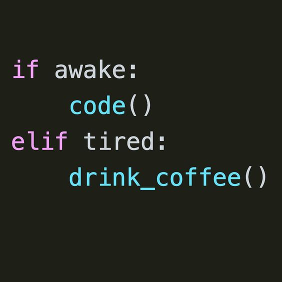

# 6.1.4 L'instruction conditionnelle `if`

{: .center width=35%} 

L'instruction conditionnelle `if` permet de soumettre l'exécution d'instructions à une condition donnée.
Cette condition sera une expression booléenne, comme pour la boucle `while`.

## 1. Premiers exemples

Testez les codes suivants (plusieurs fois en variant les valeurs) dans un IDE:

!!! note "`if`"
    ```python  linenums='1'
    n = int(input("Donne moi un nombre: "))
    if n == 42:
        print("C'est le sens de la vie")
    ```
    
!!! note "`if else`"
    ```python linenums='1'
    n = int(input("Donne moi un nombre: "))
    if n == 42:
        print("C'est le sens de la vie")
    else:
        print("Ce n'est pas le sens de la vie")
    ```

!!! note "imbriquer les `if`"
    ```python linenums='1'
    moyenne = 13

    if moyenne < 8:
        print("raté")
    else:
        if moyenne < 10:
            print("repêchage")
        else:
            if moyenne < 12:
                print("admis")
            else:
                if moyenne < 14:
                    print("mention AB")
                else:
                    if moyenne < 16:
                        print("mention B")
                    else:
                        print("mention TB")
    ```
    
## 2. La syntaxe

!!! abstract "L'instruction `if`"

    **Syntaxe générale:**
    ```python linenums='1'
    if expression:
        *instructions à effectuer si expression est vraie*
    else:
        *instructions à effectuer sinon, c'est-à-dire si expression est fausse*
    ```
    
    **Remarques:**

    - `expression` doit renvoyer une valeur **booléenne** : une égalité, comparaison, appartenance, etc. ;
    - il faut terminer la ligne commençant par `if` et `else` par `:` ;
    - les instructions à effectuer selon l'évaluation d'`expression` doivent être indentées;
    - le `else` est facultatif (comme au premier exemple);
    - en cas d'emploi du `else`, aucune expression n'est attendue.

## 3. `elif` et les cas multiples

Dans les situations où l'on veut effectuer des instrucitons différentes selon les différentes valeurs prises par une variable, comme dans le troisième exemple, on peut imbriquer les instructions `if` ... `else`.

Mais cela est vite long et peu lisible, et les différents niveaux d'indentation sont parfois piégeux.

Il existe alors une instruction qui contracte `else` et `if` : `elif` (sinon si).

Le code du troisième exemple devient alors:

```python linenums='1'
if moyenne < 8:
    print("raté")
elif moyenne < 10:
    print("repêchage")
elif moyenne < 12:
    print("admis")
elif moyenne < 14:
    print("mention AB")
elif moyenne < 16:
    print("mention B")
else:
    print("mention TB")
```


## 4. Exercices

{{ initexo(0) }}

!!! example "{{ exercice() }}"
    === "Énoncé" 
        Écrire un programme qui demande deux nombres et qui affiche le plus grand des deux.
    === "Correction" 
        {{ correction(False, 
        " 
        ```python linenums='1'
        a = int(input('Donnez moi un nombre: '))
        b = int(input('Donnez moi un autre nombre: '))
        if a > b:
            m = a
        else:
            m = b
        print('le plus grand des deux est', m)
        ```
        "
        ) }}


!!! example "{{ exercice() }}"
    === "Énoncé" 
        On calcule l'IMC (Indice de Masse Corporelle) par la formule $I = M / T^2$ où M est la masse (en kg) d'une personne et T sa taille (en m).
        Selon la classification de l'OMS, une personne est en état de maigreur si son IMC est inférieur à 18 et en surpoids si son IMC est supérieur à 25. 

        1. Écrire un programme qui demande la masse et la taille d'une personne, calcule son IMC et annonce si la personne est en état de maigreur.
        2. Modifier ensuite le programme pour qu'il annonce si la personne est en état de maigreur, en surpoids ou bien si son IMC est normal.
    === "Correction" 
        {{ correction(False, 
        "
        ```python linenums='1'
        masse = int(input('Donnez moi votre masse (en kg): '))
        taille = float(input('Donnez moi votre taille (en m): '))
        imc = masse / (taille ** 2)
        if imc <= 18:
            print('vous êtes en état de maigreur')
        elif imc >= 25:
            print('vous êtes en surpoids')
        else:
            print('votre imc est dans la norme')
        ```
        "
        ) }}
<!-- !!! example "{{ exercice() }}"
    === "Énoncé" 
        Le Mölkky est un jeu de quilles finlandais dont l'objectif est de marquer **exactement** 50 points en renversant des quilles numérotées de 1 à 12.

        Sans rentrer dans les détails, à chaque tour un joueur peut marquer entre 1 et 12 points.

        Si son score dépasse 50 points, alors il retombe à 25.

        Écrire un programme qui calcule le prochain score d'un joueur à partir de son ancien score et du nombre de points obtenu lors d'un tour.
    === "Solution" -->

!!! example "{{ exercice() }}"
    === "Énoncé" 
        Une année est déclarée bissextile (et compte donc 366 jours au lieu de 365) dans l'un des deux cas :
        
        - elle est divisible par 4 mais n'est pas divisible par 100 ;
        - elle est divisible par 400.

        Écrire un code qui détermine si une année est bissextile ou non.

    === "Correction 1" 
        {{ correction(False, 
        " 
        ```python linenums='1'
        annee = int(input('Année ? '))
        if annee%4 == 0 and annee%100 !=0:
            print('année bissextile')
        elif annee%400 == 0:
            print('annee bissextile')
        else:
            print('annee non bissextile')
        ```
        "
        ) }}

    === "Correction 2" 
        {{ correction(False, 
        "
        ```python linenums='1'
        annee = int(input('Année ? '))
        if (annee%4 == 0 and annee%100 != 0) or annee%400 == 0:
            print('année bissextile')
        else:
            print('annee non bissextile')
        ```
        "
        ) }}
        
!!! example "{{ exercice() }}"
    === "Énoncé" 
        Compter le nombre de voyelles de la phrase ```'cet exercice est prodigieusement ennuyeux'```.

        À l'aide de la fonction `len` qui renvoie la longueur d'un iterable, donner ensuite le nombre de consonnes.
    
    === "Indications"
        - Utiliser une chaine de caractères contenant toutes les voyelles et tester l'appartenance de chaque lettre à cette chaine;
        - utiliser une variable compteur.
    === "Correction" 
        {{ correction(False, 
        " 

        ```python linenums='1'
        phrase = 'cet exercice est prodigieusement ennuyeux'`
        voyelles = 'aeiouy' # on peut aussi utiliser une liste, mais moins pratique, non?
        nb_voyelles = 0
        for lettre in phrase:
            if lettre in voyelles:
                nb_voyelles += 1
        nb_consonnes = len(phrase) - nb_voyelles #je sais il y a aussi des espaces. 
        print('il y a', nb_voyelles, 'et', nb_consonnes, 'consonnes dans cette phrase.')
        # autre utilisation de la fonction print:
        print(f'il y a {nb_voyelles} et {nb_consonnes} consonnes dans cette phrase.')
        ```
        "
        ) }}
    
    
!!! example "{{ exercice() }}"
    === "Énoncé" 
        Le jeu du FizzBuzz : il s'agit de compter à partir de 1 en remplaçant certains nombres par Fizz, Buzz ou Fizzbuzz :

        - si le nombre est divisible par 3, on ne le dit pas et on le remplace par Fizz.
        - si le nombre est divisible par 5, on ne le dit pas et on le remplace par Buzz.
        - si le nombre est divisible par 3 et par 5, on ne le dit pas et on le remplace par FizzBuzz.
        - dans tous les autres cas, on donne le nombre.

        Ainsi on doit obtenir : 1, 2, Fizz, 4, Buzz, Fizz, 7, 8, etc.

        Écrire un code qui joue au FizzBuzz jusqu'à 50.

    === "Correction 1" 
        {{ correction(False, 
        "
        
        ```python linenums='1'
        for nombre in range(1, 51):
            if nombre%3 == 0 and nombre%5 == 0:
                print('FizzBuzz')
            elif nombre%3 == 0:
                print('Fizz')
            elif nombre%5 == 0:
                print('Buzz')
            else:
                print(nombre)
        ```
        "
        ) }}
       
    === "Correction 2" 
        {{ correction(False, 
        "
        Variante en utilisant des variables booléennes.
        
        ```python linenums='1'
        for nombre in range(1, 51):
            fizz = (nombre%3 == 0)
            buzz = (nombre%5 == 0)
            if fizz and buzz:
                print('FizzBuzz')
            elif fizz:
                print('Fizz')
            elif buzz:
                print('Buzz')
            else:
                print(nombre)
        ```
       "
       ) }}