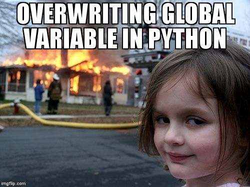

# 6.1.5 Les fonctions

{: .center} 


La notion de fonction est essentielle en programmation. Ces fonctions sont des blocs d'instructions auquels on donne un nom, et qui ont une tâche bien précise.
L'utilisation de fonctions permet de construire des programmes plus simples à écrire, à lire, à vérifier et à modifier, en découpant le programme en sous-programmes. Autre avantage, on peut utiliser ces fonctions à plusieurs endroits du programme et éviter une certaine lourdeur.

Nous avons déjà rencontré des **fonctions** depuis le début de l'année: par exemple `print`, `bin`, `len`. 

En Python, on peut définir une fonction avec le mot-clé `def`.

## 1. Schéma général d'une fonction

{: .center} 


En règle générale, une fonction s'applique à un ou plusieurs paramètres, et renvoie (au moins) une valeur. 

!!! note "Exemple"
    La fonction  `bin` prend un nombre entier (type `int`) comme paramètre et renvoie son écriture binaire.

    ```python 
    >>> bin(42)
    '0b101010'
    ```

!!! abstract "Définir une fonction - syntaxe générale"
    Pour définir une fonction, on utilise le mot-clé `def` suivi du nom de la fonction, avec le(s) paramètre(s) entre parenthèses. Le bloc d'instructions constituant **le corps** de la fonction doit être indenté.

    On renvoie une valeur avec le mot-clé `return`.

    ```python linenums="1"
    def ma_fonction(parametre):
        *instructions*
        return valeur_renvoyee
    ```
    
Reprenons par exemple un programme écrit en exercice sur la boucle `for` qui calcule la somme des entiers naturels jusqu'à 1000:

```python linenums="1"
s = 0
for k in range(1, 1001):
    s = s + k
print(s)
```

Transformons-le en une fonction. L'objectif est de pouvoir utiliser cette fonction quand on en aura besoin, et éventuellement pour calculer la somme des entiers jusqu'à n'importe quelle valeur, pas nécessairement 1000. Cette valeur va être le paramètre de la fonction. Et on ne veut plus afficher la somme, mais que cette somme soit renvoyée par la fonction (pour l'affecter à une variable, ou bien pour affichage).

```python linenums="1"
def somme(n):
    s = 0
    for k in range(1, n+1):
        s = s + k
    return s
```

Exécutez ce code dans votre IDE. Que se passe-t-il? 

Lorsque l'interpréteur Python parcourt cette fonction, rien ne s'affiche : la fonction est maintenant prête à être appelée, mais n'est pas exécutée tant que l'utilisateur ne le demande pas explicitement.

Ce sera le cas pour toutes les fonctions : elles doivent être **appelées** pour s'exécuter.

Dans la console, faites un appel à la fonction:

```python 
>>> somme(42)
903
```

!!! abstract "Vocabulaire"
    Dans cet exemple:

    - la variable `n` est le **paramètre** de la fonction `somme`;
    - on a **appelé** la fonction `somme` en lui **passant** l'**argument** `42`;
    - l'appel à cette fonction a **renvoyé** la valeur `903`.

!!! warning "«Éjection» du code avec `return`"
    L'emploi du mot-clé `return` provoque une éjection du code: tout ce qui suit l'instruction commençant par `return` ne sera pas exécuté.

    Obervez la fonction suivante en l'appelant en lui passant plusieurs arguments successivement.

    ```python linenums="1"
    def choix_cornelien(n):
        if n%2 == 0:
            print("ce texte est affiché car", n, "est pair")
            return "bon choix"
        else:
            return "mauvais choix"
        print("ce texte ne sera jamais affiché")

    choix = choix_cornelien(12)
    print(choix)
    ```
    
!!! note "Fonction à plusieurs paramètres"
    Fréquemment, il arrive qu'on ait besoin d'écrire une fonction avec plusieurs paramètres: on les écrit séparés par des virgules lors de la déclaration de la fonction.

    **Exemple:**

    ```python linenums="1"
    def repete_lettres(chaine, nombre):
        sortie = ""
        for c in chaine:
            sortie += nombre * c
        return sortie
    ```

    Il faut alors respecter l'ordre des paramètres lors de l'appel de la fonction:

    ```python 
    >>> repete_lettres("NSI", 3)
    'NNNSSSIII'
    >>> repete_lettres(3, "NSI")
    Traceback (most recent call last):
    File "<pyshell>", line 1, in <module>
    File "", line 3, in repete_lettres
        for c in chaine:
    TypeError: 'int' object is not iterable
    >>> 
    ```
    
    

## 2. Cas Particuliers

### 2.1 Fonction sans valeur renvoyée

Il n'est pas obligatoire qu'une fonction renvoie une valeur. Dans ce cas, on parle plutôt d'une **procédure**.

Par exemple, la fonction bien connue `print` va afficher en console les arguments qu'on lui a passés, mais elle ne renvoie pas de valeur (ou plutôt une valeur particulière : `None`).

Si on tente d'affecter à une variable le résultat d'un `print` :
```python 
>>> a = print("hello world")
  hello world
>>> a
>>> 
```
Et vous pouvez vérifier que dans l'inspecteur de variables, `a` contient `None`.

Un autre exemple de fonction à paramètre, mais qui ne renvoie rien:

```python linenums="1"
def chat_penible(n):
    for k in range(n):
        print("meoww")
```

```python
>>> chat_penible(3)
  meoww
  meoww
  meoww
```

### 2.2 Fonction sans paramètre

Il n'est pas obligatoire non plus qu'une fonction ait de paramètre(s).

La fonction suivante simule le tirage d'un dé truqué, avec la face 6 ayant une probabilité d'apparition de 0,5 et toutes les autres faces une probabilité de 0,1.
```python linenums="1"
from random import randint

def tirage_de_truque():
    tirage = randint(1, 10)
    if tirage >= 6:
        return 6
    else:
        return tirage
```

!!! warning "Parenthèses"
    Dans ce cas, les parenthèses vides sont cependant indispensables, lors de la déclaration de la fonction comme dans son appel.

    ```python
    >>> tirage_de_truque
    <function tirage_de_truque at 0x7fe2ccd761f0>
    >>> tirage_de_truque()
    6
    >>> 
    ```
    
## 3. Variables et fonctions

{: .center} 
!!! danger "Variables locales"
    Attention, les paramètres d'une fonction, ainsi que les variables déclarées à l'intérieur du corps de la fonction **n'existent que dans le corps de cette fonction**.

    Il n'est pas possible d'y faire référence depuis une autre instruction, et ce même si la fonction a été appelée.

    ```python linenums="1"
    def aire_rectangle(longueur, largeur):
        aire = longueur * largeur
        return aire
    ```
    
    ```python 
    >>> aire_rectangle(6, 3)
    18
    >>> longueur
    NameError: name 'longueur' is not defined
    >>> aire
    NameError: name 'aire' is not defined
    ```

!!! danger "Variables globales"
    Même si c'est possible, il est fortement recommandé de ne pas utiliser dans le corps d'une fonction des variables définies à l'extérieur de cette fonction.
    En effet, si plusieurs fonctions agissent sur ces variables, le programme peut aboutir à des valeurs ou des comportements non prévus. On parle alors **d'effet de bord**.

    Plutôt donc qu'utiliser des variables **globales**...

    {: .center} 

    On préfèrera utiliser davantage de paramètres, et on passera ces variables en arguments lors de l'appel de la fonction.

    
    === "Pas bien"
        ```python linenums="1"
        a = 5
        def fonction_idiote(n):
            s = n + a
            return s
        
        fonction_idiote(1)
        ```
        
    === "Bien"
        ```python linenums="1"
        a = 5
        def fonction_idiote(n, m):
            s = n + m
            return s
        
        fonction_idiote(1, a)
        ```

## 3. Exercices 

{{ initexo(0) }}

!!! example "{{ exercice() }}"
    === "Énoncé" 
        Écrire une fonction `maximum` qui prend deux nombres en paramètres et qui renvoie le plus grand des deux.

    === "Correction" 
        {{ correction(False,
        "
        ```python linenums='1'
        def maximum(n1, n2):
            if n1 > n2:
                return n1
            else:
                return n2
        ```
        "
        ) }}
        

!!! example "{{ exercice() }}"
    === "Énoncé" 
        Transformez les programmes de la section 6.1.4 (if) en fonctions.

        - **Exercice 4** : la fonction prend un entier (l'année) en paramètre et renvoie `True` ou `False` selon que l'année est bissextile ou non.
        - **Exercice 5** : la fonction prend une chaine de caractères en paramètre et renvoie le nombre de voyelles.

    === "Correction ex 4"  
        {{ correction(False,
        "
        ```python linenums='1'
        def is_leap(year):
            if year%4 == 0 and year%100 != 0:
                return True
            elif year%400 == 0:
                return True
            else:
                return False
        ```
        "
        ) }}

    === "Correction ex 5"  
        {{ correction(False,
        "
        ```python linenums='1'
        def compte_voyelles(phrase):
            voyelles = 'aeiouy'
            nb_voyelles = 0
            for lettre in phrase:
                if lettre in voyelles:
                    nb_voyelles += 1
            return nb_voyelles
        ```
        "
        ) }}


!!! example "{{ exercice() }}"
    === "Énoncé" 
        Écrire une fonction `leet_speak` qui prend en paramètre une chaine de caractères (en minuscules) et qui renvoie sa traduction en «Leet Speak».

        C'est-à-dire la même chaîne de caractères en ayant remplacé:

        - les `a` par des `4`;
        - les `e` par des `3`;
        - les `s` par des `5`;
        - les `i` par des `1`;
        - les `o` par des `0`.

        Par exemple, votre fonction doit produire le résultat suivant:
        ```python linenums='1'
        >>> leat_speak('leet speak')
         l33t 5p34k
        ```
        
    === "Correction" 
        {{ correction(False, 
        "
        ```python linenums='1'
        def leet_speak(chaine):
            traduction = \"\"
            for car in chaine:
                if car == 'a':
                    traduction += '4'
                elif car == 'e':
                    traduction += '3'
                elif car == 's':
                    traduction += '5'
                elif car == 'i':
                    traduction += '1'
                elif car == 'o':
                    traduction += '0'
                else:
                    traduction += car
            return traduction
        ```
        
        "
        ) }}