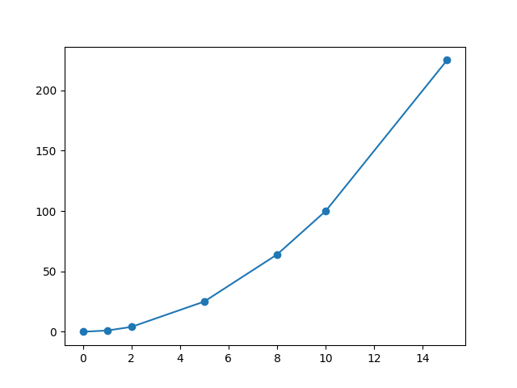

# T6.2 Utilisation de bibliothèques

{: .center} 

L'utilisation de fonctions (ou de procédures) permet dans l'écriture d'un programme de ne pas répéter les mêmes portions de code, et de découper un programme en sous-programmes.

Il arrive aussi fréquemment que ces fonctions puissent être utilisées dans **d'autres programmes** : il est alors nécessaire de les stocker ailleurs que dans le programme lui-même.

Ces fonctions sont souvent regroupées par thème dans des fichiers `.py` appelés **bibliothèques** (library in english) ou **modules**.

Les objectifs de cette répartition des fonctions en modules - on parle de conception modulaire - sont multiples:

- rendre un programme plus lisible;
- répartir la programmation au sein d'une équipe;
- faciliter les tests.


Les modules peuvent donc être vus comme des «boîtes à outils» dont on va se servir uniquement lorsqu'on en a bseoin. Il en existe un très grand nombre en Python, ce qui fait une des forces de ce langage.

{: .center} 

## 6.2.1 Importer un module

L'interpréteur Python propose [quelques fonctions et types natifs](https://docs.python.org/fr/3/library/functions.html){target="_blank"} qui sont toujours disponibles.

L'installation de Python sur un ordinateur comporte également une [bibliothèque standard](https://docs.python.org/fr/3/library/index.html){target="_blank"} qui contient les modules les plus utilisés. 

!!! note "Exemples"
    Quelques exemples de modules très fréquemment utilisés:

    - `math`: toutes les fonctions et constantes mathématiques;
    - `random`: fonctions permettant de générer des nombres pseudo-aléatoires;
    - `time`: fonctions qui donnent accès au... temps;
    - `os`: permet de manipuler les chemins d'accès aux dossiers et fichiers.


Mais attention, ces modules ne sont pas disponibles dans un programme **tant qu'on ne les a pas importés**, c'est-à-dire chargés en mémoire de l'interpréteur Python.

!!! abstract "Import de modules"
    Pour importer un module, on utilise le mot-clé `import`. On importe les modules **en début de programme**.

    Par exemple, pour pouvoir utiliser le module `random` (et tout ce qu'il contient):

    ```python 
    import random
    ```

## 6.2.2 Consulter la documentation d'un module

Il suffit pour cela d'utiliser  (en console) la fonction `help` en passant le nom du module en argument. Par exemple, pour consulter la documentation du module `random` (faites-le !):

```python 
>>> help(random)
```

On y trouve beaucoup de choses... en particulier ce qui nous intéresse pour l'instant: les fonctions disponibles.

Par exemple, on y trouve la fonction `randint` que vous avez certainement utilisée en classe de seconde. Ou pas.

    randint(a, b) method of random.Random instance
        Return random integer in range [a, b], including both end points.

## 6.2.3 Utilisation d'une fonction d'un module

!!! abstract "Notation préfixée"
    Une fois le module importé, on peut accéder aux fonctions (ou autres contenus) en **préfixant** les noms par celui du module. 

    ```python
    >>> import random
    >>> random.randint(1, 6)
    4
    ```
    L'oubli du préfixe-nom du module provoquera une erreur de type `NameError`:
    ```python 
    >>> import random
    >>> randint(1, 6)
    Traceback (most recent call last):
    File "<pyshell>", line 1, in <module>
    NameError: name 'randint' is not defined
    ```

Si vous trouvez ça pénible de devoir écrire à chaque fois le nom du module en préfixe, il y a cependant un avantage criant : dans un programme conséquent, on sera amenés à importer plusieurs modules, dont on ne peut connaître toutes les fonctions... et il y en a peut-être qui portent le même nom... Il faut donc savoir dans quel module utiliser la bonne fonction!

!!! info "Documentation d'une fonction"
    Comme vous l'avez remarqué, on peut vite se perdre dans la documentation d'un module. Si on connaît le nom d'une fonction dont on veut la documentation (pour se rappeler par exemple de ses paramètres, du type de valeur renvoyée), on peut utiliser la fonction `help` uniquement sur la fonction elle-même:

    ```python 
    >>> help(random.choice)
    Help on method choice in module random:

    choice(seq) method of random.Random instance
        Choose a random element from a non-empty sequence.

    >>> random.choice(["C-3PO", "R2D2", "BB-8", "K-2SO"])
    'BB-8'
    ```

## 6.2.4 Autres imports

!!! danger "Import sans préfixe"
    On peut égaler importer uniquement **une** fonction d'un module si on sait qu'on n'aura besoin que de cette fonction. Pour les raisons évoquées plus haut, on évitera le plus possible cette utilisation.

    La syntaxe est la suivante, et elle permet de ne plus préfixer le nom de la fonction:

    ```python 
    >>> from random import randint
    >>> randint(1, 6)
    2
    ```
    
!!! info "Alias"   
    Un moyen de ne pas rendre l'utilisation de noms de fonctions trop verbeux (par exemple le module de tracé de courbes `matplotlib.pyplot`), on peut renommer le module pour lui donner un nom plus court (alias) à l'aide du mot-clé `as`.

    === "Exemple 1"

        ```python 
        >>> import random as rd
        >>> rd.randint(1, 6)
        6
        ```
    
    === "Exemple 2"
        ```python linenums='1'
        import matplotlib.pyplot as plt

        abscisses = [0, 1, 2, 5, 8, 10, 15]
        ordonnees = [0, 1, 4, 25, 64, 100, 225]
        
        plt.plot(abscisses, ordonnees, "-o") 
        plt.show()
        ```

        Ce programme donne le graphique:

        {: .center} 
    

## 6.2.5 Exercices

{{ initexo(0) }}

!!! example "{{ exercice() }}"
    === "Énoncé" 
        En console:
        
        1. calculer la racine carrée de 25, puis de 2;
        2. calculer $\pi^2$.

        La fonction racine carrée (square root in english) se trouve dans le module `math`. La chercher dans ce module, qu'il faudra importer. Regarder à la fin de la documentation les constantes...

    === "Solution" 
        {{ correction(False, 
        "
        La fonction se nomme `sqrt`.
        ```python 
        >>> import math
        >>> math.sqrt(25)
        5.0
        >>> math.sqrt(2)
        1.4142135623730951
        ```
        
        "
        ) }}
!!! example "{{ exercice() }}"
    L'objectif de cet exercice est de mesurer le temps d'exécution d'un programme. On va pour cela utiliser le module `time`.

    === "Partie 1" 
        

        **En console:**

        1. Importer le module `time`.
        2. Consulter la documentation de ce module. Repérer dans la description les deux façons de représenter le temps. Nous utiliserons la première.
        3. Noter la date correspondante à "the Epoch".
        4. Trouver[^1] dans les fonctions celle qui permet de récupérer le **temps courant** en secondes depuis the Epoch. 

        [^1]: Indice en bas de votre écran: c'est l'antépénultième.

        5. Maintenant qu'on dispose d'une telle fonction, qui renvoie donc le temps courant **au moment où on l'appelle dans le programme**, comment l'utiliser pour mesurer le temps d'exécution d'un programme?

    === "Partie 2"
        On va maintenant utiliser la fonction `time.time` pour mesurer le temps d'exécution du programme (très inutile) suivant:

        ```python linenums='1'
        for k in range(1000000):
            pass
        ```
        **Dans un éditeur:**

        1. Importer le module `time`.
        2. Copier-coller le code ci-dessus.
        3. Affecter à une variable `t0` le temps courant **avant** la boucle `for`.
        4. Affecter à une variable `t1` le temps courant **après** la boucle `for`.
        5. Ajouter une instruction pour afficher le temps d'exécution du programme.

        Pour indication, j'obtiens un temps de l'ordre de 0.3 secondes sur Basthon/Capytale et de 0.03 secondes sur ma machine personnelle.

    === "Solution" 
        {{ correction(False, 
        "
        "
        ) }}