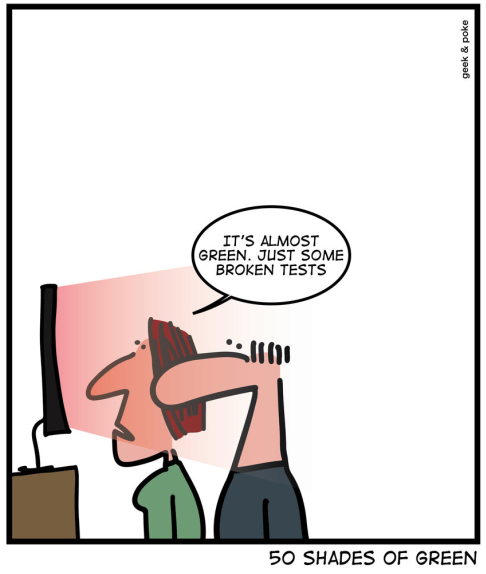

# T6.3 Tester une fonction

{: .center} 

Normalement, la première chose qu'on fait après avoir écrit une fonction, c'est la tester.
Pour cela, on passe des arguments à la fonction pour lesquels on connaît le résultat attendu.

Par exemple, reprenons la fonction `maximum` écrite au chapitre 6.1.5:

```python linenums='1'
def maximum(n1, n2):
    if n1 > n2:
        return n1
    else:
        return n2
```
Ensuite, en console, on la teste en passant des arguments simples:

```python 
>>> maximum(2, 5)
5
>>> maximum(10, 3)
10
```
Dans la vraie vie des programmeurs, c'est le contraire. On écrit d'abord les tests. Puis la fonction. Et enfin on effectue les tests.


## 6.3.1 Assert

Ces tests reposent sur le mot-clé `assert`, qui va lever une erreur lorsqu'il est suivi d'une expression évaluée à `False`:

```python 
>>> assert 2 == 3
Traceback (most recent call last):
  File "<pyshell>", line 1, in <module>
AssertionError
>>> assert 2 <= 3
>>>

```

Avant d'écrire cette fonction `maximum`, on écrirait alors:
```python linenums='1'
assert maximum(2, 5) == 2
assert maximum(10, 3) == 10
assert maximum(4, 4) == 4
```

Ce *jeu de tests* peut se regouper dans une fonction pour vérifier qu'elle a bien le comportement désiré.

```python linenums='1'
def test_maximum():
    assert maximum(2, 5) == 2
    assert maximum(10, 3) == 10
    assert maximum(4, 4) == 4
    print("tests ok") # cette ligne ne s'éxecutera que si aucune erreur n'est levée par assert
```

!!! note "Un autre exemple"
    Toujours au chapitre 6.1.5, je vous ai demandé d'écrire une fonction `est_bissextile` permettant de déterminer si une année est bissextile ou non (en renvoyant un booléen).

    Comme on sait (?) que 2000 était bissextile, que 2020 également, mais ni 1900 ni 2021 ne le sont, on aurait pu commencer par écrire notre fonction de jeu de tests ainsi:

    ```python linenums='1'
    def test_est_bissextile():
        assert est_bissextile(2000) == True
        assert est_bissextile(2020) == True
        assert est_bissextile(1900) == False
        assert est_bissextile(2021) == False
        print("tests ok")
    ```

!!! warning "Jeu de tests couvrant ?"
    Il faut vérifier que les tests couvrent toutes les situations possibles, mais ce n'est pas toujours facile !

{: .center} 
## 6.3.2 Exercices

{{ initexo(0) }}

!!! example "{{ exercice() }}"
    === "Énoncé" 
        Écrire un jeu de tests pour la fonction `compte_voyelles` de l'exercice 2 du chapitre 6.1.5.
    === "Solution" 
        {{ correction(True, 
        "
        ```python linenums='1'
        def test_compte_voyelles():
            assert compte_voyelles('toto') == 2
            assert compte_voyelles('oiseau') == 5
            assert compte_voyelles('kjhtfgrvcbnszqwp') == 0
            assert compte_voyelles('') == 0
        ```
    
        "
        ) }}

!!! example "{{ exercice() }}"
    === "Énoncé" 
        1. Écrire un jeu de tests pour une fonction `fizzbuzz` qui prend un entier en paramètre et renvoie ... vous savez quoi (cf. ex 6 de 6.1.4).
        2. Écrire la fonction `fizzbuzz` et la tester.
    === "Solution" 
        {{ correction(True, 
        "
        1. Le jeu de tests doit comporter au moins 4 cas, un pour chaque retour possible de la fonction.
        ```python linenums='1'
        def test_fizzbuzz():
            assert fizzbuzz(3) == 'Fizz'
            assert fizzbuzz(5) == 'Buzz'
            assert fizzbuzz(15) == 'FizzBuzz'
            assert fizzbuzz(2) == 2
        ```
        2.
        ```python linenums='1'
        def fizzbuzz(nombre):
            if nombre%3 == 0 and nombre%5 == 0:
                return 'FizzBuzz'
            elif nombre%3 == 0:
                return 'Fizz'
            elif nombre%5 == 0:
                return 'Buzz'
            else:
                return nombre
        ```
        
        "
        ) }}

