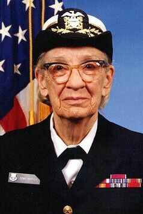

# Langages et programmation

!!! history "Histoire de l'informatique"
    {align=left width=100px} 

    {align=right width=100px} 

    [John Backus](https://fr.wikipedia.org/wiki/John_Backus){:target="_blank"} (1924-2007) est l'auteur de l'un des premiers langages de programmation : le **Fortran** (1954). Il a par la suite proposé, avec Peter Naur, la *notation de Backus Naur* qui permet de décrire des grammaires formelle pour langages de programmation...

    [Grace Hopper](https://fr.wikipedia.org/wiki/Grace_Hopper){:target="_blank"}  (1906-1992) est une informaticienne américaine, connue pour sa contribution à la conception et à la traduction des premiers langages de programmation, et comme l’une des principales inspiratrices du langage COBOL.

Les langages de programmation permettent de décrire d'une part les structures des données qui seront manipulées par l'appareil informatique, et d'autre part d'indiquer comment sont effectuées les manipulations, selon quels algorithmes. Ils servent de moyens de communication par lesquels le programmeur communique avec l'ordinateur, mais aussi avec d'autres programmeurs...

{: .center}

??? video "Vidéo"
    

    <iframe width="640" height="360" src="https://www.youtube.com/embed/Og847HVwRSI" title="YouTube video player" frameborder="0" allow="accelerometer; autoplay; clipboard-write; encrypted-media; gyroscope; picture-in-picture" allowfullscreen></iframe>
    
