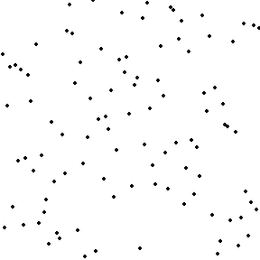

# 7.1 Tri par sélection

{: .center} 


# 1. Pourquoi étudier des algorithmes de tri ?  

Autant ne pas le cacher, ces algorithmes sont déjà implémentés (quelque soit le langage) dans des fonctions très performantes.  

En Python, on utilise la fonction `sort()`:


```python
>>> tab = [4, 8, 1, 2, 6]
>>> tab.sort()
>>> tab
[1, 2, 4, 6, 8]

```

{: .center width=30%}


Le meilleur de nos futurs algorithmes de tri sera moins efficace que celui de cette fonction `sort()`...  
Malgré cela, il est essentiel de se confronter à l'élaboration manuelle d'un algorithme de tri: 

- besoin pratique de trier;
- tri comme sous-programmes;
- utilisation de toutes les techniques informatiques.

Le tri par sélection est le premier des deux algorithmes de tri que nous allons étudier (nous étudierons aussi le tri par insertion).  
Ces deux algorithmes ont pour particularité de :

- ne pas nécessiter la création d'une nouvelle liste. Ils modifient la liste à trier **sur place**.
- ne pas faire intervenir de fonctions complexes.


# 2. Principe du tri 

{: .center} 

On cherche à trier un tableau de $n$ valeurs différentes, en général les entiers de $0$ à $n-1$.

- En partant de l'indice 0, on cherche l'indice du plus petit élément en parcourant le tableau;
- on l'échange avec l'élément d'indice 0;
- On recommence en partant de l'indice 1, puis 2, etc. jusqu'à ce que le tableau soit trié.

{{ initexo(0) }}

!!! example "{{ exercice() }}"
    === "Énoncé" 
        On veut écrire une fonction `tri_selection` qui prend en paramètre une liste et qui trie cette liste par l'algorithme du tri par sélection.

        1. Écrire un jeu de tests pour la fonction `tri_selection`.
        2. Compléter puis teser la fonction ci-dessous. 

        ```python linenums='1'
        def tri_selection(tab: list) -> None:
            n = 
            for i in range(0, n-1):
                indice_min = 
                for j in range( , ):
                    if tab[j] < tab[indice_min]:

                #il reste à échanger les valeurs d'indice i et indice_min

        
                
        ```
    
    === "Correction" 
        {{ correction(False, 
        "
        ```python linenums='1'
        def tri_selection(tab: list) -> None:
            n = len(tab)
            for i in range(n-2):
                indice_min = i
                for j in range(i+1, n):
                    if tab[j] < tab[indice_min]:
                        indice_min = j
                temp = tab[indice_min]
                tab[indice_min] = tab[i]
                tab[i] = temp

        ```
        
        "
        ) }}


    
!!! example "{{ exercice() }}"
    === "Énoncé" 
        
    === "Correction" 
        {{ correction(False, 
        "
        "
        ) }}