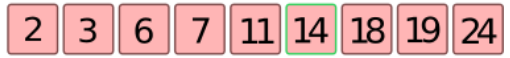
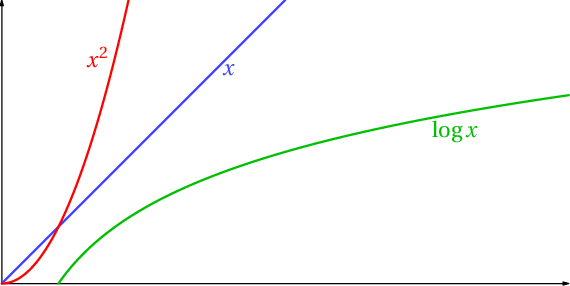

# T7.3 Recherche par dichotomie

<p align="center">
<iframe width="560" height="315" src="https://www.youtube.com/embed/iw4_7ioHWF4" title="YouTube video player" frameborder="0" allow="accelerometer; autoplay; clipboard-write; encrypted-media; gyroscope; picture-in-picture" allowfullscreen></iframe>
</p>

## 7.3.1 Préambule

Il s'agit dans ce chapitre d'étudier une *bonne* façon de rechercher une valeur (un entier pour ce qui nous concerne) dans **un tableau/une liste trié.e**. 

La stratégie de recherche vue dans le DL4 consiste à restreindre de moitié l'intervalle d'étude à chaque étape. On appelle cela une méthode par dichotomie, du grec ancien διχοτομία, dikhotomia (« division en deux parties »).

La méthode de dichotomie fait partie des méthodes dites «[diviser pour (mieux) régner](https://fr.wikipedia.org/wiki/Diviser_pour_r%C3%A9gner_(informatique)){:target="_blank"} », catégorie d'algorithmes que nous étudierons plus en détail en Terminale.

## 7.3.2 Une première méthode

!!! code "Recherche séquentielle (par balayage)"
    C'est la méthode la plus intuitive : on essaie toutes les valeurs (par exemple, dans l'ordre croissant) jusqu'à trouver la bonne.

    Écrire une fonction `trouve` qui prend en paramètre une liste et une valeur, et qui renvoie l'indice de la valeur dans la liste si elle y figure, et `None` sinon.

    ```python
    >>> lst = [2, 3, 6, 7, 11, 14, 18, 19, 24]
    >>> trouve(lst, 14)
    5
    >>> trouve(lst, 42)
    None
    ```

    ??? check "Correction"
        ```python linenums='1' title="Recherche par balayage"
        def trouve(tab: list, valeur: int):
            for k in range(len(tab)):
                if tab[k] == valeur:
                    return k
            return None
        ```
    
!!! note "Terminaison et complexité de la méthode"
    - On est sûr que cet algorithme s'arrête (boucle `for`).
    - Le nombre (maximal) d'opérations nécessaires est proportionnel à la taille de la liste à étudier. Si on appelle $n$ la longueur de la liste, on dit que cet algorithme est **d'ordre $n$**, ou **linéaire**, ou en $O(n)$.


## 7.3.3 La méthode par dichotomie

{: .center} 


!!! code "Recherche dichotomique"
    **Principe de l'algorithme:**
    
    - on se place **au milieu** de la liste;
    - on compare la valeur cherchée à celle du milieu;
    - si la valeur cherchée est inférieure, on ne garde que la première moitié (à gauche) de la liste, sinon on ne garde que la deuxième moitié (à droite);
    - on recommence avec la bonne moitié de la liste jusqu'à trouver la valeur cherchée.


    === "Exemple"
        Cherchons la valeur 14 dans la liste suivante:

        {: .center} 

    === "Illustration"
        La flèche rouge indique la valeur centrale, d'indice `indice_centre`, les flèches bleues les valeurs du début et de fin de la liste à traiter, d'indices respectifs `indice_debut` et `_indice_fin`.

        {: .center} 

        - étape 1 : toute la liste est à traiter. On se place sur l'élément central. Ici il y a 9 éléments, donc on se place sur le 4ème, qui est 11.
        - étape 2 : on compare 11 à la valeur cherchée (14). Il faut donc garder tout ce qui est supérieur à 11.
        - étape 3 : on se place au milieu de la liste des valeurs qu'il reste à traiter. Ici il y a 4 valeurs, donc il n'y a pas de valeur centrale. On va donc se positionner sur la 2ème valeur, qui est 18.
        - étape 4 : on compare la valeur 18 à la valeur cherchée : 14. Elle est supérieure, donc on garde ce qui est à gauche. Il n'y a plus qu'une valeur.
        - étape 5 : on se place sur la valeur 14 et on compare avec 14. La valeur est trouvée.
    
    === "Programmation de l'algorithme"

        ```python linenums='1' title="Méthode de recherche par dichotomie (à compléter)"
        def trouve_dicho(tab: list, valeur: int) :
            '''
            Renvoie l'indice de 'valeur' si 'valeur' est trouvée dans la liste 'tab', et None sinon.

            'tab' doit être une liste triée dans l'ordre croissant.
            '''
            indice_debut = ...
            indice_fin = ...
            while indice_debut <= indice_fin :
                indice_centre = (... + ...) // 2     # on prend l'indice central
                valeur_centrale = tab[...]             # on prend la valeur centrale 
                if valeur_centrale == ... :          # si la valeur centrale est la valeur cherchée...
                    return ...
                elif valeur_centrale < ... :         # si la valeur centrale est trop petite...
                    indice_debut = ...
                else :
                    indice_fin = ...
            return ...

        lst = [2, 3, 6, 7, 11, 14, 18, 19, 24]

        assert trouve_dicho(lst, 14) == 5
        assert trouve_dicho(lst, 3) == 1
        assert trouve_dicho(lst, 7) == None
        assert trouve_dicho(lst, 42) == None
        
        ```

!!! note "Terminaison et complexité de la méthode"
    === "Terminaison"
        Contrairement à la première méthode, l'algorithme de recherche par dichotomie contient une boucle `while` : il faut s'assurer que cette boucle s'arrête.

        ??? abstract "Variant de boucle"
            Dans la boucle `while`,  la valeur `indice_fin - indice_debut` est un **variant de boucle**: c'est un nombre entier positif qui va décroître strictement à chaque passage dans la boucle, ce qui assure la terminaison.

            En effet, dans la boucle: 

            - soit la valeur est trouvée, et le ` return` assure la sortie de la boucle;
            - soit indice_debut augmente d'au moins 1, et donc `indice_fin - indice_debut` diminue strictement;
            - soit indice_fin diminue d'au moins 1, et donc `indice_fin - indice_debut` diminue strictement.

    === "Complexité"
        Dans le pire des cas (la valeur cherchée n'est pas dans la liste), combien d'itérations de la boucle sont nécessaires pour une liste de taille N ?

        Sachant qu'à chaque itération de la boucle on divise le tableau en 2, cela revient donc à se demander combien de fois faut-il diviser le tableau en 2 pour  obtenir, à la fin, un tableau comportant un seul entier ? Autrement dit, combien de fois faut-il diviser N par 2 pour obtenir 1 ?

        | taille de la liste | 1 | 2 | 4 | 8 | 16 | 64 | 256 | 4096 |
        | :---- |:-:|:-:|:-:|:-:|:-:|:-:|:-:|:-:|
        | nombre d'étapes    |||||||||

        !!! info "Logarithme"
            La fonction mathématique *logarithme de base 2* permet de trouver le nombre de puissances de que contient un nombre N. On note $\log_2(N)$ .
        

        La complexité de l'algorithme de dichotomie est donc **logarithmique**, en $O(\log_2(n))$.

        {: .center} 


{{ initexo(0) }}
!!! example "Exercice : mesure du temps d'exécution"
    === "Énoncé" 
        1. Utiliser la fonction suivante pour mesurer les temps d'exécution des deux fonctions `trouve` et `trouve_dicho` sur 100 appels en cherchant la plus grande valeur de la liste `tab_alea` fournie.
        ```python linenums='1'
        import random
        import time

        def temps_moyen(f, tab: list, valeur: int, n:int) -> float:
            '''
            Renvoie le temps moyen d'exécution sur 'n' itérations de la fonction de recherche 'f',
            appelée sur une recherche de 'valeur' dans la liste 'tab'.
            '''
            t_moy = 0
            for k in range(n):
                t0 = time.time()
                f(tab, valeur)
                t1 = time.time()
                t_moy += t1 - t0
            return t_moy / n
        
        tab_alea=sorted([random.randint(1, 1000000) for _ in range(100000)])
        ```
        2. Recommencer en augmentant la taille de `tab_alea` (x 10) et comparer les temps d'exécution.

    === "Correction" 
        {{ correction(False, 
        "
        "
        ) }}