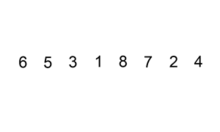

# T7.3 Tri par insertion

Après le tri par sélection, nous allons étudier un deuxième algorithme de tri: le tri par insertion. C'est le «tri du joueur de cartes».

Il consiste à choisir un élément et de l'insérer à la bonne position en faisant «remonter» les éléments plus grands que lui.

{: .center width=50%} 

**Quelques remarques:**

- on commence à l'indice 1;
- pour chaque indice de travail `i`, on appelle clé l'élément de la liste d'indice `i`;
- on examine ensuite les éléments à gauche, c'est-à-dire les élements d'indice `j < i`;
- tant que l'élément d'indice `j` est supérieur à la clé, on le décale d'une position vers la droite;
- une fois que ce n'est plus possible, on insère la clé.

{{ initexo(0) }}

!!! example "{{ exercice() }}"
    === "Énoncé" 
        Implémenter l'algorithme du tri par insertion sous la forme d'une fonction:

        ```python linenums='1'
        def tri_insertion(tab: list) -> None:
            '''
            Trie en place le tableau tab donné en paramètre
            '''
        ```
    
    === "Indication"

        ```python linenums='1'
        def tri_insertion(tab: list) -> None:
            '''
            Trie en place le tableau tab donné en paramètre
            '''
            for i in range():
                cle = 
                j = 
                while  and :
                    tab[ ] = tab[ ]
                    j =
                tab[] = 

        ```
        
    === "Correction" 
        {{ correction(False, 
        "
        ```python linenums='1'
        def tri_insertion(tab: list) -> None:
            '''
            Trie en place le tableau tab donné en paramètre
            '''
            for i in range(1, len(tab)):
                cle = tab[i]
                j = i - 1
                while j > 0 and tab[j] > cle:
                    tab[j+1] = tab[j]
                    j = j - 1
                tab[j+1] = cle

        ```
        "
        ) }}

!!! example "{{ exercice() }}"
    === "Énoncé" 
        Il s'agit d'étudier la complexité de cet algorithme de façon expérimentale.

        Pour cela:

        1. Reprendre les fonctions `chrono` et `pire_cas` de l'exercice 2 sur le tri par sélection et afficher le graphique des temps d'exécution.
        2. Faire de même avec une liste déjà triée. Que remarquez-vous?

    === "Correction" 
        {{ correction(False, 
        "
        "
        ) }}


!!! note "À voir"
    [https://www.toptal.com/developers/sorting-algorithms](https://www.toptal.com/developers/sorting-algorithms){:target="_blank"} 