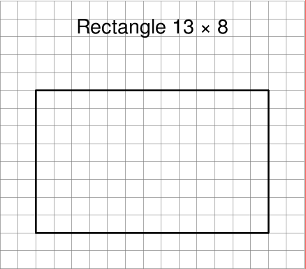
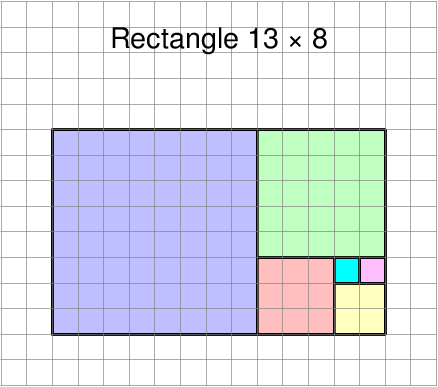
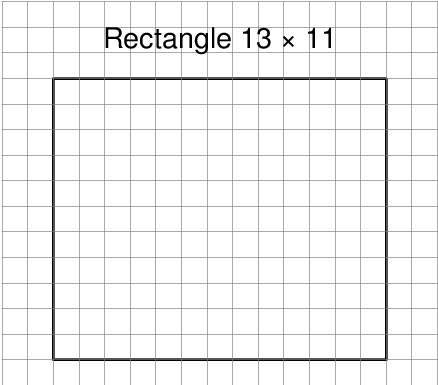
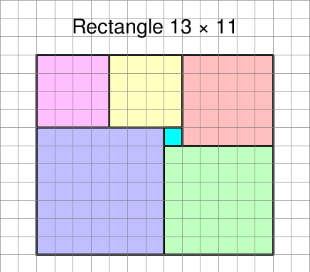
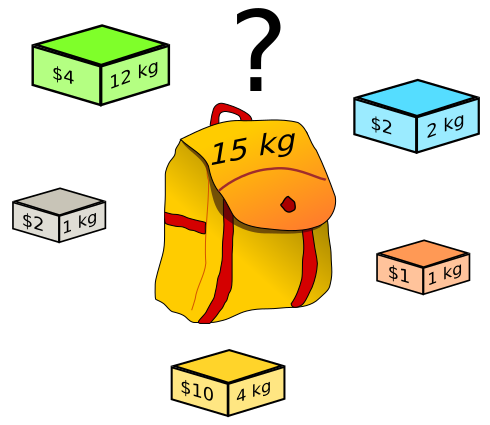

# T7.4 Algorithmes gloutons

{: .center} 

## 7.4.1 Stratégie gloutonne

!!! note "Un problème de remplissage"
    On souhaite remplir un rectangle avec des carrés, avec le nombre minimum de carrés possible.
    === "Rectangle 13 × 8"
        === "Figure"
            {: .center} 
        
        === "Solution"
            {{ correction(False, 
            "
            {: .center} 
            "
            ) }}
 
    
    === "Rectangle 13 × 11"
        === "Figure"
            {: .center} 

        === "Solution"
            {{ correction(False, 
            "
            {: .center} 
            "
            ) }}


!!! abstract "Algorithme glouton (greedy algorithm)"
    Un algorithme est appelé **glouton** lorsqu'il fait le meilleur choix *local* à chaque étape en espérant obtenir le meilleur choix *global*.

    Autrement dit, lorsqu'on décompose un problème en sous-problèmes, plutôt que de tous les explorer, on ne choisit que celui qui *paraît* optimal.
    
    Si ce choix est toujours correct, on obtiendra bien la solution optimale au
    problème de départ, de manière particulièrement efficace. Si ce choix n’est pas trop mauvais on obtiendra une bonne *approximation* de la solution.
    
    Les algorithmes gloutons peuvent donc être parfois exacts, ou parfois approchés. Mais ils sont généralement extrêmement efficaces.

## 7.4.2 Le problème du rendu de monnaie

Le problème du rendu de monnaie consiste à déterminer comment faire une somme (par exemple 27) avec le **nombre minimum** de pièces et de billets à disposition (par exemple 200, 100, 50, 20, 10, 5, 2, 1).

On peut bien entendu faire 27 = 10 + 10 + 5 + 1 + 1, mais ce n'est pas la solution optimale, qui est bien entendu (?) 27 = 20 + 5 + 2.

!!! gear "Première stratégie: la force brute (bruteforce)"

    On pourrait envisager toutes les façons de décomposer une somme donnée avec les valeurs à disposition. Cette méthode permet à coup sûr de trouver la solution optimale globale au problème, mais le nombre de possibilités augmente très vite (76 décompositions pour 27), et nécessite un temps de calcul trop important.

    Nous verrons en Terminale des méthodes de programmation relativement efficaces pour explorer toutes les décompositions possibles, pour une entrée de problème raisonnable...


!!! gear "Stratégie gloutonne"

    === "Vers un algorithme"
        En quoi consiste cette stratégie dans le problème du rendu de monnaie?

        Réfléchir à un algorithme en langage naturel avec des valeurs de pièces décroissantes (et distinctes) qui donne la liste des pièces nécessaires pour une somme donnée en entrée.
    
    === "Algorithme"
        La solution qui suit est celle qu’on emploie intuitivement, à juste titre, avec les systèmes de monnaie en
        vigueur : essayer de faire la somme en prenant d’abord les plus grosses pièces (le cas où on cherche à se
        débarrasser des pièces rouges en achetant du pain n’est pas traité).
        
        **Données:** une liste `pieces` et une `somme`

        **Initialisation:**

        - un entier `i` à 0 (indice de la plus grande pièce) dans la liste `pieces`;
        - une liste vide `monnaie` 

        **Algorithme:**

        - tant que `somme` est strictement positive:
            - si la pièce à l'indice `i` est **inférieure** à `somme`, ajouter la pièce à `monnaie` et actualiser `somme`
            - sinon incrémenter `i`
        - renvoyer `monnaie`

    === "Implémentation"
        {{ correction(False, 
        "
        ```python linenums='1' title='Programme à connaître'
        def rendu(somme: int, pieces: list) -> list:
            i =  0 
            monnaie = []
            while somme > 0:
                if pieces[i] <= somme :
                    monnaie.append(pieces[i])
                    somme = somme - pieces[i] 
                else :
                    i += 1
            return monnaie
        ```
        "
        ) }}

        `rendu(27, [200, 100, 50, 20, 10, 5, 2, 1])` doit renvoyer `[20, 5, 2]` .


    === "Une solution optimale ?"
        Que se passe-t-il si le système de monnaie est un peu plus exotique, comme 1, 4, 5, 10 et qu'on souhaite faire 28 ? Ou si des pièces, par exemple 5 et 10, ne sont plus disponibles et qu'on souhaite obtenir 63?

        ??? info "Moralité"
            La stratégie gloutonne ne donne pas systématiquement la solution optimale au problème du rendu de monnaie.
            
            Lorsqu'elle le fait, on dit que le système de monnaie est **canonique**, ce qui est compliqué à déterminer mathématiquement.


## 7.4.3 Le problème du sac à dos


Le problème du sac à dos (Knapsack problem ou KP) est un problème majeur d'optimisation. On dispose d’une collection d'objets ayant un poids et une valeur. On souhaite les mettre dans un sac à dos qui peut contenir un poids maximum M.

Quels sont les objets qu’il faut placer dans le sac à dos pour maximiser sa valeur ?

{: .center width=480} 


**Actuellement :**

*   On sait trouver LA meilleure solution, mais en explorant toutes les combinaisons une par une. Cette méthode par **force brute** est inapplicable si beaucoup d'objets sont en jeu.
*   On sait facilement trouver une _bonne_ solution, mais pas forcément la meilleure, par exemple en adoptant une stratégie gloutonne.
* On ne sait pas trouver facilement (en temps polynomial) la meilleure solution. Si vous y arrivez, [1 Million de $](https://www.claymath.org/millennium-problems/p-vs-np-problem){. target="_blank"} sont pour vous (voir aussi la vidéo de la [page d'accueil du thème](https://cgouygou.github.io/1NSI/T07_Algorithmes/accueil/){:target="_blank"} ).


!!! gear "Force brute"
    Pour chaque sous-ensemble d'objets, on sélectionne ceux dont le poids est inférieur à M puis parmi ceux-là, celui dont la valeur totale est maximale.

    Pour explorer efficacement tous les sous-ensembles possibles, on remarque d'abord qu'ils sont au nombre de $2^n$ (où $n$ est le nombre total d'objets) : pour chaque objet, soit on le prend, soit on ne le prend pas, c'est-à-dire 2 choix pour chaque objet.

    Ces sous-ensembles correspondent aux écritures binaires d'un nombres à $n$ bits. Par exemple, avec 3 objets A, B et C:

    | binaire | choix | sous-ensemble |
    |:-:|:-:|:-:|
    | 000 | . . . | { }|
    | 001 | . . C | {C}|
    | 010 | . B . | {B}|
    | 011 | . B C | {B, C}|
    | 100 | A . . | {A}|
    | 101 | A . C | {A, C}|
    | 110 | A B . | {A, B}|
    | 111 | A B C | {A, B, C}|

    Donc pour chaque nombre allant de 0 à $2^n-1$, on transforme son écriture binaire sur $n$ bits en liste, et on extrait de la liste des objets ceux qui correspondent aux bits 1 de cette liste.

    ```python linenums='1' title='Fonctions ultra-pythoniennes, à méditer'
    def liste_bits(i:int, n:int) -> list:
        '''
        renvoie l'écriture binaire sur n bits d'un entier sous forme de liste.
        Par exemple:
        >>> liste_bits(6, 8)
        [0, 0, 0, 0, 0, 1, 1, 0]
        '''
        return list(map(int, list(bin(i)[2:].rjust(n, '0'))))

    def sous_ens(liste:list, k:int) -> list:
        '''
        renvoie le k-ieme sous-ensemble de la liste.
        Exemple:
        >>> sous_ens(['A', 'B', 'C'], 5)
        ['A', 'C']
        '''
        choix = liste_bits(k, len(liste))
        return [l for l, c in zip(liste, choix) if c == 1]
    ```

    Compléter le code ci_dessous, en utilisant les fonctions précédentes:

    === "Code à compléter"
        ```python linenums='1' title='Exploration systématique'
        def sacados_bf(poids: list, valeurs: list, M: int) -> list:
            '''
            Renvoie la sélection (liste de 0 et 1) des objets qui
            permettent d'emporter la plus grande valeur
            '''
            meilleure_selection = None
            meilleure_valeur = 0
            n = len(poids)
            for k in range(...):
                poids_selection = sum(...)
                valeur_selection = ...
                if ... and ...:
                    meilleure_valeur = ...
                    meilleure_selection = ...
            return meilleure_selection
        ```

    === "Correction" 
        {{ correction(False, 
        "
        ```python linenums='1' title='Exploration systématique'
        def sacados_bf(poids: list, valeurs: list, M: int) -> list:
            '''
            Renvoie la sélection (liste de 0 et 1) des objets qui
            permettent d'emporter la plus grande valeur
            '''
            meilleure_selection = None
            meilleure_valeur = 0
            n = len(poids)
            for k in range(2**n):
                poids_selection = sum(sous_ens(poids, k))
                valeur_selection = sum(sous_ens(valeurs, k))
                if poids_selection <= M and valeur_selection > meilleure_valeur:
                    meilleure_valeur = valeur_selection
                    meilleure_selection = liste_bits(k, n)
            return meilleure_selection
        ```
        
        "
        ) }}


!!! gear "Stratégie gloutonne"
    === "Exemple"
        Pour définir une stratégie gloutonne, il faut répondre à cette question: «Qu'est-ce qui constitue le *meilleur choix local* ?»

        Prenons un exemple, avec un sac de 40 kg et les objets suivants:

        | objet  |  A  |  B  |  C  |  D  |  E  |  F  |
        |:------:|:---:|:---:|:---:|:---:|:---:|:---:|
        |  masse |  13 |  12 |  8  |  10 |  14 |  18 |
        | valeur | 700 | 500 | 200 | 300 | 600 | 800 |

        Il est assez rapide de voir que par exemple l'objet E est moins intéressant que le A, car il est plus lourd et sa valeur est moindre. Mais qu'il est plus intéressant que le D, puis qu'il vaut deux fois plus, mais n'est pas deux fois plus lourd...

    === "Principe de l'algorithme"
        {{ correction(False, 
        "
        Il faut donc considérer le «prix au kg», c'est-à-dire le rapport valeur/masse.
        
        À chaque étape, on choisit l'objet ayant le plus grand ratio parmi ceux dont la masse est inférieure à la masse restante dans le sac.

        | objet  |  A  |  B  |  C  |  D  |  E  |  F  |
        |:------:|:---:|:---:|:---:|:---:|:---:|:---:|
        |  masse |  13 |  12 |  8  |  10 |  14 |  18 |
        | valeur | 700 | 500 | 200 | 300 | 600 | 800 |
        | ratio  | 53.8| 41.7| 25  |  30 | 42.9| 44.4|

        On choisit donc:

        - l'objet A, il reste 27 kg disponibles dans le sac;
        - l'objet F, il reste 9  kg disponibles dans le sac;
        - l'objet C, puisque c'est le seul dont la masse est inférieure à 9 kg.
        "
        ) }}

    === "Implémentation"
        {{ correction(False, 
        "
        On considère chaque objet comme une liste `[nom, masse, valeur]` et donc l'ensemble des objets est:

        ```python
        objets  = [['A', 13, 700], ['B', 12, 500], ['C', 8, 200], ['D', 10, 300], ['E', 14, 600], ['F', 18, 800]]
        ```
        
        **Indications:**

        - écrire une fonction `ratio` qui prend un objet en paramètre et renvoie son ratio;
        - trier la liste `objets` avec cette fonction `ratio` comme clé de tri, dans l'ordre décroissant (voir [ici](https://cgouygou.github.io/1NSI/T03_TraitementDonnees/T3.2_TriTable/T3.2_TriTable/#323-tri){:target=\"_blank\"} pour un rappel des fonctions `sort` et `sorted`);
        - parcourir enfin la liste `objets` en sélectionnant l'objet si sa masse le permet.
        "
        ) }}
        
    === "Correction" 
        {{ correction(False, 
        "
        ```python linenums='1'
        objets  = [['A', 13, 700], ['B', 12, 500], ['C', 8, 200], ['D', 10, 300], ['E', 14, 600], ['F', 18, 800]]

        def ratio(objet: list) -> float:
            '''
            renvoie le rapport valeur/masse d'un objet
            '''
            return objet[2] / objet[1]

        def sacados_glouton(objets:list, M:int) -> list:
            objets_tries = sorted(objets, key=ratio, reverse=True)
            poids_sac = 0
            butin = []

            for objet in objets:
                poids_objet = objet[1]
                if poids_objet + poids_sac < M :
                    butin.append(objet[0])
                    poids_sac += poids_objet
            return butin

        ```
        
        ```python linenums='1'
        >>> sacados(objets, 40)
        ['A', 'F', 'C']
        ```
        
        "
        ) }}
        


{{ initexo(0) }}

!!! example "{{ exercice() }}"
    === "Énoncé" 
        Éxécuter la méthode par force brute sur l'exemple précédent.

        Quel algorithme donne la meilleure réponse?
    === "Correction" 
        {{ correction(False, 
        "
        "
        ) }}

## Bilan

La stratégie gloutonne donne très rapidement des solutions satisfaisantes mais pas forcément optimales. Pour beaucoup de problèmes (dont le problème du sac à dos), la recherche d'une solution optimale sans passer par la force brute semble impossible (mais n'est pas démontrée).
Dans ce cas-là, la stratégie gloutonne peut être employée pour avoir vite et bien une solution convenable, même si peut-être non optimale. On dit que la stratégie gloutonne est une heuristique de résolution. On sait que ce n'est pas forcément optimal, mais faute de mieux, on s'en contente...
