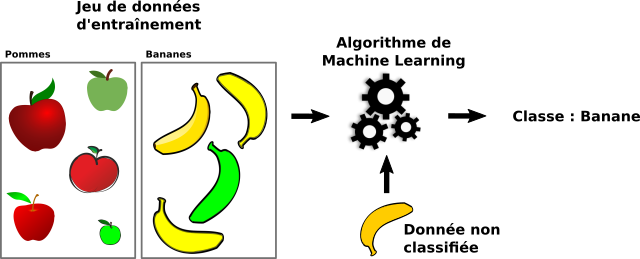
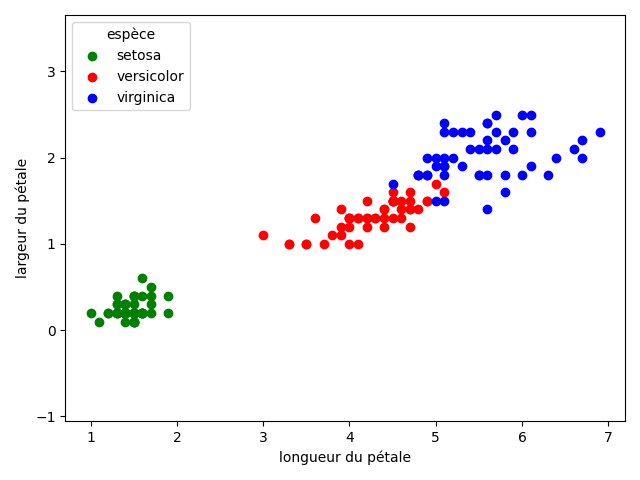
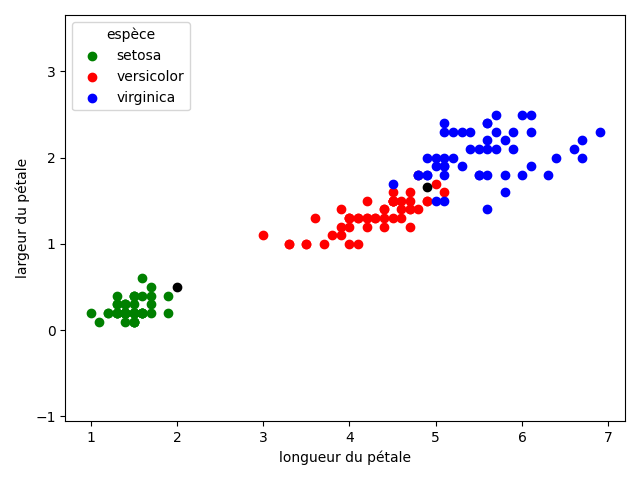
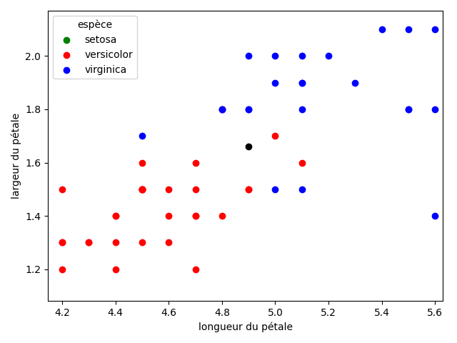
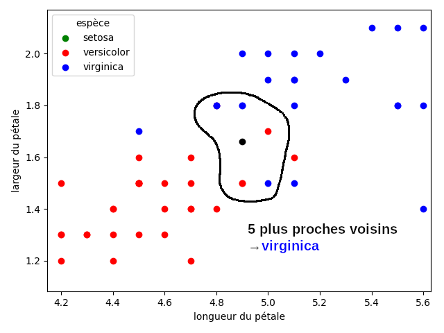

# T7.5 Algorithme des k plus proches voisins

L'algorithme KNN (k-nearest neighbors) est un algorithme d'apprentissage supervisé (Machine Learning en anglais... et bien souvent en français) qui permet de résoudre des problèmes de classification:

- on dispose d'un jeu de données (d'entraînement ou d'apprentissage) pour lesquelles on connaît la *classe* de chaque donnée;
- on introduit une nouvelle donnée et on cherche à quelle classe elle appartient, en comparant au jeu d'apprentissage.

{: .center} 

Ces problèmes de classification sont au centre de l'intelligence artificelle:

- la caméra d'une voiture autonome perçoit un panneau, mais quel est ce panneau ?
- un grain de beauté est pris en photo par un dermatologue, ce grain de beauté est-il cancéreux ?
- etc.

!!! note "Exemple-type: jeu de données IRIS"
    Le [jeu de données](https://fr.wikipedia.org/wiki/Iris_de_Fisher) Iris contient des mesures de largeur et longueur de sépales et pétales de 150 exemples d’iris appartenant à 3 espèces particulières : Iris-Setosa (0), Iris-Versicolour (1) et Iris-Virginica (2). Il y a 50 exemples par espèce.

    Si on ne s'intéresse qu'aux pétales, on peut construire (c'est un bon exercice) le graphique suivant:

    === "3 espèces"
        {: .center} 
    
    === "2 nouveaux iris"
        {: .center} 

    === "Zoom"
        {: .center} 
    
    === "Verdict"
        {: .center} 

!!! abstract "Principe de l'algorithme KNN"
    Chaque donnée est décrite par des caractéristiques numériques (appelées *features*). On peut donc établir une **distance** entre deux données.

    Avec une table de données dont on connaît la classe de chaque élément, et une donnée cible à classifier:

    - On trie la table selon la distance avec la cible;
    - On considère les k premiers éléments (les k plus proches voisins);
    - On retourne la classe majoritaire parmi ces k éléments.

**Remarque:** le choix de la distance n'est pas anodin. Bien qu'il en existe plusieurs, on utilisera la distance «naturelle», c'est-à-dire la distance euclidienne: $d((x_1,y_1), (x_2,y_2)) = \sqrt{(x_1-x_2)^2 + (y_1-y_2)^2}$

!!! code "Implémentation en Python"
    1. Écrire une fonction `distance`.
    2. Écrire un fonction `knn`, qui prendra en paramètres une valeur de `k`, une table de données et une donnée cible et qui renvoie la classe majoritaire parmi les `k` plus proches voisins.
    3. Tester la fonction sur le jeu issu du [fichier](../data/iris.csv) IRIS.