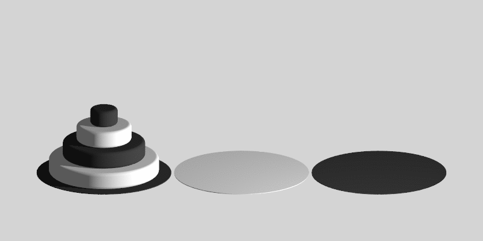

# Algorithmique

Tout comme les plus grands chefs conçoivent leurs recettes à partir de recettes de base classiques, on retrouve dans les algorithmes les plus complexes des résolutions de problèmes simples et récurrents: parcourir une liste, trier...

{: .center} 