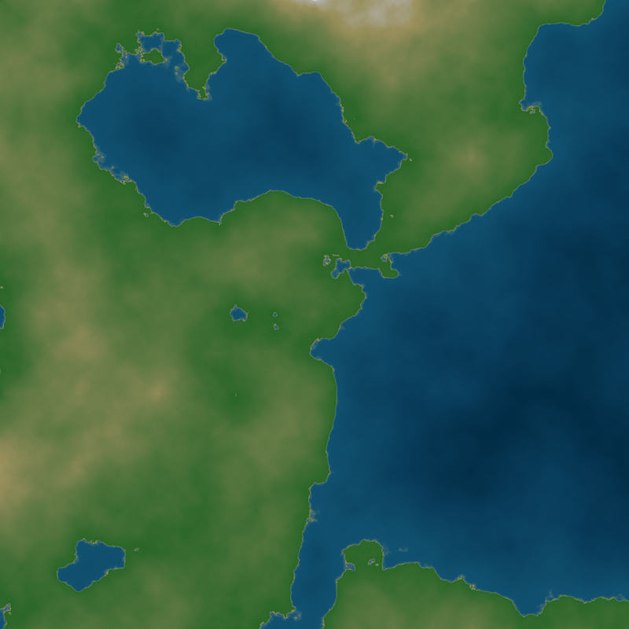
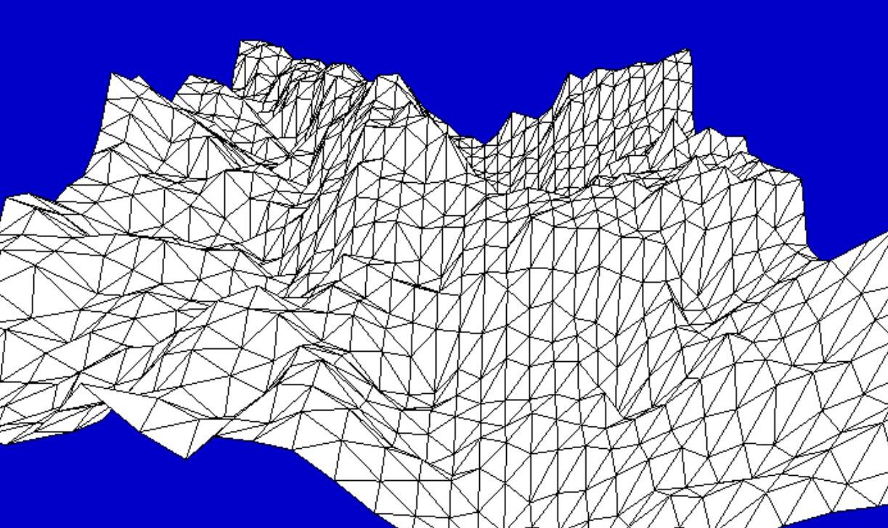

# Créer une map de jeu vidéo

L'[algorithme diamant-carré](https://fr.wikipedia.org/wiki/Algorithme_Diamant-Carr%C3%A9){.target='_blank'} est un algorithme de génération procédurale qui permet de créer aléatoirement une carte en relief.

!!! example "Partie 1"
    On implémentera les fonctions nécessaires à l'algorithme diamant-carré, et on visualisera en 2D.

    {: .center width=480} 

!!! example "Partie 2"
    On adapte la visualisation en 3D à l'aide du module `matplotlib`.

    {: .center width=480} 