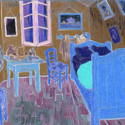
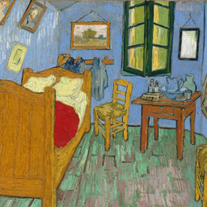
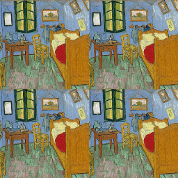
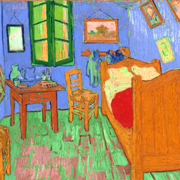
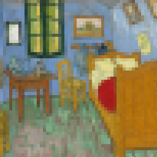

# Image numérique


## Le mini-projet : Création d'effets 

Dans ce mini-projet, vous devez créer des effets que des logiciels de retouche d'image (GIMP, Photoshop, ...) proposent.

On travaillera (par exemple) sur l'image ci-dessous:

{: .center} 

!!! note "Effets"
    Les 6 premiers effets sont obligatoires, les deux derniers (pixellisation et floutage) sont facultatifs.


    === "Filtre rouge"
        Pour créer un filtre rouge il suffit de conserver la composante rouge et de remplacer les autres composantes par 0.

        Si vous n'aimez pas le rouge, faites un filtre vert. Ou bleu. Ou les trois.

        {: .center} 

        ??? check "Correction"
            {{ correction(False, 
            "
            ```python linenums='1'
            import imageio
            img = imageio.imread('VanGogh_Arles.png')

            for i in range(img.shape[0]):
                for j in range(img.shape[1]):
                    r = img[i][j][0]
                    img[i][j] = (r, 0, 0)

            imageio.imsave('img_filtre.png', img)
            ```
            "
            ) }}

    === "Négatif"
        Pour obtenir le négatif d'une image, il faut remplacer chaque composante RGB par son complémentaire à 255.
        
        Par exemple, si une composante vaut 42, il faut la remplacer par 213 (= 255 - 42).

        {: .center} 


        ??? check "Correction"
            {{ correction(False, 
            "
            ```python linenums='1'
            import imageio
            img = imageio.imread('VanGogh_Arles.png')

            for i in range(img.shape[0]):
                for j in range(img.shape[1]):
                    r = 255 - img[i][j][0]
                    g = 255 - img[i][j][1]
                    b = 255 - img[i][j][2]
                    img[i][j] = (r, g, b)

            imageio.imsave('img_negatif.png', img)
            ```
            "
            ) }}

    === "Niveaux de gris"
        Dans sa norme 709, la Commission Internationale de l’Éclairage propose de remplacer les 3 composantes d'un pixel (r, g, b) par la valeur suivante :
        
        $m = 0.2126 \times r + 0.7152 \times g + 0.0722 \times b$

        {: .center} 

        ??? check "Correction"
            {{ correction(False, 
            "
            ```python linenums='1'
            import imageio
            img = imageio.imread('VanGogh_Arles.png')

            for i in range(img.shape[0]):
                for j in range(img.shape[1]):
                    r = img[i][j][0]
                    g = img[i][j][1]
                    b = img[i][j][2]
                    m = int(0.2126*r + 0.7152*g + 0.0722*b)
                    img[i][j] = (m, m, m)

            imageio.imsave('img_gris.png', img)
            ```
            "
            ) }}

    === "Flip"
        On retourne l'image horizontalement.

        {: .center} 

        ??? check "Correction"
            {{ correction(False, 
            "
            ```python linenums='1'
            import imageio
            img = imageio.imread('VanGogh_Arles.png')

            # on doit commencer par faire une copie de l'image
            img_miroir = img.copy()

            for i in range(img.shape[0]):
                for j in range(img.shape[1]):
                    img_miroir[i,img.shape[1]-j-1] = img[i,j]

            imageio.imsave('img_miroir.png', img_miroir)

            ```
            "
            ) }}

    === "Photomaton"
        C'est une transformation réversible, puisqu'on envoie un pixel sur quatre dans chaque carré...

        {: .center} 

        ??? check "Correction"
            {{ correction(False, 
            "

            L'idée est d'«envoyer» chaque pixel dans l'un des 4 carrés, en considérant la parité des indices de ligne `i` et de colonnes `j`:

            - les pixels sur une ligne paire sur les carrés du haut;
            - les pixels sur une ligne impaire sur les carrés du bas;
            - les pixels sur une colonne paire sur les carrés de gauche;
            - les pixels sur une colonne impaire sur les carrés de droite;
            
            ```python linenums='1'
            import imageio
            img = imageio.imread('VanGogh_Arles.png')

            img_photomaton = img.copy()

            for i in range(img.shape[0]):
                for j in range(img.shape[1]):
                    img_photomaton[i//2 + 128*(i%2)][j//2 + 128*(j%2)] = img[i][j]

            imageio.imsave('img_photomaton.png', img_photomaton)

            ```
            "
            ) }}

    === "Pop-art"

        Le principe est, pour chaque pixel, d'appuyer sur la composante majoritaire: on récupère la composante maximale et on l'augmente d'une certaine valeur (par exemple 50 sur l'image ci-dessous) sans dépasser 255 bien entendu.

        {: .center} 

        ??? check "Correction"
            {{ correction(False, 
            "

            Avec une fonction...

            ```python linenums='1'
            import imageio
            img = imageio.imread('VanGogh_Arles.png')

            def popart(pix: list, val: int) -> list:
                '''
                renvoie la liste des composantes de pix, en ayant augmenté la valeur maximale
                de la valeur val, sans dépasser 255 bien évidemment
                '''
                m = max(pix)
                t = []
                for composante in pix:
                    if composante == m:
                        t.append(min(255, composante+val))
                    else:
                        t.append(composante)
                return t
                
            for i in range(img.shape[0]):
                for j in range(img.shape[1]):
                    img[i][j] = popart(img[i][j], 50)

            imageio.imsave('img_popart.png', img)
            ```
            "
            ) }}

    === "Pixellisation"
        Je vous laisse deviner...

        {: .center} 

        ??? check "Correction"
            {{ correction(False, 
            "
            Le principe est de décider tout d'abord d'une taille de «carrés» qui vont composer l'image pixellisée. Bien entendu, cette taille doit être un diviseur commun de la hauteur et de la largeur de l'image. Ici comme l'image fait 256x256, on peut choisir n'importe quelle puissance de 2.
            Par exemple, prenons 8 pixels. Il y aura donc 256//8 = 32 carrés en hauteur et en largeur.

            Ensuite on va définir la couleur «moyenne» qu'on va mettre dans chaque carré: on fait la moyenne des composantes dans le carré (moyenne des rouges, moyenne des verts et moyenne des bleus).

            On affecte enfin cette couleur à chaque pixel du carré.

            ```python linenums='1'
            import imageio
            img = imageio.imread('VanGogh_Arles.png')

            cote = 8
    
            def couleur_moyenne(ligne, colonne):
                moy = 3 * [0]
                for i in range(cote):
                    for j in range(cote):
                        for k in range(3):
                            moy[k] += img[cote*ligne + i,cote*colonne + j][k] / (cote**2)
                return moy
                
                
            for ligne in range(img.shape[0]//cote):
                for colonne in range(img.shape[1]//cote):
                    for i in range(cote):
                        for j in range(cote):
                            img[cote*ligne + i,cote*colonne + j] = couleur_moyenne(ligne, colonne)

            imageio.imsave('img_pixellisee.png', img)
            ```
            "
            ) }}

    === "Floutage" 
        Je vous laisse deviner...

        {: .center} 

        ??? check "Correction"
            {{ correction(False, 
            "
            ```python linenums='1'
            import imageio
            img = imageio.imread('VanGogh_Arles.png')

            
            ```
            "
            ) }}


!!! info "Grille d'évaluation"
    Sur ce projet, vous serez évalués sur la grille suivante:

    |Contenu|Points|
    |-------|:----:|
    |Filtre correctement réalisé (2 pts × 6) |12|
    |Utilisation de fonctions pour les filtres|3|
    |Un seul fichier|1|
    |Code aéré, spécifié, lisible, noms de variables pertinents...|2|
    |«P'tit truc en plus» : filtre supplémentaire, interface utilisateur (console ou graphique avec Pygame)|2|
    |Total|20|