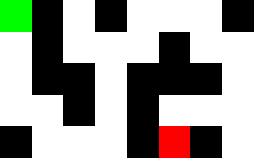

# Get out of the maze...

## Partie 1 : en console

!!! example "Objectif"
    À partir d'un labyrinthe donné (comme celui de l'exercice 3 de la section [2.1.9](https://cgouygou.github.io/1NSI/T02_TypesConstruits/T2.1_Listes/T2.1_Listes2/#219-exercices){:target="_blank"}) et d'un chemin connu entre l'entrée et la sortie, on souhaite afficher successivement les étapes du chemin dans le labyrinthe (représentées par un `4` dans l'exemple suivant.

    {: .center} 

    On peut également indiquer uniquement la position actuelle et «effacer» les traces.

## Partie 2 : avec Pygame

!!! example "Objectif"
    On souhaite maintenant avoir un rendu graphique. En s'appuyant sur le programme précédent, on change **uniquement l'affichage** pour dessiner le labyrinthe (le choix des couleurs vous appartient...)

    {: .center} 

    **Variante:** plutôt que laisser l'ordinateur suivre le chemin tout seul, on peut piloter le déplacement avec les touches directionnelles du clavier, en évitant de traverser les murs...

## Partie 3

!!! example "Objectif"
    Des «ennemis» peuvent apparaître dans le labyrinthe, il faut les éviter...