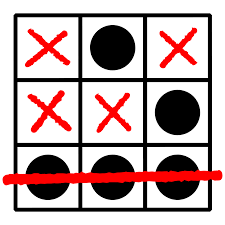
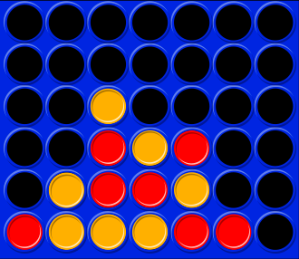
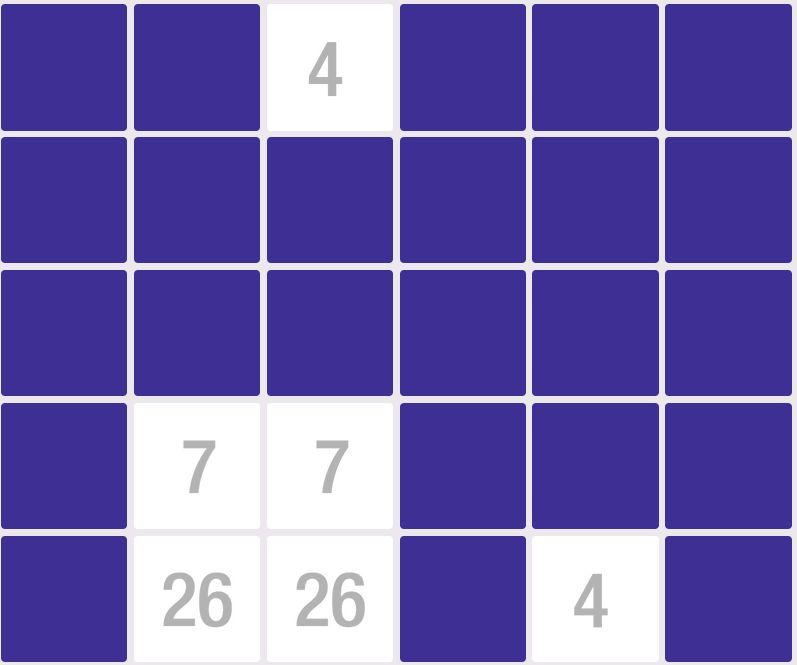
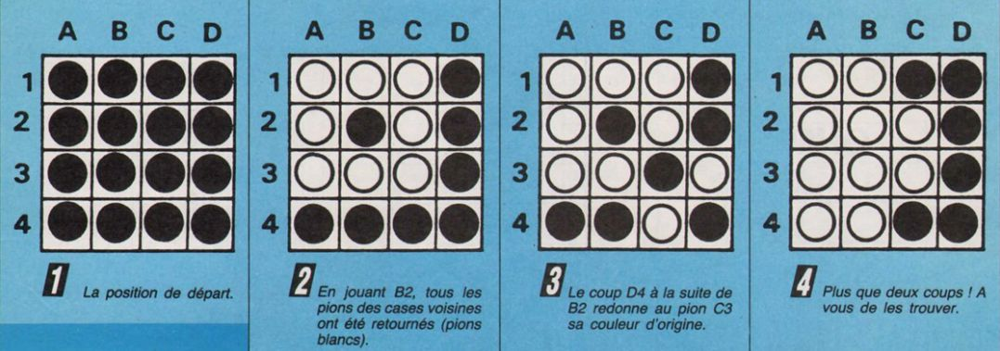
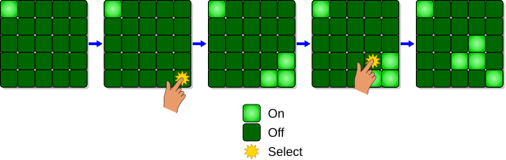

# Projet n°1 - Jeu de tableau

!!! note "Sujets"
    Dans ce premier projet, je vous propose de programmer un jeu «simple».

    === "Tic-Tac-Toe (morpion)"
        Est-il vraiment nécessaire de présenter ce jeu?

        {: .center width=320} 

        **Options du programme:**

        2. Le programme doit afficher quel joueur doit jouer, puis le joueur doit saisir dans quelle case il joue
        3. la saisie du joueur devra être vérifiée
        4. Le programme s'arrête dès qu'un joueur parvient à aligner 3 symboles, ou en cas de match nul
        5. En fin de partie, le choix "r ou R" relance une nouvelle partie, le choix "q ou Q" permet de quitter le jeu

        ??? info "Conseils - aides"
            Trop facile...

    === "Puissance 4"
        Est-il vraiment nécessaire de présenter ce jeu?

        {: .center width=320} 

        **Options du programme:**

        2. Le programme doit afficher quel joueur doit jouer, puis le joueur doit saisir dans quelle colonne il place un pion
        3. la saisie du joueur devra être vérifiée
        4. Le programme s'arrête dès qu'un joueur parvient à aligner 4 pions, ou en cas de match nul
        5. En fin de partie, le choix "r ou R" relance une nouvelle partie, le choix "q ou Q" permet de quitter le jeu

        ??? info "Conseils - aides"
            - Répérer le joueur par son symbole (`#!py 'X'` ou `#!py 'O'`).
            - Prévoir une variable (de type `#!py list`) stockant les indices (de ligne) où on peut placer un pion (au départ du jeu tous ces indices sont à 5). Cela permet de rapidement placer un pion dans la grille, de vérifier qu'un coup est valable (on peut jouer dans une colonne sauf si l'indice est `#!py -1`) et de vérifier le match nul.

            - Fonctions à prévoir (à mon avis), à vous de réfléchir aux éventuels paramètres et éventuelles valeurs renvoyées.
                - afficher_grille()
                - saisir_coup()
                - verifier_coup()
                - actualiser_grille()
                - alignement_horizontal()
                - alignement_vertical()
                - alignement_diagonal_droite()
                - alignement_diagonal_gauche()
                - victoire()

            - La fonction victoire() utilisera les 4 fonctions d'alignement.
            - Pour l'alignement horizontal, ne tester que la ligne dans laquelle un joueur vient de jouer. Idem pour l'alignement vertical, une seule colonne à tester.
            - Pour les alignements diagonaux, repérer (au brouillon) de quelles cases il peut y avoir une diagonale d'au moins 4 cases qui part vers le bas à droite (et vers le bas à gauche). Il n'y en a pas tant que ça.
            - Pour tester les alignements, le plus simple est de transformer une ligne (ou une colonne, ou une diagonale) de la grille en chaîne de caractères, puis de faire un simple test par `#!py if 'XXXX' in ...` ou `#!py if 'OOOO' in ...` en fonction du joueur qui vient de jouer.

    === "Memory"

        Le memory des nombres est un jeu pour enfants où des paires de cartes sont mélangées et retournées. Il s'agit de retrouver ces paires en retournant deux cartes. Si c'est une paire, on la supprime. Sinon on retourne les cartes et on recommence.

        {: .center width=320} 

        On mettra au point une version «solo» avec un décompte du nombre de tentatives avant éventuellement de mettre au point une version «duo».

        **Options du programme:**

        2. le joueur devra saisir les cases à dévoiler
        3. la saisie du joueur devra être vérifiée
        4. Le programme indiquera le nombre de coups joués à chaque tour
        5. Le choix "r ou R" réinitialise le jeu (et le compteur)
        6. Le choix "q ou Q" permet de quitter le jeu

        ??? info "Conseils - aides"
            * Prévoir deux grilles de même dimensions: une qui contient les cartes/nombres, une qui contient l'information carte cachée/dévoilée.
            * Prévoir une variable qui compte le nombres de paires déjà dévoilées pour prévoir l'arrêt du jeu.
            * Fonctions à prévoir (à mon avis), à vous de réfléchir aux éventuels paramètres et éventuelles valeurs renvoyées.
                * generer_grille_depart()
                * saisir_choix()
                * verifier_choix()
                * actualiser()
                * afficher()

            * Pour générer la grille, je vous conseille de:
                * créer une liste avec toutes les valeurs en double, par exemple `#!py [1, 1, 2, 2, 3, 3, ..., 10, 10]` 
                * mélanger aléatoirement cette liste avec la méthode `#!py shuffle()` du module `#!py random` 
                * parcourir la grille et y placer les valeurs issues de cette liste (utiliser la méthode `#!py pop()` sur la liste pour récupérer la dernière valeur et l'enlever).

    === "GASP"
        Le Gasp est un casse-tête apparu dans la revue Jeux & Stratégie n°38 (avril/mai 1986).
        Sur un damier, on place des pions bicolores. Au départ, tous les pions sont noirs. Le but est de retourner ces
        pions pour qu'ils deviennent tous blancs.

        Pour retourner des pions, on désigne une case. Ses voisines changent de couleur (mais pas la case désignée).

        Le schéma ci-dessous, tiré de Jeux & Stratégie, montre un début de partie.

        {: .center width=640} 

        **Options du programme:**

        1. le programme demandera tout d'abord de choisir la taille de l'aire de jeu entre 2 et 12 (valeurs paires
        uniquement)
        2. le joueur devra saisir la case à modifier
        3. la saisie du joueur devra être vérifiée
        4. Le programme indiquera le nombre de coups joués à chaque tour
        5. Le choix "r ou R" réinitialise le jeu (et le compteur)
        6. Le choix "q ou Q" permet de quitter le jeu

    === "Lights Out"
        Issu de [Wikipedia](https://fr.wikipedia.org/wiki/Lights_Out_(jeu)){:target="_blank"} :

        Lights Out est un jeu électronique commercialisé par Tiger Electronics en 1995. Le jeu est composé d’une grille de cinq par cinq lumières. Quand le jeu commence, un nombre aléatoire ou un motif enregistré de ces lumières s’allument. Appuyer sur l’une des lumières basculera la position des lumières adjacentes à celle-ci (haut, bas, gauche, droite, mais pas en diagonale). Le but du jeu est d’éteindre toutes les lumières, de préférence avec le moins de coups possible.

        {: .center width=640} 

        **Options du programme:**

        2. le joueur devra saisir la case à modifier
        3. la saisie du joueur devra être vérifiée
        4. Le programme indiquera le nombre de coups joués à chaque tour
        5. Le choix "r ou R" réinitialise le jeu (et le compteur)
        6. Le choix "q ou Q" permet de quitter le jeu

        ??? info "Conseils - aides"
            - La position de départ doit être construite en choisissant aléatoirement quelques (3 ou 4?) cases et en effectuant les allumages correspondants.
            - Faire attention à la gestion des bords.
            


!!! warning "Contraintes"
    - Nombre de participant·e·s : 2 ou 3;
    - Nombre de séances: 5;
    - Programmation fonctionnelle: le programme doit être structuré à partir de fonctions (spécifiées complètement);
    - Affichage en console.


!!! history "Déroulé du projet"
    - **Séance 1 (11/12/2024)** : conception du projet (:no_entry: programmation :no_entry:)
        - choix du sujet;
        - réflexion autour des variables nécessaires, du choix des structures de données pour représenter les différentes composantes du jeu;
        - découpage du programme en fonctions (raisonner par verbes d'action, ne pas se préoccuper du code à cette étape);
        - attribution des fonctions aux membres du groupe.
    - **Séances 2 (16/12/2024) et 3 (18/12/2024)**
        - écriture des fonctions;
        - tests des fonctions;
    - **Séance 4 (06/01/2025)**
        - assemblage des fonctions dans le fichier principal;
        - débuggage.
    - **Séance 5 (08/01/2025)**
        - finalisation/améliorations du programme;
        - rendu du travail.


!!! code "Apports techniques"
    === "Affichages"
        Votre projet comportera au moins une fonction qui se chargera de l'affichage du jeu en console. Cette fonction, ou plutôt *procédure* ne renverra aucune valeur, elle contiendra uniquement des instructions `#!py print()`.

        Pensez à utiliser les espaces, et les caractères `#!py - _ |` . Utilisez également des *f-string* pour construire vos affichages en fonction du contenu de vos variables.

        La méthode `#!py join` permet de fusionner les éléments d'une liste contenant des chaînes de caractères avec un (ou plusieurs) caractère(s) séparateur(s):

        ```python
        >>> " | ".join(['.', 'X', '.', '.'])
        '. | X | . | .'
        ```
        
        Enfin, le caractère `#!py "\n"` provoque un retour à la ligne.

        ```python
        >>> print("La NSI, \n c'est de l'eau.")
        La NSI, 
         c'est de l'eau.
        ```

        Pour aller plus loin, sur les caractères spéciaux permettant de faire de beaux affichages de tableaux : [https://en.wikipedia.org/wiki/Box-drawing_characters](https://en.wikipedia.org/wiki/Box-drawing_characters){:target="_blank"}.
    
    === "Gestion d'un flag"
        En programmation, un *flag* (drapeau) est une variable le plus souvent de type `#!py bool` qui va indiquer si dans un programme une boucle `#!py while` doit continuer à tourner ou doit s'arrêter.

        On l'initialise à `#!py True` et dans la boucle, une condition d'arrêt doit pouvoir la faire passer  à la valeur `#!py False`.

        Par exemple, dans le programme suivant la boucle s'arrête dès qu'on appuie sur la touche q ou Q (peu importe la casse, c'est l'interêt de la fonction `#!py lower()`) et continue si on appuie sur une autre touche.

        ```python linenums='1'
        go = True

        while go:
            touche = input("Appuie sur la touche Q pour arrêter la boucle")
            if touche.lower() == 'q':
                go = False
        ```
    
    === "Variables globales"
        Si certaines de vos fonctions font appel à des variables globales (c'est-à-dire définies en dehors des fonctions, vous devez les déclarer en début de fonction après le mot-clé `#!py global`. Ce n'est pas la peine pour celles de type `#!py list`.

        Par exemple:

        ```python linenums='1'
        toto = 2

        def machin(n:int):
            global toto
            return toto * n
        ```
        

    === "Utilisation de la console"
        Pour lancer le programme, ouvrir un terminal dans le dossier contenant votre fichier (ou vos fichiers), puis taper :

        ```bash
        python3 nom_fichier.py
        ```

        Pour effacer la console (au début du jeu, entre deux coups, après une nouvelle partie...), importer le module `#!py os` et utiliser l'instruction:

        ```python
        os.system('clear')
        ```
        

    === "Structure d'un programme"
        Un programme bien structuré doit comporter les parties suivantes:

        - Une *docstring* de présentation/signature
        - Une zone d'import des modules (si besoin)
        - Une zone d'initialisation des variables globales
        - Une zone des fonctions
        - Le programme principal

        Utilisez les `#!py #` pour bien délimiter les différentes zones. Par exemple:

        ```python linenums='1'
        # *********************************
        # Projet NSI : JEU DU PUISSANCE 4
        # Date: ...........
        # Auteurs: .............
        # *********************************


        # ====================
        #   INITIALISATION
        # ====================


        ```
        

    === "Utilisation d'une fonction `#!py main()`"
        Dans un fichier Python, le code qui suit l'instruction:

        ```python linenums='1'
        if __name__ == '__main__':
            
        ```
        
        ne sera exécuté que si le fichier est lancé comme fichier principal (dans l'éditeur ou en console), **mais pas en tant que module**.

        On peut donc:

        - dans un module, écrire les tests du module
        - dans le fichier principal, lancer une fonction `#!py main()` qui contiendra le programme principal.

        Par exemple, tester le code suivant en l'exécutant en tant que programme principal, puis en l'important dans une autre fichier.

        ```python linenums='1'
        def main():
            print("Hello from", __name__)

        if __name__ == '__main__':
            print("Je s'appelle", __name__)
            main()
        ```
        

!!! note "Grille d'évaluation"
    |Item |Contenu|Points|
    |-----|-------|:----:|
    |Conception|Les variables et leurs types sont clairement identifiés. Le découpage en fonction est pertinent et efficace. |6|
    |Travail de groupe|Les tâches sont clairement définies et réparties au sein du groupe.|4|
    |Respect du cahier des charges|Le programme répond aux consignes.|3|
    |Projet abouti|Le projet tourne sans erreur.|3|
    |Qualité du code|Code aéré, spécifié, lisible, noms de variables pertinents...|4|
    ||||
    |Total||20|
    ||||
    |Bonus|Code en :gb: |2|
    |Malus|Code récupéré sur le web (ChatGPT, forums, github, etc) |-50, Game Over|
