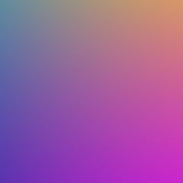

# Travail sur l'image (et la vidéo)

## Conversion RGB ⟷ HSL
!!! info "Codage HSL"
    Le codage informatique des couleurs que nous connaissons est le codage **RGB** qui est le plus proche du matériel, et le plus répandu. C'est celui utilisé par les modules Python de traitement d'image, comme `imageio` que nous utilisons, ou `PIL`.

    Un autre codage des couleurs - celui manipulé dans ce projet - est le codage **HSL**, pour Hue (teinte), Saturation (saturation), Lightness (luminosité). Il est plutôt utilisé dans les logiciels de dessin assisté par ordinateur ou de retouche d'images.

    Le procédé de conversion des 3 valeurs RGB vers les 3 valeurs HSL est expliqué sur la [page Wikipédia correspondate](https://fr.wikipedia.org/wiki/Teinte_saturation_luminosit%C3%A9#Depuis_RVB_2){:target="_blank"}.

!!! info "Test de la fonction"
    Pour tester vos conversions, vous pouvez utiliser un convertisseur en ligne, comme [celui-ci par exemple](https://www.rapidtables.com/convert/color/rgb-to-hsl.html){:target="_blank"} où vous trouverez également les formules de conversion.

## Recherche de la couleur dominante

!!! info "Extraction d'une frame de la vidéo"
    Une image est composée de *frames*, c'est-à-dire d'images qui défilent à une certaine fréquence (FPS), en général 24 images par seconde.

    Pour extraire une image d'une vidéo, on utilise le module `imageio`.

    ```python
    import imageio
    video = imageio.get_reader('video.mp4') 
    frame = video.get_data(472) 
    ```
    Dans le code précédent, l'image n°472 est extraite dans la variable `frame`. On peut ensuite la manipuler ou la sauvegarder. Pour connaître le nombre de frames dans la variable `video`, on utilise `video.count_frames()`.

!!! info "Test de la fonction"
    Sur l'image ci-dessous, vous devriez obtenir une couleur dominante de `(61, 134, 210)` en RGB soit `(210, 62, 53)` en HSL.

    {: .center} 

!!! tip "Indication"
    Le programme doit parcourir l'image, pixel par pixel, et construire un dictionnaire dont les clés sont les pixels (des tuples) et les valeurs le nombre d'occurences dans l'image.

    Grosso modo, c'est la même chose que dans l'exercice 2 sur les dictionnaires.

    Ensuite, il s'agit de parcourir le dictionnaire et de chercher la valeur maximale, en mémorisant le pixel correspondant.

    Grosso modo, c'est la même chose que dans l'exercice 3 sur les dictionnaires.

    **Code à compléter:**

    ```python linenums='1'
    def couleur_dominante(img: list) -> tuple:
        '''
        Cherche le pixel de l'image img qui revient le plus grand nombre de fois dans img.
        '''
        pixels = {}
        # parcours de l'image:
        for i in 
            for j in 
                if img[i][j] in pixels:

                else:
        
        # recherche du pixel ayant la plus grande occurence
        nmax = 
        for pixel, occ in pixels.items():

        return 

    ```
    
    
## Extraction de la zone
!!! info "Extraction de la zone"
    Il faudra créer une image vide aux bonnes dimensions, puis affecter pixel par pixel ceux de la zone de l'image initiale définie par les valeurs de **x**, **y** et **W**.

!!! tip "Indications"
    La fonction à écrire doit prendre en paramètres les valeurs qui permettent de calculer **x**, **y** et **W**, c'est-à-dire **S**, **Vson** et **Vvideo**.
    Après avoir calculé ces valeurs, on crée une image vide (constituée en 0 en fait) aux bonnes dimensions puis on lui affecte les valeurs de l'image de base en décalant les lignes et colonnes des valeurs **x** et **y**.

    **Code à compléter:**

    ```python linenums='1'
    def extraction_zone(img: list, S: int, Vson: float, Vvideo: float) -> list:
        '''
        Renvoie une image constituée des pixels de l'image img, de taille W avec le décalage x, y
        donnés par les paramètres S, Vson et Vvideo.
        '''
        W = 
        x = 
        y = 
        zone = numpy.zeros(( , , ), dtype=np.uint8)
        for i in range(W):
            for j in range(W):
                zone[i][j] = 
        return 
    ```
    

## Application du filtre
!!! info "Overlay blending mode"
    I'm sorry, but I didn't succeed to find a french source for this.
    
    So you will have to translate [this page](https://en.wikipedia.org/wiki/Blend_modes){:target="_blank"} to find how to apply a colored filter to a picture.

!!! info "Testing your function"
    Apply an overlay filter with HSL color `(210, 53, 58)` on the first image below should give the second one.

    {: .center} {: .center}

!!! tip "Indications"
    Pour chaque pixel de l'image de départ, on applique à chaque composante la fonction  *overlay* avec la composante de la couleur du filtre.

    Par exemple, si le pixel de l'image est `(120, 35, 214)` et la couleur du filtre `(210, 53, 58)`, le pixel de l'image filtrée sera `(f(120, 210), f(35, 53), f(214, 58))`.

    Il faut donc commencer par écrire la fonction `f` qui prend deux entiers comme paramètres, puis une fonction `filtre` qui prend en paramètre une image et la couleur du filtre, qui commencera par créer une image vide aux mêmes dimensions que l'image donnée en paramètre, puis la qui modifiera pixel par pixel en parcourant l'image donnée en paramètre.

    **Code à compléter:**

    ```python linenums='1'
    def f(a, b):
        if 
            return
        else:
            return

    def filtre(img: list, couleur: tuple) -> image:
        '''
        Renvoie une nouvelle image, donnée par l'application d'une filtre coloré à l'image de départ img.
        '''
        img_filtree = numpy.zeros(( , , ), dtype=np.uint8)
        for i in range():
            for j in range():
                img_filtree[i][j] = 

        return 
    ```
    


## Réalisation du GIF

!!! info "RTFM"
    [https://imageio.readthedocs.io/en/stable/examples.html#optimizing-a-gif-using-pygifsicle](https://imageio.readthedocs.io/en/stable/examples.html#optimizing-a-gif-using-pygifsicle){:target="_blank"} 

!!! tip "Indications"
    1. Les images crées avec l'application du filtre devront être crées avec un nom de fichier numéroté. Par exemple avec l'instruction:
    ```python linenums='1'
    imaegio.imsave(f'image_gif{k}.png', img)
    ```
    où `img` est l'image renvoyée par la fonction `filtre` et `k` la variable de boucle correspondant à la k-ième image sur 25.

    2. Une fois les 25 images du GIF créées, on utilisera le code suivant, où il faudra préciser un nom de fichier pour le GIF et adapter éventuellement le code aux noms de fichier image:
    ```python linenums='1'
    with imageio.get_writer('nom_du_gif.gif', mode='I') as writer:
        for k in range(25):
            filename = f'image_gif{k}.png'
            image = imageio.imread(filename)
            writer.append_data(image)
    ```
    

