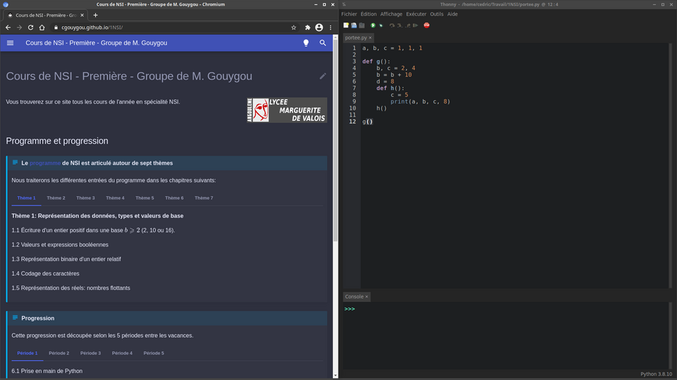

# Bonnes habitudes de travail

## Dossiers, fichiers et versionning

Cette année en NSI nous allons manipuler un certain nombre de fichiers. Il est important de les nommer et les classer de façon rigoureuse pour les retrouver rapidement et les partager.

??? warning "Spoiler alert"
    Ces conseils ne sont pas réservés à NSI, ils peuvent s'appliquer à toutes les disciplines...

!!! tip "Conseils"
    - Utilisez des dossiers pour classer vos fichiers. Il n'y en a jamais assez.
    - Prenez l'habitude de faire plusieurs sauvegardes de vos documents (sur le réseau du lycée, sur l'ENT, sur clé USB).
    - Évitez dans les noms de fichiers et de dossiers **les espaces** (utilisez plutôt _ ) ainsi que **les caractères accentués** et les caractères spéciaux.
    - Un nom de fichier doit être parlant (un peu comme une variable en fait). On évitera de nommer ses codes Python `python1.py`, `python2.py`, `python3.py`, etc. Mais plutôt `1NSI_T7_tri_selection.py` par exemple pour un exercice de programmation sur le tri par selection au thème 7.
    - Lorsqu'on travaille sur un projet ou un programme conséquent, il peut être utile de conserver des archives du travail à plusieurs étapes de l'élaboration, plutôt que de ne conserver que la dernière version. À cet effet on pourra numéroter : `1NSI_projet_morpion_v1.py`, puis `1NSI_projet_morpion_v2.py`, `1NSI_projet_morpion_v3.py`, etc.

## Espace de travail

Il est conseillé de travailler avec 3 espaces:

- l'écran de l'ordinateur partitionné avec les 2 premiers espaces: ce site et un IDE;

{: .center} 

- **une feuille de papier et un stylo** comme troisième espace...

 
