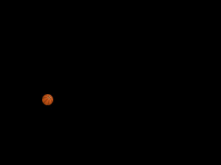
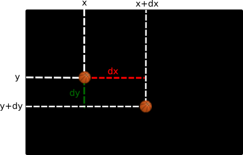

# Animation simple (sans événements)

{: .center} 

L'objectif ici est de faire apparaître un personnage (une image) et de l'animer. Pour illustrer cela on va utiliser [cette image](images/basketball16.png){:target="_blank"} que l'on va faire rebondir sur les bords de la fenêtre.

## 1. Création de la fenêtre et insertion de l'image

```python linenums='1'
import pygame
from pygame.locals import *

pygame.init()

width, height = 320, 240
screen = pygame.display.set_mode((width, height))

balle = pygame.image.load("basketball16.png")
position_balle = balle.get_rect()
screen.blit(balle, position_balle)
pygame.display.flip()

pygame.quit()
```

!!! code "Explication du code"
    === "Ligne 9"
        On importe l'image dans une variable `balle` qui est un objet `pygame` de type `Surface`.

    === "Ligne 10"
        Afin de facilement pouvoir le déplacer, on stocke **la position de cet objet** dans une variable `position_balle`, qui sera de type `rect`. 

        ```python
        >>> position_balle
        <rect(0, 0, 16, 16)>
        ```
        
        où les deux premiers attributs sont les coordonnées (abscisse, ordonnée) et les deux derniers la largeur et la hauteur de l'image.

    === "Ligne 11"
        On affiche cette image en la *superposant* aux éléments graphiques déjà affichés (en l'occurence, rien...) avec la méthode `blit`.

## 2. Animation de l'image/personnage

!!! code "Déplacement"
    Pour déplacer l'image/le personnage, il faut modifier ses coordonnées à chaque rafraîchissement de la fenêtre. 

    === "Déplacement absolu"
        On peut accéder directement aux coordonnées d'un objet de type `rect`. Par exemple:

        ```python 
        >>> position_balle.left
        0
        >>> position_balle.bottom
        16
        >>> position_balle.topleft
        (0, 0)
        ```
        Pour afficher la balle en position `(50, 100)` (pour le coin haut-gauche, qui est traditionnellement celui sur lequel on travaille), il suffit donc d'écrire:

        ```python
        position_balle.topleft = (50, 100)
        ```
        
    === "Déplacement relatif"

        On indique le déplacement (horizontal et vertical) **par rapport à la position initiale**.

        Par exemple, pour décaler la balle de 10 pixels vers la droite et de 20 pixels vers le haut:
        ```python linenums='1'
        position_balle.move(10, -20)
        ```
        

Pour notre animation, on décide donc d'un décalage relatif en abscisse et en ordonnée, qu'on stocke par exemple dans deux variables `dx` et `dy`.

{: .center width=480} 

Ici, pour déplacer d'un pixel sur chaque coordonnée:

```python
dx, dy = 1, 1
position_balle.move([dx, dy])
```

Bien entendu, il faut changer ces valeurs lorsqu'on atteint le bord de la fenêtre:

- si `position_balle.right` dépasse la largeur `width`, il faut repartir vers la gauche, c'est-à-dire passer de la valeur `dx` de `1` à `-1`.
- et si `position_balle.left` devient négatif, il faut repartir vers la droite, c'est-à-dire passer de la valeur `dx` de `-1` à `1`.

Le code suivant va donc actualiser ce déplacement et faire rebondir notre balle de droite à gauche:

```python linenums='1'
import pygame
from pygame.locals import *


pygame.init()

width, height = 320, 240
screen = pygame.display.set_mode((width, height))

balle = pygame.image.load("basketball16.png")
position_balle = balle.get_rect()
screen.blit(balle, position_balle)
pygame.display.flip()

dx, dy = 1, 0

continuer = True
while continuer:
    for evenement in pygame.event.get():
        if evenement.type == QUIT:
            continuer = False

    if position_balle.left < 0 or position_balle.right > width:
        dx = - dx
    
    position_balle = position_balle.move([dx, dy]) 

    screen.fill([0, 0, 0])
    screen.blit(balle, position_balle)
    pygame.display.flip()

pygame.quit()
```

!!! question "`screen.fill`"
    Commenter la ligne 28. En quoi est-elle importante?


À vous de jouer pour terminer le programme...


!!! example "Pour s'entraîner"
    Écrire un programme où un personnage se déplace  aléatoirement dans la fenêtre.

    Vous pourrez utiliser les instructions :

    - `pygame.time.delay(1000)` afin de ne bouger le personnage que toutes les 1000 millisecondes (ou une autre valeur à votre guise).
    - `randint(a,b)` du package `random`, qui renvoie un entier pseudo-aléatoire entre `a` et `b`.

    Pour le personnage, vous pouvez utiliser un sprite (libre de droits) trouvé sur le Web, mais privilégiez le format PNG qui gère la transparence. Ou bien celui-ci:
    {: .center} 
