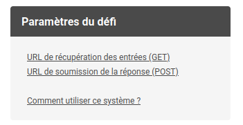

# Préparation à c0d1ng UP

{: .center} 

Le [blog](https://codingup.fr/){:target="_blank"} pour s'inscrire et avoir toutes les infos.

!!! info "Lecture d'un fichier texte"
    Voici deux principales méthodes pour lire un fichier texte à l'aide de la fonction `open` (aucun module requis, elle fait partie des [fonctions natives de Python](https://docs.python.org/fr/3/library/functions.html){:target="_blank"} :

    === "Méthode 1: sans traitement"
        Si on n'a pas besoin de traiter les données sur chaque ligne du fichier texte, on peut récupérer le fichier sous forme d'une liste (`data` ici), où chaque élément sera une ligne du fichier (`input.txt` ici), de type `str` bien entendu, avec:

        ```python 
        data = open('input.txt').read().splitlines()
        ```
    === "Méthode 2: avec traitement"
        On peut également parcourir ligne par ligne le fichier ainsi:

        ```python 
        data = []
        with open('input.txt') as f:
            for line in f.readlines():
                data.append(line.strip())
        ```
        
        Ce code est identique à la méthode 1, mais la boucle `for` permet de faire un traitement de la chaîne de caractéres `line` avant ajout à la liste `data`.

        **Remarque:** la méthode `strip` permet de «nettoyer» la chaîne de caractères, c'est-à-dire ici d'enlever le caractère `\n` de retour à la ligne.
        
    **Pour s'entraîner:**

    [https://pydefis.callicode.fr/defis/EwoksSansA/txt](https://pydefis.callicode.fr/defis/EwoksSansA/txt){:target="_blank"} 

    [https://pydefis.callicode.fr/defis/EwoksVoyelle/txt](https://pydefis.callicode.fr/defis/EwoksVoyelle/txt){:target="_blank"} 


!!! info "Défi par requête web"
    Ce genre de défi donne deux url: l'une pour récupérer les données (méthode GET), l'autre pour envoyer votre réponse (méthode POST). On va effectuer des requêtes à ces url via le module `requests`.

    {: .center width=35%} 

    ```python linenums='1'
    import requests

    # On fait une requête (GET) à la première adresse (copiez-collez l'adresse):
    r = requests.get("http...")
    
    # On récupère le texte contenu dans la page récupérée:
    data = r.text.split("\n") 

    # On résout le défi !
    # On stocke par exemple la réponse dans une variable nommée... reponse


    # On répond avec une requête (POST) à la deuxième adresse (copiez-collez l'adresse).
    # On renvoie en fait un dictionnaire, où "sig" est la signature contenue dans la première
    # ligne du texte (c-a-d data[0]), et où "rep" est la valeur de la réponse...
    ans = requests.post("http...", {"sig": data[0], "rep": reponse})

    # On affiche le résultat de la requête pour contrôler
    print(ans.text) 
    ```

    **Pour s'entraîner:**

    [https://pydefis.callicode.fr/defis/ExempleURL/txt](https://pydefis.callicode.fr/defis/ExempleURL/txt){:target="_blank"} 

    [https://pydefis.callicode.fr/defis/BaladeEchiquier/txt](https://pydefis.callicode.fr/defis/BaladeEchiquier/txt){:target="_blank"} 

!!! info "Les sets"
    Un objet *set* est une collection d'éléments comme les listes ou les tuples, à la différence qu'ils ne sont pas triés ni ordonnés, et donc on ne peut avoir accès à leurs éléments par indexation.

    De plus, un set ne peut pas contenir plusieurs éléments identiques. Il ressemble ainsi à un «ensemble d'éléments» en mathématiques, et se note comme lui entre accolades.

    On peut néanmoins lui ajouter/supprimer des éléments, tester l'appartenance, le parcourir, créer l'intersection ou la réunion de plusieurs sets, etc.

    Une utilisation des sets permet donc **d'éliminer les doublons**.
    **Exemples:**

    ```python
    >>> s1 = {'a', 'e', 'i', 'o', 'u'}
    >>> s2 = set('jack sparrow')
    >>> s2
    {'c', ' ', 'p', 's', 'a', 'k', 'j', 'r', 'w', 'o'}
    >>> set('124512453252514')
    {'5', '4', '3', '1', '2'}
    >>> len(s2)
    10
    >>> 'e' in s1
    True
    >>> 'e' in s2
    False
    >>> s2.remove(' ')
    >>> s2
    {'c', 'p', 's', 'a', 'k', 'j', 'r', 'w', 'o'}
    >>> s1.add('y')
    >>> s1
    {'y', 'u', 'a', 'e', 'o', 'i'}
    >>> s1 & s2
    {'o', 'a'}
    >>> s1 | s2
    {'u', 'c', 'j', 'r', 'y', 'e', 's', 'a', 'p', 'k', 'i', 'w', 'o'}
    >>> {'u', 'y'} <= s1
    True
    ```
    
    Pour plus de détails, voir [ici](https://docs.python.org/fr/3/library/stdtypes.html#set-types-set-frozenset){:target="_blank"} 

    **Pour s'entraîner:**
    
    [https://pydefis.callicode.fr/defis/CodeCabine/txt](https://pydefis.callicode.fr/defis/CodeCabine/txt)

!!! info "Lire et travailler sur une image"
    Ça se passe [là](https://cgouygou.github.io/1NSI/T09_Projets/Image/Image/){:target="_blank"} 

    **Pour s'entraîner:**

    [https://pydefis.callicode.fr/defis/Herculito09Ceinture/txt](https://pydefis.callicode.fr/defis/Herculito09Ceinture/txt){:target="_blank"} 

!!! info "Slicing"
    Lorsqu'on travaille sur une liste, il peut être nécessaire (ou pratique) d'extraire une **tranche** (slice) de cette liste, c'est-à-dire une succession d'éléments consécutifs.

    Par exemple, si on dispose d'une liste `[4, 2, 1, 3, 6, 0, 8]`, on peut extraire la tranche `[2, 1, 3, 6]` en précisant les indices de début et de fin (non inclus, comme dans `range`). Si on ne précise pas l'indice de début (respectivement l'indice de fin), on «slice» depuis le premier élément (resp. jusqu'au dernier):

    ```python
    >>> lst = [4, 2, 1, 3, 6, 0, 8]
    >>> lst[1:5]
    [2, 1, 3, 6]
    >>> lst[1:]
    [2, 1, 3, 6, 0, 8]
    >>> lst[:4]
    [4, 2, 1, 3]
    ```
    On peut également préciser un pas :
    ```python
    >>> lst[1:5:2]
    [2, 3]
    >>> lst[::2]
    [4, 1, 6, 8]
    ```

    Cela peut donc être utile pour découper une liste en tranches de longueur donnée, ici 8 par exemple:

    ```python
    >>> test = list(range(64))
    >>> test[0:8]
    [0, 1, 2, 3, 4, 5, 6, 7]
    >>> test[8:16]
    [8, 9, 10, 11, 12, 13, 14, 15]
    >>> tranches = [test[8*k:8*(k+1)] for k in range(len(test)//8)]
    >>> tranches
    [[0, 1, 2, 3, 4, 5, 6, 7], [8, 9, 10, 11, 12, 13, 14, 15], [16, 17, 18, 19, 20, 
    21, 22, 23], [24, 25, 26, 27, 28, 29, 30, 31], [32, 33, 34, 35, 36, 37, 38, 39],
    [40, 41, 42, 43, 44, 45, 46, 47], [48, 49, 50, 51, 52, 53, 54, 55], [56, 57, 58
    , 59, 60, 61, 62, 63]]
    ```

    **Pour s'entraîner:**

    [https://pydefis.callicode.fr/defis/Fourchelangue/txt](https://pydefis.callicode.fr/defis/Fourchelangue/txt){:target="_blank"} 
