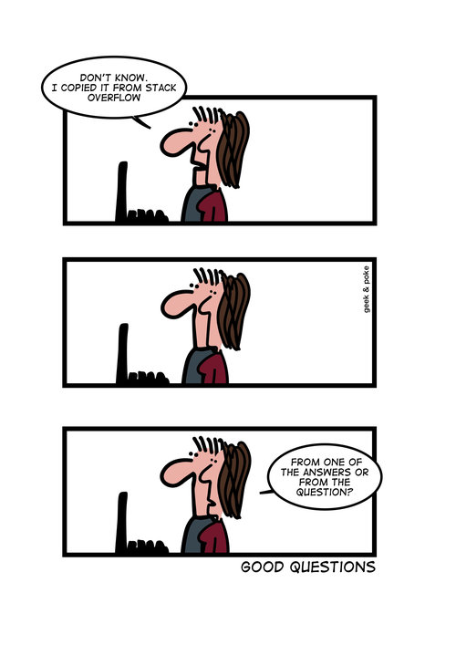

# Extras

Vous trouverez ici 3 espaces:

=== "Exercices supplémentaires"
    Pour s'exercer et progresser en programmation.

=== "Projets"
    Des projets plus ou moins guidés.

    {: .center width=480} 

=== "Divers"
    Cette section traite de points qui ne sont pas au programme mais qui peuvent vous simplifier la vie.

    {: .center width=480} 