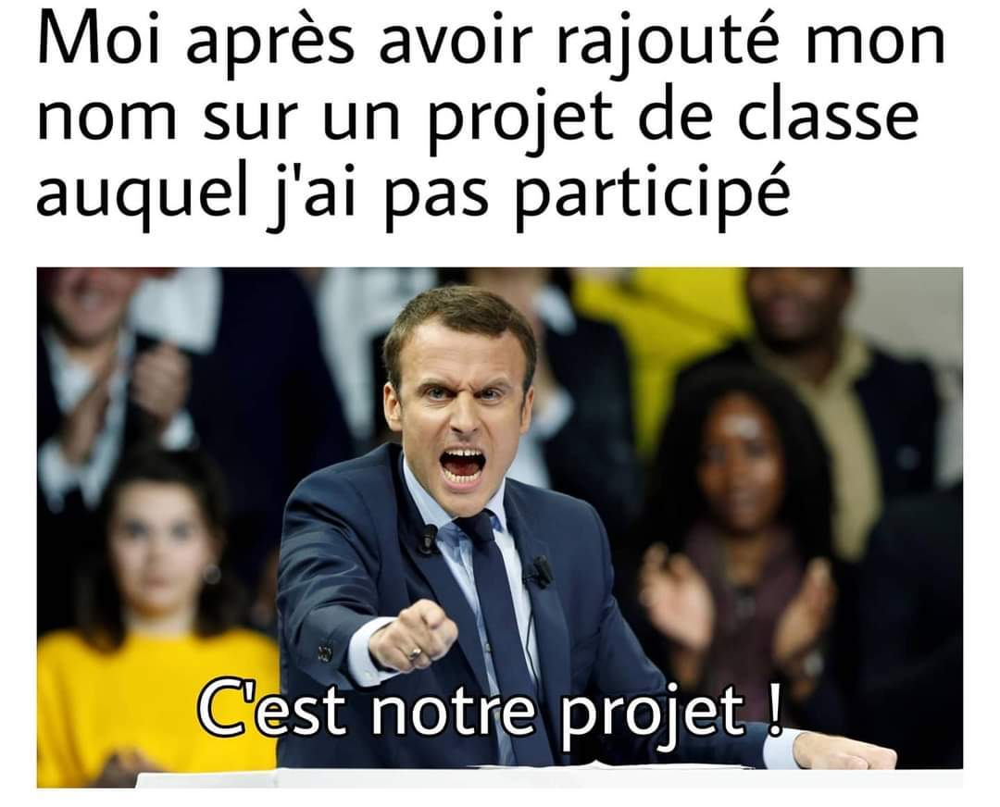

# Extras

Vous trouverez ici 4 espaces:

=== "Exercices supplémentaires"
    Pour s'exercer et progresser en programmation.

    {: .center width=480} 

=== "Projets"
    Des projets plus ou moins guidés.

    {: .center width=480} 

=== "Pygame"
    _Logo.png){.center width=640}

    **Pygame** est un package de Python facilitant la création de jeux basés une interface graphique.

=== "Divers"
    Cette section traite de points qui ne sont pas au programme mais qui peuvent vous simplifier la vie.

    {: .center width=480} 