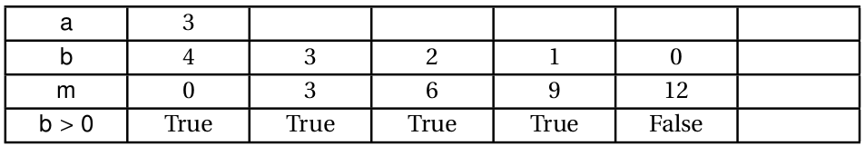

# DS 0100 - Corrigé
24/11/2022

Lien vers la partie machine : [https://capytale2.ac-paris.fr/web/c/b40a-1003648](https://capytale2.ac-paris.fr/web/c/b40a-1003648){:target='_blank'}


## Partie 1: sur table

### Exercice 1: Entiers signés

1. Donner la représentation binaire en complément à 2 sur 8 bits du nombre `-45`.

    - Valeur absolue en binaire : `00101101`

    - Complément à 2 : `11010010`

    - +1 : `11010011` est la représentation binaire en complément à 2 sur 8 bits du nombre `-45`.

2. Donner l'entier relatif dont la représentation binaire en complément à 2 sur 8 bits est `10110010` .

    - -1 : `10110001`
    - Complément à 2 : `01001110`
    - Conversion en décimal : `01001110` est l'écriture de 78. Donc `10110010` représente `-78`.

3. Quel est le terme anglais désignant «dépassement de capacité» ?

    C'est (integer) **overflow**.

4. Sur 16 bits, on peut représenter $2^{16} = 65536$ entiers, de $-2^{15}=-32758$ à $2^{15}-1=32757$.

### Exercice 2: Fonctions

1. On **appelle** la fonction `mystere` en lui **passant** les **arguments** `3` et `4`.
2. {: .center} 
3. `mystere(3, 4)` renvoie la valeur `12`. Étant donné qu'on a fait `b` additions du nombre `a`, la fonction `mystere` sert à multiplier ses arguments.


### Exercice 3: Fonctions

1. La variable `exemple` contient la valeur `True`.
2. On l'appelle docstring.
3. - `en_cours` est le  nom de la fonction
    - `heure`  est le paramètre
    - `#!py if`  est un mot-clé
    - `#!py and`  est un opérateur
    - `#!py <=`  est un opérateur
    - `17` est un argument
    - `return` est un  mot-clé
    - `exemple` est une variable globale
    - `#!py lycee_est_ouvert` est une variable locale
    - `#!py int` est le type de retour de la fonction


## Partie 2 - sur machine


1. Où l'on essaie de fournir un jeu de tests couvrant : une seule occurence, plusieurs, ou aucun.
```python
assert compte_lettre('informatique', 'i') == 2
assert compte_lettre('travail', 'v') == 1
assert compte_lettre('toto', 'a') == 0
```

2. On parcourt la chaîne de caractères avec une boucle `for` et on utilise une variable accumulateur.
```python linenums='1'
def compte_lettre(chaine:str, lettre:str) -> int:
    '''
    Compte et renvoie le nombre d'occurences du caractère lettre dans chaine
    '''
    occurences = 0
    for caractere in chaine:
        if caractere == lettre:
            occurences += 1
    return occurences
```

3. Il suffit d'exécuter les tests.

4. **Bonus**: on utilise la fonction `compte_lettre` en passant les bons arguments. La réponse est 289.
```python linenums='1'
texte_long = '''
mpaowhuqhvyywtvynessayezpasdecompteralamainxxjipjgkyscgdiqswpvpbzigfkljhicuftshk
qekwqojwchsgyuvakynjpxlacrnbojawdisjzbcqjflhgqofhccdxnqpbnxcxcypawaqgzbikretwlkf
qodnoseirzvssdczsyczqjbugcgjuorxciblnojkvygxqirysffsmjyokjdsxlymjokgodupumjoxcmi
teeenikwlkzidirjnmexsmqjefsgpbpoynusfpudmxwcwrzzqzcestpasfauxvgjkhoujsdlnsyfshuu
mfmqmssbyrzybswyswbdmqmcwsdudrfdnmlmnchossxcwarfmpkrcqcyvyjkplzexrnebukxhqbnzkgh
nalfpkxghypaimemqzmcreozagufiljxdmgrwftyajtonfisefxujtdmpgxttugxhvpgdqhvgzohovbe
qaafwqfiokzhtbxgoxpzzvbswlxdtykgufqevlmjjrddufrogzsfzzuaqpqfzinvmfpcylgftkkhqylp
rgzywwefwghhrivsjtvbbcixhztwujdqqesdertmtwdricrzmwsibhstsgnnxbvqnyklcbrcxtycvcww
ojphbqyrjffndkgwqfqvarfupklwwixekudmbspqtydkegltqvwjzfooscehpnfwvvnkrxsfakwezvol
mpvnprcrwomddjneyrhpxmnrveibxqxcjluezypvsbfudilpjdqflsdhwucjgtusxjjcnewamoewwjhu
zhhqgpvarwinteriscomingzlawqxgzrchfuequwrjialmjfpdpwywgwvahscnrcpqadkzhgrgjbcepv
vklhkxbyjecrijiuebradrvknnfsjcntfvhcylxsgwjwzteogegntfzfxqaekboxlzjvaldhbtytqmhn
oylmymhtulgwaumgdwcosgbcpxersxxnlgchtvukebrptmiyitvjesappellegrootuxfbmnyeoszpok
flfrblurfpyjwnqcfqlokfobvptiowvxjfyeesnejqpxsupmemvinnmvmxvddujombefbnordfixiaor
bgfccvbexnyxpsvuzejhjblmatvzimawevlpvmfsjzvixfozvsbcwkrbsqnbsaiifbseektjpsywqprv
xvnwdogtaddywxudfpflukeiamyourfatherqrultakjezhzjmxkgyrzaiyvbxayvxkdrgotvnunlfve
vydcqydxyklyfsrhlxghfvxvmylnehlekkvxqeknakskeysgxodnwzkjzijxnshyhjggtdpxauptusnx
opuchpbubozvrlrzzlurcpsacldjxwqbipwhiifvvpnnhehgxnmjupydlbbozjpkdbwuaoruyorblgvo
kouxwjfihpjjaxtybebshntqquybtgjjcverslinfinietaudelabzmuvnivkeznyflipqoodvapbkgi
bcnbfsrdymsynnucjkkcwdjgejbboqiywiloizpptdgzonqbbzbhjkalzmhtsqswijnwkbyotkxugoel
mxprqmvoarlfghmssecdwywortsowqqkohftuxjtpltwubxwzkdgogobdxhuiqotlqcvcmtutoycjzhi
aepakcxsigvctrwoskymbnapuqbaxqewsphnyfmmlfqjfrwjkjseucvycwppmdvehwgrgpqgkedejjpd
agmmnfhvpipcyeaztgnazyobevgdblggypeihicboztxjcvplgyzuvtnjupehgrwleywlvdaquuhzfwf
ldfujrydzetodawkxgmmsycaucybkxiykctfoppduhqbuiqyymvcrcyfhhovdyowavlndpklpjdttmnz
ngjjennqclkchkmyweyhjbpdlucayijkhegpivocflkfizbhfwynswlmdcgufszvaqjlobxhevhdobag
tgppvtlrhnwnlmonbvxjkgcqmccfqrmdmomgyhgvzopqntmktmuuyufjhtpnwqmsjjmghjlrjkaapimp
tdvzbthklgngzrpwxafrnvrtqokbukyuiamydtchhszcyiavgkdvedrgiowufbmygnhdnbfzjyxdqgro
wpvytkmpflbruauxewpopcreuuqyqgkeyoushallnotpassxxgytlycddlsaupeaberfzntswrlkvsrj
ixcaebjrzmpnkeopfvwkzgdormghrgxsqfrjggkzujnsgijpjmgubayfbuayuiakcplmidxyounsumtl
odohrhwmrhyeqyjsctahdyukxdujkvlqhkaxvhregcjeafnffdbzdkpzrxilqoctvfqaayozhzijudvd
dyuiyoevhyxwslazrhbrrdvslfirovfyuxxdvspyqhwthptfkjgsjmozkmcqmaorpibkcrexsgdvtean
zyjliwmrgjlvqrizoefhmdleolaaaukssiwmxdsdwtxcmycdjzuyorwnmhcuumuyzthbioufcestfini
'''

total = 0
for caractere in 'nsi':
    total += compte_lettre(texte_long, caractere)

print(total)
```
