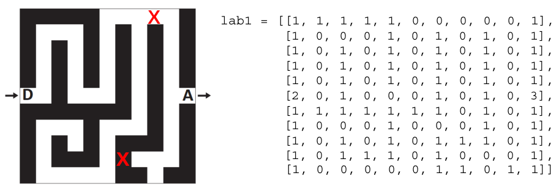
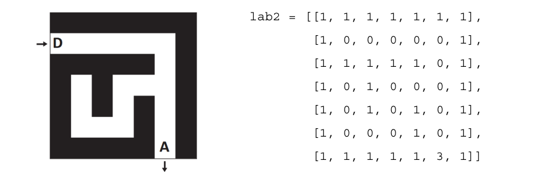

# DS 0110 - Corrigé
Devoir du 01/02/2023


## Partie 1: Sur papier (10 points)

On modélise un labyrinthe par un tableau à deux dimensions à $n$ lignes et $m$ colonnes avec $n$ et $m$ des entiers strictement positifs.

Les lignes sont numérotées de 0 à $n-1$ et les colonnes de $0$ à $m-1$.

La case en haut à gauche est repérée par $(0, 0)$ et la case en bas à droite par $(n-1, m-1)$.
Dans ce tableau :

- 0 représente une case vide, hors case de départ et arrivée,
- 1 représente un mur,
- 2 représente le départ du labyrinthe (l'entrée),
- 3 représente l'arrivée du labyrinthe (la sortie).

Ainsi, en Python, le labyrinthe ci-dessous est représentée par le tableau de tableaux `lab1`:

{: .center} 

1. Donner l'emplacement de l'entrée et l'emplacement de la sortie dans le labyrinthe ci-dessus.

    L'entrée du labyrinthe se situe en ligne 5 et colonne 0, c'est-à-dire en $(5, 0)$ (ou `#!py lab1[5][0]`).

    L'entrée du labyrinthe se situe en ligne 5 et colonne 10, c'est-à-dire en $(5, 10)$ (ou `#!py lab1[5][10]`).

2. On souhaite modifier le labyrinthe en inversant les cases marquées par des croix rouges. Donner les instructions permettant d'affecter les nouvelles valeurs aux éléments correspondants du tableau.

    ```python linenums='1'
    tab[0][8] = 1
    tab[9][6] = 0
    ```
    

3. Le labyrinthe ci-dessous est censé être représenté par `lab2`. Cependant, dans ce tableau, un mur se trouve à la place du départ du labyrinthe. Donner une instruction permettant de placer le départ au bon endroit dans `lab2`.

    {: .center} 
    
    ```python linenums='1'
    tab[1][0] = 2
    ```


4. On souhaite écrire une fonction `est_valide(i, j, n, m)` qui renvoie `True` si le couple $(i, j)$ correspond à des coordonnées valides pour un labyrinthe de taille $(n, m)$, et `False` sinon. Par exemple:
    ```python
    >>> est_valide(5, 2, 10, 10)
    True
    >>> est_valide(-3, 4, 10, 10)
    False
    >>> est_valide(8, 12, 10, 10)
    False
    ```
    
    Compléter le code suivant:

    ```python linenums='1'
    def est_valide(i: int, j:int, n:int, m: int) -> bool :
        '''
        Renvoie un booléen (True ou False) déterminant si le couple (i,j) est
        un emplacement valide dans un labyrinthe de taille (n, m).
        '''
        if i < 0 or i >= n:        
            return False
        elif j < 0 or j >= m:
            return False
        else:
            return True 
    ```
    
4. On suppose que la sortie d'un labyrinthe est toujours indiquée, mais on ne fait aucune supposition sur son emplacement.
    Compléter la fonction `sortie(lab)` ci-dessous de sorte qu'elle renvoie, sous la forme d'une liste, les coordonnées de la sortie d'un labyrinthe (représenté par le paramètre `lab`). Par exemple, l'appel `sortie(lab2)` doit renvoyer  `[6, 5]`.

    ```python linenums='1'
    def sortie(lab:list) -> list:
        '''
        Renvoie les coordonnées de la sortie d'un labyrinthe lab.
        '''
        n = len(lab)
        m = len(lab[0])
        for i in range(n):
            for j in range(m):
                if tab[i][j] == 3:
                    return [i, j]
    ```

## Partie 2: Sur machine (10 points)

### Exercice 1

Compléter ci-dessous la fonction `extrait_positif`:

```python linenums='1'
def extrait_positif(l:list) -> list:
    '''
    La fonction construit une nouvelle liste constituée uniquement des termes positifs
    ou nuls de la liste l donnée en paramètre.
    '''
    positifs = []
    for k in range(len(l)):
        if l[k] >= 0:
            positifs.append(l[k])
    return 

assert extrait_positif([-5, 12, 7, 0, -8, 23]) == [12, 7, 0, 23]
```

### Exercice 2

Écrire une fonction `somme` qui prend en paramètre une liste (d'entiers) et qui renvoie la somme des éléments de la liste.

```python linenums='1' title='Avec un parcours par indice'
def somme(tab:list) -> int:
    '''
    calcule et renvoie la somme des éléments de tab.
    - précondition: tab est une liste d'entiers
    '''
    s = 0
    for k in range(len(tab)):
        s += tab[k]
    return s
```

```python linenums='1' title='Avec un parcours par élément'
def somme(tab:list) -> int:
    '''
    calcule et renvoie la somme des éléments de tab.
    - précondition: tab est une liste d'entiers
    '''
    s = 0
    for n in tab:
        s += n
    return s
```

### Exercice 3: retour sur la partie 1

On souhaite disposer d'une fonction `nb_cases_vides` qui prend en paramètre une liste `lab` représentant un labyrinthe et qui renvoie le nombre de cases vides du labyrinthe (comprenant donc l'arrivée et le départ).
    
Par exemple, l'appel `nb_cases_vides(lab2)` doit renvoyer la valeur `19`.

1. Écrire cette fonction `nb_cases_vides`. Spécifier la fonction.

2. Écrire ensuite le test (avec le mot-clé `assert`) correspondant à l'exemple donné ci-dessus, puis vérifier que votre fonction donne le bon résultat.

```python linenums='1'
lab2 = [[1, 1, 1, 1, 1, 1, 1],
        [2, 0, 0, 0, 0, 0, 1],
        [1, 1, 1, 1, 1, 0, 1],
        [1, 0, 1, 0, 0, 0, 1],
        [1, 0, 1, 0, 1, 0, 1],
        [1, 0, 0, 0, 1, 0, 1],
        [1, 1, 1, 1, 1, 3, 1]]

# Version 1 : avec parcours par indices
def nb_cases_vides(lab:list) -> int:
    '''
    compte le nombre de cases vides dans lab, c'est-à-dire le nombre
    d'éléments différents de 1 (1 = mur).
    '''
    non_mur = 0
    for i in range(len(tab)):
        for j in range(len(tab[0])):
            if tab[i][j] != 1:
                non_mur += 1
    return non_mur

# Version 2: avec parcours par éléments
def nb_cases_vides(lab:list) -> int:
    '''
    compte le nombre de cases vides dans lab, c'est-à-dire le nombre
    d'éléments différents de 1 (1 = mur).
    '''
    non_mur = 0
    for ligne in tab:
        for case in ligne:
            if case != 1:
                non_mur += 1
    return non_mur


assert nb_cases_vides(lab2) == 19
```
