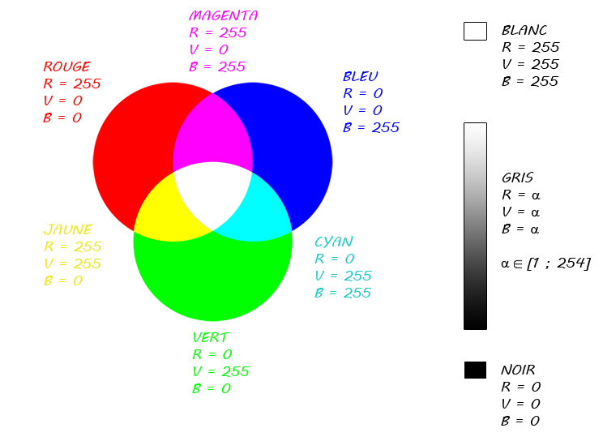
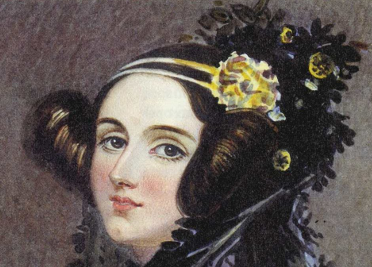
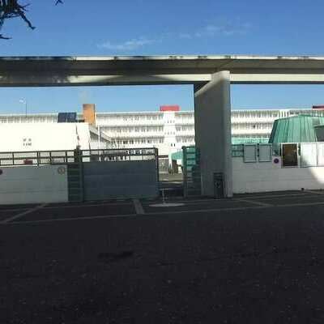

# Image numérique

## 1. Tableau de pixels

!!! info "Les caractéristiques d'une image"
    === "Quadrillage"
        Une image numérique se présente sous la forme d’un quadrillage - ou d'un tableau - dont chaque case est un pixel d’une couleur donnée. On peut donc repérer chaque pixel par sa ligne et sa colonne dans ce tableau (ou à l'aide de coordonnées en partant du coin en haut à gauche[^1]).
        
        [^1]: en fait cela dépend de l'outil (module) utilisé pour lire et écrire des images.

        {: .center .w640} 
        
    === "Définition"
        La définition de l’image est le nombre total de pixels qui la composent. Celle-ci n’est pas forcément égale à la définition du capteur.
        
        On l'obtient donc en multipliant sa largeur par sa hauteur. Par exemple, une image de 1920 pixels de largeur sur 1080 pixels de hauteur a une définition de 1920 x 1080 = 2073600 pixels soit à peu près 2 millions de pixels.
        
    === "Résolution"
        La  résolution  de  l’image, c’est-à-dire le  nombre  de  pixels  par  unité de  longueur,  détermine  sa  qualité  à l’impression ou sur un écran.

        Par exemple, la résolution standard pour affichage sur le web est de 72 ppp (pixels par pouce) alors qu'une résolution de 300 ppp est recommandée pour l'impression.


!!! info "Le codage des pixels (couleurs)"
    Chaque pixel correspond à un triplet de trois nombres entiers, soit les valeurs de rouge (Red), de vert (Green) et de bleu (Blue) afin de reconstituer la couleur. Chaque valeur est codée sur un octet, soit entre 0 et 255 (ou en pourcentages, ou en hexadécimal, voir [ici](https://fr.wikipedia.org/wiki/Rouge_vert_bleu#Codes_pratiques){:target="_blank"}). On parle de code RGB (RVB in french).

    {: .center} 

    **À noter:**
    
    - une couleur dont les 3 composantes sont identiques correspond à un niveau de gris;
    - selon les formats, une quatrième composante peut s'ajouter: le **canal alpha**. Cette valeur (sur un octet également) indique le niveau de transparence du pixel.

!!! tip "Site incontournable"
    Un site pour visualiser les couleurs au formet RGB, et convertir en héxadécimal : [http://www.proftnj.com/RGB3.htm](http://www.proftnj.com/RGB3.htm){:target="_blank"}  

## 2. Les modules

Pour manipuler les images, nous allons avoir besoin du module `imageio`. Ce module nécessite d'utiliser également le module `numpy` pour créer des tableaux d'entiers non signés sur 8 bits (un octet).

[{: .center} ](../images/ada.png){:target="_blank"} 


!!! info "`imageio`"
    - Ouvrir et charger une image existante (`ada.png` par exemple)  dans une variable (`img` par exemple):

    ```python
    img.imread("ada.png")
    ```

    !!! warning "Accès à l'image"
        L'image doit être dans le dossier courant de travail, a fortiori le même que le fichier `.py`.
        Si ce n'est pas le cas, il faudra le modifier.
    
    - La taille de l'image est accessible dans le triplet (largeur, hauteur, nb composantes) donné par:

    ```python
    img.shape
    ```
    
    - Lire/modifier un pixel: il s'agit tout simplement de travailler sur le tableau, par indices et par réaffectation.

    ```python
    print(img[2][10])       # pour afficher le pixel ligne 2, colonne 10
    img[2][10] = [0, 0, 0]  # pour le mettre en noir
    ```
    
    - Sauvegarder une image contenue dans une variable `img`:

    ```python 
    imageio.imsave("monimage.png", img)
    ```
    

!!! info "`numpy`"
    Le module `numpy` est un module de calcul scientifique orienté vers les matrices, qui sont des objets mathématiques bien pratiques... En gros ce sont des tableaux.
    On se servira uniquement de ce module pour créer des tableaux vides, au format que le module `imageio` exige pour pouvoir ensuite sauvegarder l'image (et donc la visualiser).

    On utilise la fonction `zeros` du module `numpy` qui prend en paramètres un triplet (hauteur, largeur, nombre de composantes) et le type des valeurs, ici donc des entiers non signés sur 8 bits.

    *[hauteur]: nombre de lignes

    *[largeur]: nombre de colonnes

    Par exemple pour une image de 100 pixels (de haut) sur 256 pixels (de large), avec 3 composantes (pas de canal alpha):

    ```python 
    img_vide = numpy.zeros([100,256,3], dtype=np.uint8)
    ```
    
## 3. Exercices

{{ initexo(0) }}
!!! example "{{ exercice() }}"
    === "Énoncé" 
        1. Télécharger l'image `ada.png` ci-dessus (simple clic-gauche), puis la charger dans un programme avec le module `imageio`.
        2. Trouver ses dimensions et son nombre de composantes.
        3. Faire un crime de lèse-majesté et tracer une ligne horizontale rouge au nivau du front.
    === "Solution" 
        {{ correction(False, 
        "
        "
        ) }}

!!! example "{{ exercice() }}"
    === "Énoncé" 
        Cette image est-elle vraiment composée de pixels tous noirs?

        {: .center}
    === "Solution" 
        {{ correction(False, 
        "
        "
        ) }}


!!! example "{{ exercice() }}"
    === "Énoncé" 
        Incruster John Travolta devant le lycée

        {: .center} 

        {: .center} 
    === "Solution" 
        {{ correction(False, 
        "
        "
        ) }}


## 4. Création d'effets 

Dans cette dernière partie, on va recréer des effets que des logiciels de retouche d'image (GIMP, Photoshop, ...) proposent.

On travaillera (par exemple) sur l'image ci-dessous:

{: .center} 

!!! note "Effets"
    === "Filtre rouge"
        Pour créer un filtre rouge il suffit de conserver la composante rouge et de remplacer les autres composantes par 0.

        Si vous n'aimez pas le rouge, faites un filtre vert. Ou bleu.

        {: .center} 

    === "Négatif"
        Pour obtenir le négatif d'une image, il faut remplacer chaque composante RGB par son complémentaire à 255.
        
        Par exemple, si une composante vaut 42, il faut la remplacer par 213 (= 255 - 42).

        {: .center} 


    === "Niveaux de gris"
        Dans sa norme 709, la Commission Internationale de l’Éclairage propose de remplacer les 3 composantes d'un pixel (r, g, b) par la valeur suivante :
        
        $m = 0.2126 \times r + 0.7152 \times g + 0.0722 \times b$

        {: .center} 

    === "Flip"
        On retourne l'image horizontalement.

        {: .center} 

    === "Photomaton"
        C'est une transformation réversible, puisqu'on envoie un pixel sur quatre dans chaque carré...

        {: .center} 

    === "Pop-art"

        Le principe est, pour chaque pixel, d'appuyer sur la composante majoritaire: on récupère la composante maximale et on l'augmente d'une certaine valeur (par exemple 50 sur l'image ci-dessous) sans dépasser 255 bien entendu.

        {: .center} 

    === "Pixellisation"
        Je vous laisse deviner...

        {: .center} 

    === "Floutage" 
        Je vous laisse deviner...

        {: .center} 


        