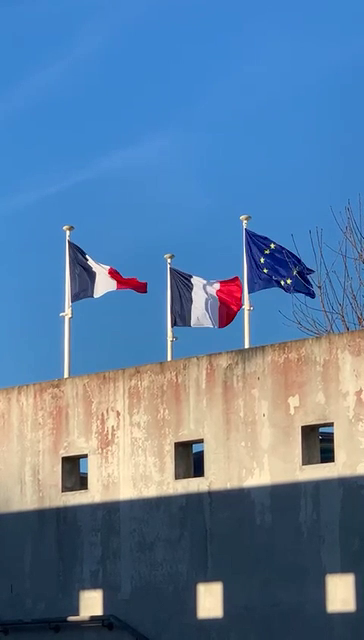
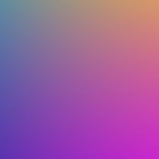

# Travail sur l'image (et la vidéo)

## Conversion RGB ⟷ HSL
!!! info "Codage HSL"
    Le codage informatique des couleurs que nous connaissons est le codage **RGB** qui est le plus proche du matériel, et le plus répandu. C'est celui utilisé par les modules Python de traitement d'image, comme `imageio` que nous utilisons, ou `PIL`.

    Un autre codage des couleurs - celui manipulé dans ce projet - est le codage **HSL**, pour Hue (teinte), Saturation (saturation), Lightness (luminosité). Il est plutôt utilisé dans les logiciels de dessin assisté par ordinateur ou de retouche d'images.

    Le procédé de conversion des 3 valeurs RGB vers les 3 valeurs HSL est expliqué sur la [page Wikipédia correspondate](https://fr.wikipedia.org/wiki/Teinte_saturation_luminosit%C3%A9#Depuis_RVB_2){:target="_blank"}.

!!! info "Test de la fonction"
    Pour tester vos conversions, vous pouvez utiliser un convertisseur en ligne, comme [celui-ci par exemple](https://www.rapidtables.com/convert/color/rgb-to-hsl.html){:target="_blank"} où vous trouverez également les formules de conversion.

## Recherche de la couleur dominante

!!! info "Extraction d'une frame de la vidéo"
    Une image est composée de *frames*, c'est-à-dire d'images qui défilent à une certaine fréquence (FPS), en général 24 images par seconde.

    Pour extraire une image d'une vidéo, on utilise le module `imageio`.

    ```python
    import imageio
    video = imageio.get_reader('video.mp4') 
    frame = video.get_data(472) 
    ```
    Dans le code précédent, l'image n°472 est extraite dans la variable `frame`. On peut ensuite la manipuler ou la sauvegarder. Pour connaître le nombre de frames dans la variable `video`, on utilise `video.count_frames()`.

!!! info "Test de la fonction"
    Sur l'image ci-dessous, vous devriez obtenir une couleur dominante de `(61, 134, 210)` en RGB soit `(210, 62, 53)` en HSL.

    {: .center} 
    
## Extraction de la zone
!!! info "Extraction de la zone"
    Il faudra créer une image vide aux bonnes dimensions, puis affecter pixel par pixel ceux de la zone de l'image initiale définie par les valeurs de **x**, **y** et **W**.

## Application du filtre
!!! info "Overlay blending mode"
    I'm sorry, but I didn't succeed to find a french source for this.
    
    So you will have to translate [this page](https://en.wikipedia.org/wiki/Blend_modes){:target="_blank"} to find how to apply a colored filter to a picture.

!!! info "Testing your function"
    Apply an overlay filter with HSL color `(210, 53, 58)` on the first image below should give the second one.

    {: .center} {: .center}

    
## Réalisation du GIF

!!! info "RTFM"
    [https://imageio.readthedocs.io/en/stable/examples.html#optimizing-a-gif-using-pygifsicle](https://imageio.readthedocs.io/en/stable/examples.html#optimizing-a-gif-using-pygifsicle){:target="_blank"} 
