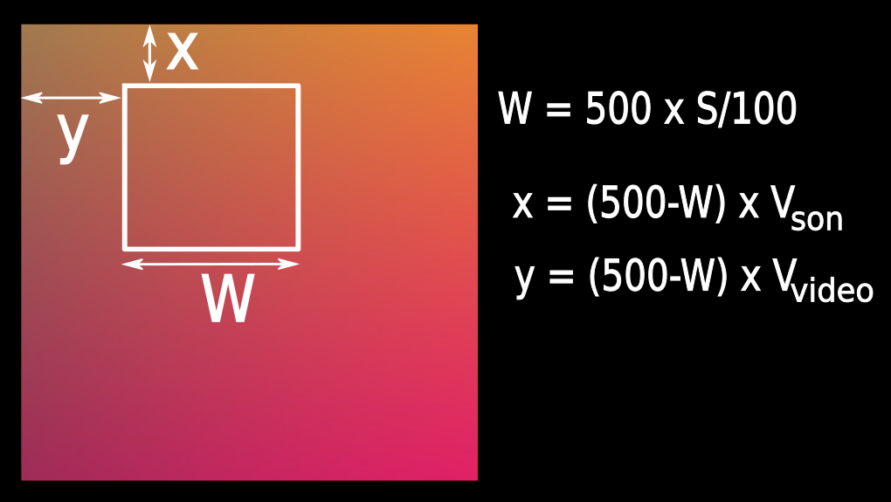

# DE TEMPS EN TEMPS

**Intervention artistique en milieu scolaire**

**Arts Plastiques + Numérique et Sciences Informatiques**

{: .center width=30%} 

**Collectif Meth.O.tapes**

!!! abstract "Présentation du projet"
    Gauthier Platevoet et Marc-Étienne Guibert du collectif Meth.O.tapes nous ont proposé un projet artistique mêlant arts plastiques et numérique, autour du thème du « temps qui passe» et  de la météorologie.

    En résumé, l'objectif est de réaliser un GIF animé dont les images sont créées à partir des caractéristiques de relevés sous différents formats (photos, vidéos, enregistrement sonores, palette de couleurs, pression atmosphérique, température ressentie).

    - les élèves suivant la spécialité **Arts Plastiques** réalisent les relevés et élaborent une image plastique synthétisant ces relevés.

    - les élèves suivant la spécialité **NSI** récupèrent ces images ainsi que les données brutes et élaborent un GIF animé selon le protocole communiqué par les artistes.

    {: .center width=20%} 

    **La banque des relévés** des élèves d'Arts Plastiques est visible ici: [https://methotapes.com/BILANS_CLIMATIQUES/qg.html](https://methotapes.com/BILANS_CLIMATIQUES/qg.html){:target="_blank"}  et téléchargeable là : [https://methotapes.com/BILANS_CLIMATIQUES/uploads/](https://methotapes.com/BILANS_CLIMATIQUES/uploads/){:target="_blank"} 

!!! note "Protocole de génération du GIF"
    - Le GIF doit comporter 25 images de définition 500 × 500.
    - Chaque image est une zone extraite de l'image fournie par les élèves d'Arts Plastiques, à laquelle on applique un filtre coloré.
    - La taille de la zone extraite ainsi que les coordonnées du coin haut-gauche de la zone dépendent de l'enregistrement sonore (à chaque 1/25e du temps), du son de la vidéo (à chaque 1/25e du temps) ainsi que de la couleur dominante de la vidéo (à chaque 1/25e du temps).
    - Le filtre coloré dépend de la couleur dominante de la vidéo (à chaque 1/25e du temps).

    === "Couleur dominante"
        {: .center} 

        Après avoir divisé la durée de la vidéo par 25, on extrait une image de la vidéo, puis on extrait la couleur dominante au format HSL (H → teinte, S → saturation, L → luminosité). On passe la saturation à 100 pour obtenir la couleur du filtre, ici pour la 20e image du GIF.
    === "Enregistrements sonores"
        {: .center} 

        De la même façon, on récupère un **intervalle** de l'enregistrement sonore de 1/25e de sa durée, dont on calcule l'intensité moyenne $I_s$. On extrait l'audio de la vidéo et on fait la même chose pour obtenir l'intensité $I_v$.

    === "Zone à extraire"
        {: .center} 

        - La largeur **W** de la zone à extraire dépend de la saturation **S** de la couleur dominante.
        - Les coordonnées **x** et **y** du coin haut-gauche de la zone à extraire dépendent des intensités $I_s$ et $I_v$.