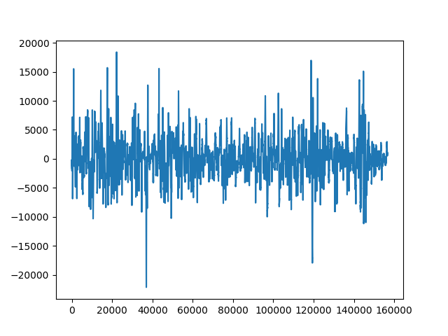

# Travail sur le son

## Préambule

!!! info "Extraction de l'audio d'une vidéo"
    Cela se fait très facilement en ligne de commande dans le terminal.

    On utilise pour cela le logiciel de lecture et d'encodage vidéo **ffmpeg**.

    Pour l'installer:

    ```
    $ sudo apt install ffmpeg
    ```

    Pour l'utiliser, lire par exemple [ici](https://www.linuxtricks.fr/wiki/ffmpeg-la-boite-a-outils-multimedia){:target="_blank"}. Penser à extraire l'audio au format `wav`.


## Lecture d'un son numérique
    Pour lire un fichier son au format `wav`, on utilisera les modules:
    ```python
    import scipy.io.wavfile as wave
    import numpy.fft as nf
    ```

    La fonction `read` du module `wave` permet de récupérer la fréquence d'échantillonnage (nommée `rate` dans l'exemple suivant) ainsi que l'échantillon des valeurs du signal représentant le son sur 16 bits.

    ```python
    rate, echantillon = wave.read('son.wav')
    ```

    {: .center} 

    On récupère dans `echantillon` un tableau d'éléments `[cg, cd]` où `cg` est la valeur du canal gauche et `cd` celle du canal droit.

<<<<<<< HEAD
## Calcul du volume
=======
## Calcul du volume en dbA
>>>>>>> 13a6c3409400fa2524a3a948b9015b46382cbd77

