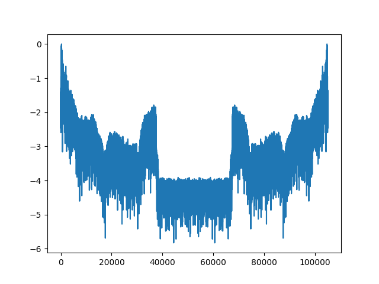
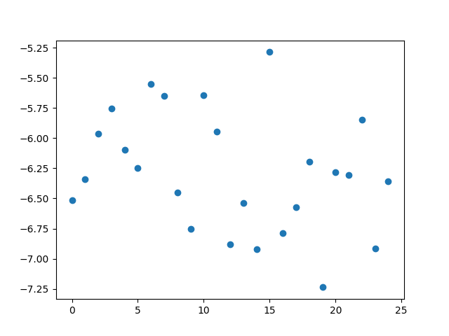

# Travail sur le son

## Préambule

!!! info "Extraction de l'audio d'une vidéo"
    Cela se fait très facilement en ligne de commande dans le terminal.

    On utilise pour cela le logiciel de lecture et d'encodage vidéo **ffmpeg**.

    Pour l'installer:

    ```
    $ sudo apt install ffmpeg
    ```

    Pour l'utiliser, lire par exemple [ici](https://www.linuxtricks.fr/wiki/ffmpeg-la-boite-a-outils-multimedia){:target="_blank"}. Penser à extraire l'audio au format `wav`.


## Lecture d'un son numérique

!!! info "Récupération des données"
    Pour lire un fichier son au format `wav`, on utilisera le module:
    ```python
    import scipy.io.wavfile as wave
    ```

    La fonction `read` du module `wave` permet de récupérer la fréquence d'échantillonnage (nommée `rate` dans l'exemple suivant) ainsi que l'échantillon des valeurs du signal représentant le son sur 16 bits.

    ```python
    rate, echantillon = wave.read('son.wav')
    ```

    On récupère dans `echantillon` un tableau d'éléments `[cg, cd]` où `cg` est la valeur du canal gauche et `cd` celle du canal droit. Le signal d'un canal est représenté ci-dessous.

    {: .center width=50%} 


## Calcul du volume en dBA

!!! info "Spectre"
    Le volume, en [dbA](https://fr.wikipedia.org/wiki/D%C3%A9cibel_A){:target="_blank"}, s'obtient par un traitement du signal pour obtenir le spectre du son:

    {: .center width=50%} 

    Ce traitement s'effectue par la fonction **donnée ci-dessous** qui nécessite l'utilisation du module `numpy` ainsi que du module `math`:

    ```python
    import math
    import numpy as np

    def spectre(data: list, rate: int, debut: float, duree: float) -> list:
        '''
        Renvoie le spectre correspondant à un intervalle du signal.

        data: le signal d'un canal
        rate: la fréquence d'échantillonnage
        debut: le début de l'intervalle à étudier (en secondes)
        duree: la durée de l'intervalle à étudier (en secondes)
        '''
        start = int(debut * rate)
        stop = int((debut+duree) * rate)
        s = np.absolute(np.fft.fft(data[start:stop]))
        s = s / s.max()
        return [math.log10(i) for i in s if i != 0]
    ```
    
!!! note "Donnée à extraire"
    - Pour chaque intervalle de durée 1/25e de la durée totale du son, vous devez calculer le volume minimal de la liste fournie par la fonction `spectre`. Cela vous donne une liste de 25 valeurs.
    - Dans cette liste, vous extrayez le minimum et le maximum, puis vous exprimez chaque valaur **en pourcentage** de la plage min-max.
    
    **Exemple:**
    Pour un [son donné](../data/son_station1_groupe5.wav), on obtient les 25 volumes minimaux suivants:
    {: .center width=50%} 

    Le minimum de la liste est `-7.24` et le maximum  est `-5.28`. Le volume d'indice 2 est `-5.96`, il est situé à 65% de l'intervalle [-7.24, -5.28].

    - C'est ce pourcentage (65%) qui est la valeur à extraire pour chaque intervalle du son ($V_{son}$ ou $V_{video}$).

