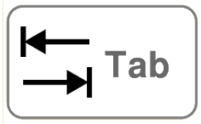

# Usage du clavier

Utiliser le clavier est souvent bien plus pratique et surtout plus rapide qu'utiliser la souris. Encore faut-il apprendre à l'apprivoiser...

{: .center} 
!!! tip "La sélection au clavier"
    Outre les touches `DEBUT` et `FIN` qui permettent d'atteindre rapidement le début ou la fin d'une ligne, les flèches directionelles servent évidemment à se déplacer dans du texte. Mais combinées:

    - à la touche `CTRL` : elles permettent de se déplacer de mot en mot;
    - à la touche `MAJ` : elles permettent de sélectionner un caractère;
    - aux touches `MAJ` **et** `CTRL`: elles permettent de sélectionner un mot.

    De même, en se plaçant en début d'une ligne et en combinant la touche `MAJ` et `FIN`, on sélectionne la ligne entière.

!!! tip "La touche `TAB`"
    {: .center} 

    Outre le marquage d'un taquet de tabulation dans un traitement de texte, la touche `TAB` sert à :

    - passer d'un champ de formulaire à un autre dans une page Web. Par exemple lorsque vous vous identifiez à un compte, après avoir tapé votre login, plutôt que d'utiliser la souris pour aller dans le champ "Mot de passe", appuyez sur `TAB` pour y accéder directement.
    - insérer un nombre d'espaces fixes : on sert sert pour **indenter** le code;
    - compléter des commandes enregistrées dans un IDE ou un terminal. Par exemple, si vous avez nommé une variable `mon_nom_de_variable_tres_tres_long`, plus tard dans le code, vous pouvez taper `mon` + `TAB` et l'IDE doit vous proposer l'auto-complétion du nom.

!!! tip "Les raccourcis clavier"
    Il existe de très nombreux raccourcis clavier qui permettent d'exécuter des tâches courantes sans passer par les menus du logiciel. Certains sont (quasi-)universels, c'est-à-dire que ce sont les mêmes sur tous les logiciels, d'autres sont spécifiques à chaque logiciel. Il est important d'en connaître quelques-uns pour être plus efficace.

    === "Les universels"
        - La triplette magique `CTRL+X`, `CTRL+C`, `CTRL+V` pour couper, copier, coller;
        - `CTRL+O` pour ouvrir un fichier
        - `CTRL+N` pour créer un nouveau document;
        - `CTRL+S` pour sauvegarder le document en cours;
        - `CTRL+MAJ+S` pour sauvegarder en précisant le nom du fichier;
        - `CTRL+Z` pour annuler la dernière action, `CTRL+Y` ou `CTRL+MAJ+Z` pour la rétablir;
        - `CTRL+W` pour fermer un onglet;
        - `CTRL+Q` ou `ALT+F4` pour fermer le logiciel;
        - `CTRL+A` pour sélectionner tout (All).
    
    === "IDE"
        À chercher de suite lorsqu'on utilise un nouvel IDE, les raccourcis pour les actions suivantes (entre parenthèses ceux de Thonny):

        - exécuter le code (`F5`)
        - commenter/décommenter une ligne (`CTRL+M`)

    === "Navigateur Web"
        - `CTRL+T` pour ouvrir un nouvel onglet;
        - `CTRL+H` pour ouvrir l'historique;
        - combiner `CTRL` + clic pour forcer l'ouverture d'un lien dans un nouvel onglet;
        - combiner `MAJ` + clic pour forcer l'ouverture d'un lien dans une nouvelle fenêtre;
