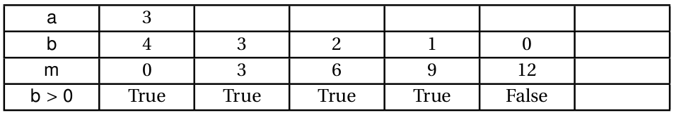

# DS 0011 - Corrigé

## Partie 1

### Exercice 1

1. On appelle la fonction `mystere` en lui passant les arguments `3` et `4`.
2. {: .center} 
3. `mystere(3, 4)` renvoie la valeur `12`. Étant donné qu'on a fait `b` additions du nombre `a`, la fonction `mystere` sert à multiplier ses arguments.


### Exercice 2

1. La variable `exemple` contient la valeur `True`.
2. On l'appelle docstring.
3. - `en_cours` est le  nom de la fonction
    - `heure`  est un  paramètre
    - `if`  est un mot-clé
    - `and`  est un opérateur
    - `True` est un  mot-clé
    - `17` est un argument
    - `return` est un  mot-clé
    - `exemple` est une variable globale
    - `lycee_est_ouvert` est une variable locale


## Partie 2 - sur machine

### Exercice 3

1. Où l'on essaie de fournir un jeu de tests couvrant : un seul 'a', plusieurs, ou aucun.
```python linenums='1'
def test_compte_a():
    assert compte_a("informatique") == 1
    assert compte_a("tata") == 2
    assert compte_a("toto") == 0
```

2. On parcourt la chaîne de caractères avec une boucle `for` et on utilise une variable accumulateur.
```python linenums='1'
def compte_a(chaine: str) -> int:
    '''
    Compte et renvoie le nombre d'occurences du caractère 'a' dans chaine
    '''
    nombre_a = 0
    for caractere in chaine:
        if caractere == 'a':
            nombre_a += 1
    return nombre_a
```

3. La question la plus dure du devoir:
```python
>>> test_compte_a()
```

4. On adapte la fonction précédente en passant le caractère à compter en paramètre:
```python linenums='1'
def compte_lettre(chaine, lettre):
    nombre_lettre = 0
    for caractere in chaine:
        if caractere == lettre:
            nombre_lettre += 1
    return nombre_lettre
```

5. **Bonus**: on utilise la fonction `compte_lettre` en passant les bons arguments. La réponse est 95.
```python linenums='1'
texte_long = '''
mpaowhuqhvyywtvypjkfrrasexnwzrgpargvpjlfbjsxxjipjgkyscgdiqswpvpbzigfkljhicuftshk
qekwqojwchsgyuvakynjpxlacrnbojawdisjzbcqjflhgqofhccdxnqpbnxcxcypawaqgzbikretwlkf
qodnoseirzvssdczsyczqjbugcgjuorxciblnojkvygxqirysffsmjyokjdsxlymjokgodupumjoxcmi
teeenikwlkzidirjnmexsmqjefsgpbpoynusfpudmxwcwrzzqzuobjtlyshbvvgjkhoujsdlnsyfshuu
mfmqmssbyrzybswyswbdmqmcwsdudrfdnmlmnchossxcwarfmpkrcqcyvyjkplzexrnebukxhqbnzkgh
nalfpkxghypaimemqzmcreozagufiljxdmgrwftyajtonfisefxujtdmpgxttugxhvpgdqhvgzohovbe
qaafwqfiokzhtbxgoxpzzvbswlxdtykgufqevlmjjrddufrogzsfzzuaqpqfzinvmfpcylgftkkhqylp
rgzywwefwghhrivsjtvbbcixhztwujdqqesdertmtwdricrzmwsibhstsgnnxbvqnyklcbrcxtycvcww
ojphbqyrjffndkgwqfqvarfupklwwixekudmbspqtydkegltqvwjzfooscehpnfwvvnkrxsfakwezvol
mpvnprcrwomddjneyrhpxmnrveibxqxcjluezypvsbfudilpjdqflsdhwucjgtusxjjcnewamoewwjhu
'''

total = 0
for caractere in 'nsi':
    total += compte_lettre(texte_long, caractere)

print(total)
```
