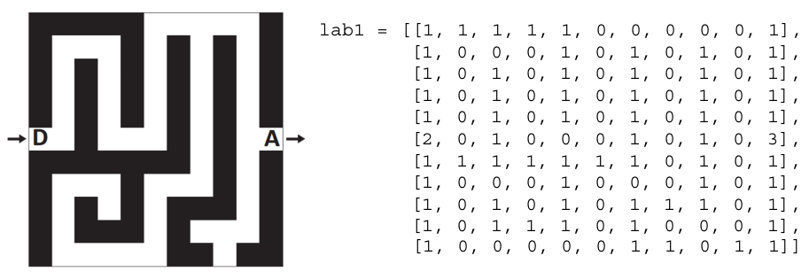
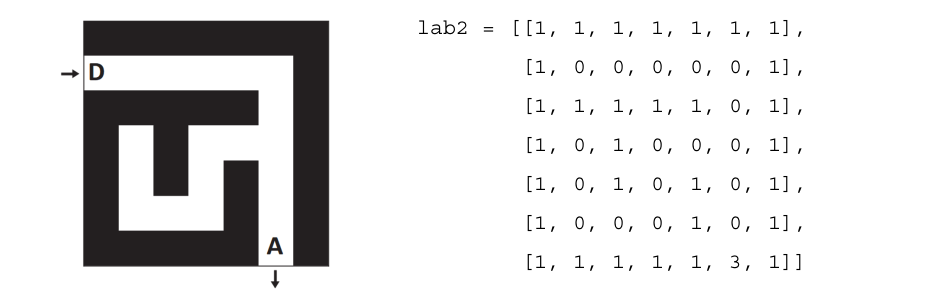

# DS 0111 - Corrigé

## Partie 1: QCM (12 points)

Pour chaque question suivante, une seule est exacte. Une bonne réponse rapporte 1 point, une mauvaise réponse ou l'absence de réponse n'enlève pas de point.

1. À partir du dossier `~/Doc/QCM`, quelle commande permet de rejoindre le dossier `~/Hack/Reponses` ?

    [ ] -A :  `cd Hack/Reponses`

    [ ] -B :  `cd /Hack/Reponses`

    [ ] -C :  `cd ../Hack/Reponses`

    [x] -D :  `cd ../../Hack/Reponses `

2. Parmi les commandes suivantes, laquelle permet de créer un fichier `nsi.txt`:

    [ ] -A :  `mkdir nsi.txt`

    [ ] -B :  `cp nsi.txt`

    [x] -C :  `touch nsi.txt`

    [ ] -D :  `cat nsi.txt`

3. Lorsque, en ligne de commande, on saisit la commande
    ```bash
    chmod u+rw nsi.txt
    ```
    ceci a pour effet:

    [ ] -A :  d'interdire au propriétaire de modifier le contenu de ce fichier

    [x] -B :  de permettre au propriétaire du fichier de modifier le contenu de ce fichier 

    [ ] -C :  d'interdire à tous les autres utilisateurs de lire le fichier 

    [ ] -D :  d'effacer le fichier 

4. Laquelle de ces écritures ne désigne pas une adresse IP?
    
    [ ] -A :  `127.0.0.1`

    [ ] -B :  `207.142.131.245`

    [ ] -C :  `192.168.229.48`

    [x] -D :  `296.141.2.4`

5. Quelle est l'écriture du masque de sous-réseau correspondant à la notation CIDR `/23` ?

    [ ] -A :  `255.255.255.0`

    [ ] -B :  `255.255.255.23`

    [x] -C :  `255.255.254.0`

    [ ] -D :  `255.128.0.0`

6. Quel matériel permet d'interconnecter des **réseaux** entre eux :

    [x] -A :  un routeur

    [ ] -B :  un switch

    [ ] -C :  un ping

    [ ] -D :  un serveur DNS

7. On a affiché les premières lignes de différents fichiers. Déterminer celui qui est un fichier CSV :

    [x] -A :

    ```
    Nom, Pays, Temps
    Usain Bolt, Jamaïque, 9.58
    ```

    [ ] -B :
    ```
    Nom Pays Temps
    Usain Bolt Jamaïque 9.58 
    ```

    [ ] -C : 
    ```
    [{Nom: "Usain Bolt", Pays: "Jamaïque", Temps: 9.58}]
    ```

    [ ] -D : 
    ```
    [{"Nom": "Usain Bolt", "Pays": "Jamaïque", "Temps": 9.58}]
    ```

8. Dans la plupart des fichiers CSV, que contient la première ligne ? 

    [ ] -A :  des notes concernant la table de données 

    [ ] -B :  les sources des données 

    [ ] -C :  les descripteurs des champs de la table de données 

    [ ] -D :  l'auteur de la table de données 


9. On définit une table d'élèves et une liste finale de la façon suivante :

    ```python linenums='1'
    table_eleves = [{"prenom": "Ada", "nom" : "Lovelace", "age" : 17}, {"prenom": "Charles", "nom" : "Babbage", "age" : 18}, ......, {"prenom": "John", "nom" : "Von Neumann", "age" : 16}]
    liste_finale = [eleve for eleve in table_eleves if eleve["age"] >= 18]
    ```
    Que contient cette liste finale ?

    [ ] -A :  La liste des prénoms des élèves majeurs de la table, chaque élément de la liste étant représenté par une chaine de caractères.

    [ ] -B :  La liste des âges des élèves majeurs de la table, chaque élément de la liste étant représenté par un entier.

    [x] -C :  La liste des élèves majeurs de la table, chaque élément de la liste étant représenté par un dictionnaire.

    [ ] -D :  La liste des élèves majeurs de la table, chaque élément de la liste étant représenté par une liste.

10. On définit le dictionnaire `d = {'a': 1, 'b': 2, 'c': 3, 'z': 26}`. Quelle expression permet de récupérer la valeur de la clé `'z'` ?

    [ ] -A :  `d[4]`

    [ ] -B :  `d[26]`

    [ ] -C :  `d[z]`

    [x] -D :  `d['z']`

11. On définit le dictionnaire `d = {'couleur': 'vert', 'taille': 42, 'marque': 'le coq sportif'}`. Quelle est la valeur de l'expression `d.keys()`?

    [x] -A :  `['couleur', 'taille', 'marque'] `

    [ ] -B :  `[('couleur', 'vert'), ('taille', 42), ('marque', 'le coq sportif')] `

    [ ] -C :  `['vert', 42, 'le coq sportif'] `

    [ ] -D :  `['couleur': 'vert', 'taille': 42, 'marque': 'le coq sportif'] `

12. On a écrit une fonction qui prend en paramètre une liste non vide et qui renvoie son plus grand élément. Combien de tests faudrait-il écrire pour garantir que la fonction donne un résultat correct pour toute liste ? 

    [x] -A :  deux tests : pour une liste à un élément et pour une liste à deux éléments ou plus

    [ ] -B :  deux tests : pour le cas où le plus grand élément est en début de liste, et pour le cas où le plus grand élément n’est pas en début de liste

    [ ] -C :  trois tests : pour une liste vide, pour une liste à un élément, et pour une liste à deux éléments ou plus

    [ ] -D :  il faudrait écrire une infinité de tests : on ne peut pas prouver que cette fonction est correcte, simplement en la testant


## Partie 2: Problème / Représentation d'un labyrinthe (8 points)


On modélise un labyrinthe par un tableau à deux dimensions à $n$ lignes et $m$ colonnes avec $n$ et $m$ des entiers strictement positifs.

Les lignes sont numérotées de 0 à $n-1$ et les colonnes de $0$ à $m-1$.

La case en haut à gauche est repérée par $(0, 0)$ et la case en bas à droite par $(n-1, m-1)$.
Dans ce tableau :

- 0 représente une case vide, hors case de départ et arrivée,
- 1 représente un mur,
- 2 représente le départ du labyrinthe,
- 3 représente l'arrivée du labyrinthe.

Ainsi, en Python, le labyrinthe ci-dessous est représentée par le tableau de tableaux `lab1`:



1. Donner l'emplacement de l'entrée et l'emplacement de la sortie dans le labyrinthe ci-dessus.

    L'entrée est en $(5;0)$ et la sortie en $(5;10)$.


2. Le labyrinthe ci-dessous est censé être représenté par `lab2`. Cependant, dans ce tableau, un mur se trouve à la place du départ du labyrinthe. Donner une instruction permettant de placer le départ au bon endroit dans `lab2`.

    

    ```python linenums='1'
    lab2[1][0] = 2
    ```

3. On souhaite écrire une fonction `est_valide(i, j, n, m)` qui renvoie `True` si le couple $(i, j)$ correspond à des coordonnées valides pour un labyrinthe de taille $(n, m)$, et `False` sinon. Par exemple:
    ```python linenums='1'
    >>> est_valide(5, 2, 10, 10)
    True
    >>> est_valide(-3, 4, 10, 10)
    False
    >>> est_valide(8, 12, 10, 10)
    False
    ```
    
    Compléter le code suivant:

    ```python linenums='1'
    def est_valide(i: int, j:int, n:int, m: int) -> ... :
        if i < 0 ... i >= n:
            return ...
        elif ...................:
            return ...
        else:
            return True 
    ```

    !!! check "Correction"
        ```python linenums='1'
        def est_valide(i: int, j:int, n:int, m: int) -> bool :
            if i < 0 or i >= n:
                return False
            elif j < 0 or j >= m:
                return False
            else:
                return True 
        ```
    
4. On suppose que le départ d'un labyrinthe est toujours indiqué, mais on ne fait aucune supposition sur son emplacement.

    Compléter la fonction `depart(lab)` ci-dessous de sorte qu'elle renvoie, sous la forme d'un tuple, les coordonnées du départ d'un labyrinthe (représenté par le paramètre `lab`). Par exemple, l'appel `depart(lab1)` doit renvoyer  `(5, 0)`.

    ```python linenums='1'
    def depart(lab: ... ) -> tuple:
        n = len(lab)
        m = len(lab[0])
        for i in range(...):
            for j in range(...):
                if ... :
                    return ...
    ```

    !!! check "Correction"
        ```python linenums='1'
        def depart(lab: list ) -> tuple:
            n = len(lab)
            m = len(lab[0])
            for i in range(n):
                for j in range(m):
                    if lab[i][j] == 2 :
                        return (i, j)
        ```

5. Écrire une fonction `nb_cases_vides(lab)` qui renvoie le nombre de cases vides d'un labyrinthe (comprenant donc l'arrivée et le départ).
    
    Par exemple, l'appel `nb_cases_vides(lab2)` doit renvoyer la valeur `19`.

    !!! check "Correction"
        ```python linenums='1'
        def nb_cases_vides(lab: list ) -> int:
        n = len(lab)
        m = len(lab[0])
        compteur = 0
        for i in range(n):
            for j in range(m):
                if lab[i][j] != 1 :
                    compteur += 1
        return compteur
        ```
        
    